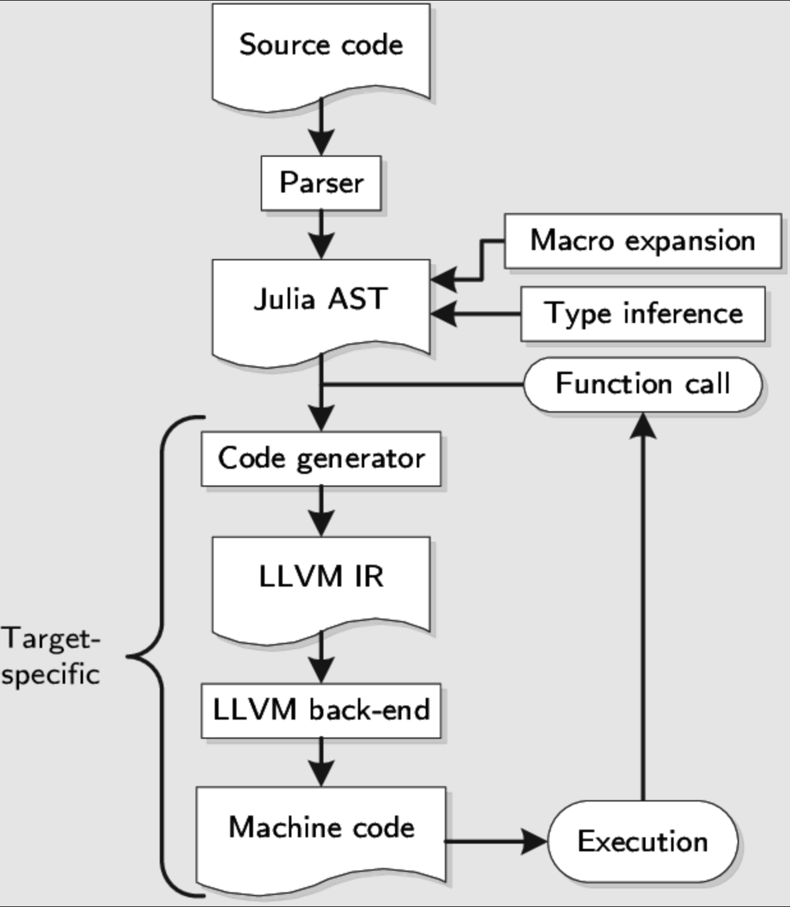
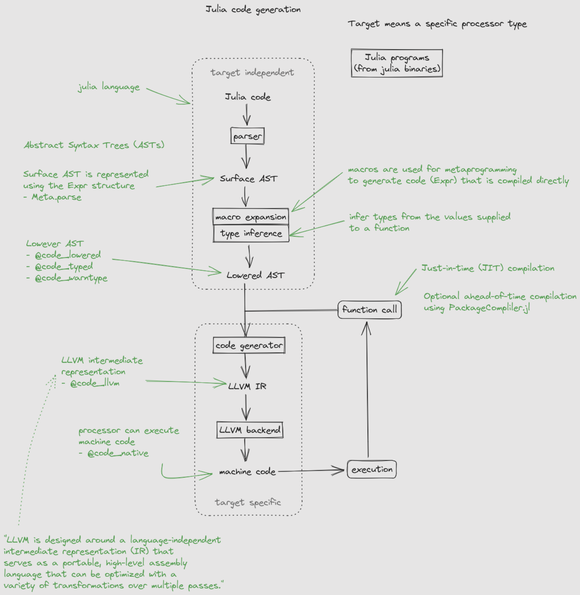
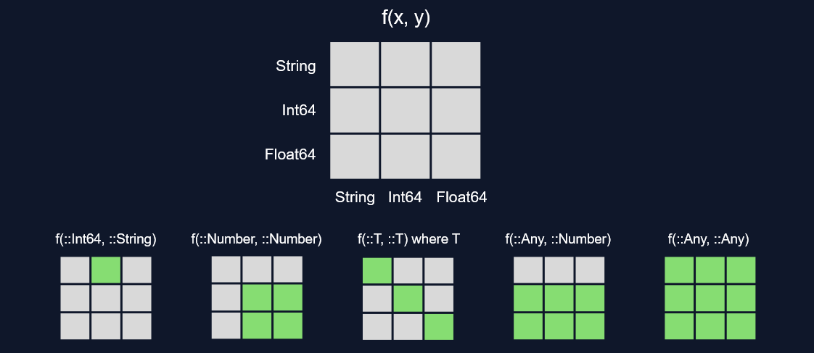

# Julia Notes

A collection of notes, examples, and resources for learning and working with the Julia programming language.

## About Julia

Julia is a high-level, high-performance programming language for technical computing. It combines the ease of use of Python with the speed of C, making it ideal for scientific computing, data analysis, and machine learning.

## Getting Started

To get started with Julia:

1. Download and install Julia from [julialang.org](https://julialang.org/downloads/)
2. Launch the Julia REPL by typing `julia` in your terminal
3. Explore the examples and notes in this repository

## Resources

- [Official Julia Documentation](https://docs.julialang.org/)
- [Julia Academy](https://juliacademy.com/) - Free online courses
- [JuliaHub](https://juliahub.com/) - Package ecosystem
- [Julia Discourse](https://discourse.julialang.org/) - Community forum
- [MIT Course](https://computationalthinking.mit.edu/Fall24/) - Goes over Math, Julia, and Computer Science
- [Good 4h Julia Tutorial for Beginners](https://www.youtube.com/watch?v=KlorfxsdWDw)
- [Rosetta Code](https://rosettacode.org/wiki/Rosetta_Code) - Coding challenges in different languages
  - [Smith-Waterman Algorithm](https://rosettacode.org/wiki/Smith%E2%80%93Waterman_algorithm) - Coding Challenge
  - [Global Alignment](https://rosettacode.org/wiki/Bioinformatics/Global_alignment) - Coding Challenge
    - [Common Biology Algorithms in Julia](https://github.com/BioJulia/BioAlignments.jl/tree/master/src/pairwise/algorithms)

## Cheatsheet

- A really good [Julia Cheatsheet](https://cheatsheet.juliadocs.org/)
- [MatLab vs Python vs Julia Cheatsheet](https://cheatsheets.quantecon.org/)

## Julia DataTypes


## How Julia Works Under the Hood

Julia is a high-level, high-performance programming language that combines the ease of use of dynamic languages with the performance of compiled languages. Understanding how Julia works internally helps you write more efficient code.

- https://enccs.github.io/julia-intro/overview/





### Julia's Compilation Model: Just-In-Time (JIT) Compilation

```julia
# Julia uses a sophisticated JIT compilation system

# 1. First run - compilation happens
function slow_function(x)
    return x * 2
end

# First call triggers compilation
result1 = slow_function(5)  # Compilation overhead on first call

# Subsequent calls use compiled code
result2 = slow_function(10)  # Fast - uses compiled version
result3 = slow_function(15)  # Fast - uses compiled version

# 2. Type specialization
function specialized_function(x::Int)
    return x * 2
end

function specialized_function(x::Float64)
    return x * 2.0
end

# Julia compiles separate versions for each type
int_result = specialized_function(5)    # Uses Int version
float_result = specialized_function(5.0) # Uses Float64 version
```

### The Type System and Multiple Dispatch

```julia
# Julia's type system is the foundation of its performance

# 1. Type hierarchy
abstract type Number end
abstract type Real <: Number end
abstract type Integer <: Real end
abstract type Signed <: Integer end
abstract type Unsigned <: Integer end

# 2. Multiple dispatch - functions are selected based on ALL argument types
function process_data(x::Int, y::Int)
    return x + y
end

function process_data(x::String, y::String)
    return x * y  # String concatenation
end

function process_data(x::Int, y::String)
    return string(x) * y
end

# Julia selects the right function based on argument types
process_data(5, 3)      # Calls first version
process_data("a", "b")  # Calls second version
process_data(5, "b")    # Calls third version

# 3. Type stability is crucial for performance
function type_stable(x::Int)
    return x * 2  # Always returns Int
end

function type_unstable(x)
    if x > 0
        return x * 2  # Could return Int or Float64
    else
        return "negative"  # Returns String!
    end
end
```

### LLVM and Code Generation

**LLVM (Low Level Virtual Machine)** is a crucial component of Julia's compilation system. It's an open-source compiler infrastructure that provides the backend for Julia's JIT compilation.

#### What is LLVM?

```julia
# LLVM is a collection of modular and reusable compiler and toolchain technologies
# Julia uses LLVM as its backend compiler to generate optimized machine code

# LLVM provides:
# 1. LLVM IR (Intermediate Representation) - platform-independent assembly
# 2. Advanced optimization passes
# 3. Code generation for multiple architectures (x86, ARM, GPU, etc.)
# 4. Just-In-Time (JIT) compilation capabilities
```

#### Julia's Compilation Pipeline with LLVM

```julia
# Julia's compilation process:
# 1. Julia AST (Abstract Syntax Tree)
# 2. Lowered to LLVM IR
# 3. LLVM optimizations applied
# 4. Generated to native machine code

# You can inspect the generated LLVM code
using InteractiveUtils

function example_function(x::Int)
    return x * 2 + 1
end

# View LLVM IR
@code_llvm example_function(5)

# View native assembly
@code_native example_function(5)

# View type inference
@code_warntype example_function(5)

# This shows how Julia optimizes your code at multiple levels
```

#### LLVM IR (Intermediate Representation)

```julia
# LLVM IR is a low-level, platform-independent assembly language
# It's the "bridge" between Julia's high-level code and machine code

# Example: Simple arithmetic
@code_llvm 5 * 3 + 2

# Example: Function with multiple operations
function complex_calculation(x, y)
    result = x * y
    result += x + y
    return result * 2
end

@code_llvm complex_calculation(3, 4)
```

#### LLVM Optimizations

```julia
# LLVM applies many optimizations automatically:

# 1. Constant folding
@code_llvm 2 + 3 * 4  # Computed at compile time

# 2. Dead code elimination
function unused_code(x)
    y = x * 2
    z = y + 1
    return x  # y and z are unused
end

@code_llvm unused_code(5)

# 3. Loop optimizations
function sum_array(arr)
    total = 0
    for i in arr
        total += i
    end
    return total
end

@code_llvm sum_array([1, 2, 3, 4, 5])

# 4. Function inlining
function inner_function(x)
    return x * 2
end

function outer_function(x)
    return inner_function(x) + 1
end

@code_llvm outer_function(5)  # inner_function gets inlined
```

#### Platform-Specific Code Generation

```julia
# LLVM enables Julia to generate optimized code for different architectures

# x86-64 (most common)
@code_native 2 + 2

# ARM (if available)
# @code_native 2 + 2  # Would show ARM assembly on ARM machines

# LLVM handles:
# - CPU instruction sets (SSE, AVX, etc.)
# - Memory alignment
# - Register allocation
# - Calling conventions
```

#### LLVM and Performance

```julia
# LLVM's optimizations contribute significantly to Julia's performance

# Example: Vectorized operations
function vector_sum(a, b)
    return a + b
end

# LLVM can vectorize this operation
@code_llvm vector_sum([1,2,3], [4,5,6])

# Example: Loop unrolling
function loop_example(n)
    sum = 0
    for i in 1:n
        sum += i
    end
    return sum
end

@code_llvm loop_example(10)
```

#### LLVM Debugging and Analysis

```julia
# LLVM provides tools for analyzing generated code

# 1. View optimization passes
using LLVM

# 2. Analyze generated code
function analyze_function(x)
    return x * 2 + 1
end

# Get LLVM function
llvm_f = @code_llvm analyze_function(5)

# 3. Performance analysis
using BenchmarkTools

# Compare different implementations
@btime analyze_function(5)
```

#### LLVM and GPU Computing

```julia
# LLVM enables GPU computing through CUDA and OpenCL

# Example with CUDA.jl (if available)
# using CUDA
#
# function gpu_function(x)
#     return x * 2
# end
#
# # LLVM generates PTX (Parallel Thread Execution) code for NVIDIA GPUs
# @code_llvm gpu_function(5)
```

#### LLVM Configuration and Tuning

```julia
# Julia allows some control over LLVM optimization levels

# Set optimization level (0-3, default is 2)
# This is typically done through environment variables or startup flags

# Common LLVM-related environment variables:
# JULIA_LLVM_ARGS: Pass arguments to LLVM
# JULIA_OPT_LEVEL: Set optimization level

# Example (in shell):
# export JULIA_LLVM_ARGS="-O3"
# export JULIA_OPT_LEVEL=3
```

#### LLVM vs Other Compilers

```julia
# LLVM advantages in Julia:
# 1. Mature, well-tested compiler infrastructure
# 2. Extensive optimization passes
# 3. Support for many target architectures
# 4. Active development and community
# 5. Integration with other LLVM-based tools

# Comparison with other approaches:
# - GCC: More traditional, less flexible
# - Custom compilers: Require significant development effort
# - Interpreters: No compilation, but slower execution
```

#### LLVM and Julia's Design Philosophy

```julia
# LLVM aligns well with Julia's design goals:

# 1. Performance: LLVM generates highly optimized machine code
# 2. Portability: LLVM supports many platforms
# 3. Interoperability: LLVM can interface with C/C++ code
# 4. Extensibility: LLVM's modular design allows custom optimizations

# This is why Julia can achieve C-like performance while maintaining
# high-level, dynamic language features
```

### Callable Objects: Making Types Function-Like

Julia allows you to make any object "callable" by defining a method for the function call operator `()`. This enables objects to behave like functions while carrying their own data.

#### Basic Callable Objects

```julia
# Define a Gaussian distribution type
struct Gaussian{T <: Real}
    μ::T  # mean
    σ::T  # standard deviation
end

# Make Gaussian objects callable by defining the function call operator
function (g::Gaussian{T})(x::Real) where T
    return exp(-(x - g.μ)^2 / (2 * g.σ^2))
end

# Usage
g = Gaussian(1.0, 0.5)
@test g(2) ≈ 0.1353352832366127
@test g(2.0) == g(2)
@test g(1.25) ≈ 0.8824969025845955

# Different Gaussian with different parameters
g2 = Gaussian(2, 5)
@test g2(-3) ≈ 0.6065306597126334
```

#### How Callable Objects Work

```julia
# The syntax `function (g::Gaussian{T})(x::Real)` defines:
# - A method for the function call operator `()`
# - Takes a Gaussian object as the first argument
# - Takes a Real number as the second argument
# - Returns the Gaussian probability density at x

# This is equivalent to:
Base.call(g::Gaussian{T}, x::Real) where T = exp(-(x - g.μ)^2 / (2 * g.σ^2))

# Now you can use Gaussian objects like functions:
g = Gaussian(0.0, 1.0)  # Standard normal distribution
x_values = [-2, -1, 0, 1, 2]
probabilities = g.(x_values)  # Broadcast over array
```

#### Advanced Callable Objects

```julia
# Callable objects can have multiple methods
struct Polynomial{T <: Real}
    coefficients::Vector{T}
end

# Method 1: Evaluate at a single point
function (p::Polynomial{T})(x::Real) where T
    result = zero(T)
    for (i, coeff) in enumerate(p.coefficients)
        result += coeff * x^(i-1)
    end
    return result
end

# Method 2: Evaluate at multiple points
function (p::Polynomial{T})(x::Vector{<:Real}) where T
    return [p(xi) for xi in x]
end

# Usage
p = Polynomial([1, 2, 3])  # 1 + 2x + 3x²
@test p(0) == 1
@test p(1) == 6
@test p([0, 1, 2]) == [1, 6, 17]
```

### Closures: Functions That Wrap Data

A **closure** is a function that captures (or "closes over") variables from its surrounding scope. This allows functions to carry their own state and data.

#### Basic Closures

```julia
# Return a function that adds x to any number
function adder(x)
    return y::Number -> x + y
end

f = adder(3)
@test f isa Function
@test f(2) == 5
@test_throws MethodError f("hello")  # f isn't defined on strings

# The closure captures the value of x
g = adder(10)
@test g(5) == 15
```

#### How Closures Work

```julia
# A closure captures variables from its creation environment
function make_multiplier(factor)
    return x -> x * factor  # factor is captured from outer scope
end

double = make_multiplier(2)
triple = make_multiplier(3)

@test double(5) == 10
@test triple(5) == 15

# Each closure has its own captured value
@test double(7) == 14
@test triple(7) == 21
```

#### Advanced Closure Patterns

```julia
# 1. Closures with multiple captured variables
function make_linear_function(slope, intercept)
    return x -> slope * x + intercept
end

line1 = make_linear_function(2, 1)  # y = 2x + 1
line2 = make_linear_function(-1, 5)  # y = -x + 5

@test line1(3) == 7
@test line2(3) == 2

# 2. Closures that modify captured state
function make_counter()
    count = 0
    return () -> (count += 1; count)
end

counter = make_counter()
@test counter() == 1
@test counter() == 2
@test counter() == 3

# 3. Closures with complex captured data
function make_data_processor(operation)
    return data -> operation(data)
end

sum_processor = make_data_processor(sum)
mean_processor = make_data_processor(mean)

data = [1, 2, 3, 4, 5]
@test sum_processor(data) == 15
@test mean_processor(data) == 3.0
```

#### Closures vs Callable Objects

```julia

```

### Memory Management and Garbage Collection

```julia
# Julia uses automatic memory management with a generational garbage collector

# 1. Stack vs Heap allocation
function stack_allocated()
    x = 42  # Likely stack-allocated (type-stable, small)
    return x
end

function heap_allocated()
    x = [1, 2, 3]  # Heap-allocated (array)
    return x
end

# 2. Avoiding allocations for performance
function inefficient_sum(arr)
    result = 0.0
    for x in arr
        result = result + x  # Creates new Float64 each iteration
    end
    return result
end

function efficient_sum(arr)
    result = 0.0
    for x in arr
        result += x  # In-place operation, no allocation
    end
    return result
end

# 3. Pre-allocating arrays
function preallocated_operation(n)
    result = Vector{Float64}(undef, n)  # Pre-allocate
    for i in 1:n
        result[i] = i * 2.0
    end
    return result
end
```

### Compilation Stages and Optimization

```julia
# Julia's compilation pipeline has multiple stages

# 1. Parsing and AST generation
# Your code → Abstract Syntax Tree

# 2. Type inference
# Julia infers types where possible
function inferred_types(x::Int)
    y = x * 2      # y inferred as Int
    z = y + 1.0    # z inferred as Float64
    return z
end

# 3. LLVM IR generation
# Type-specialized code → LLVM Intermediate Representation

# 4. LLVM optimization
# LLVM applies hundreds of optimizations:
# - Constant folding
# - Loop unrolling
# - Vectorization
# - Dead code elimination

# 5. Native code generation
# LLVM IR → Machine-specific assembly → Executable code

# You can see this in action:
function optimized_example(x::Int)
    result = 0
    for i in 1:x
        result += i * 2
    end
    return result
end

# View the optimization process
@code_llvm optimized_example(10)
```

### Type Inference and Specialization

```julia
# Julia specializes functions for specific type combinations

# 1. Automatic specialization
function generic_function(x, y)
    return x + y
end

# Julia creates specialized versions:
# generic_function(Int, Int)
# generic_function(Float64, Float64)
# generic_function(String, String)
# etc.

# 2. Type inference in action
function inference_example(x::Int)
    y = x * 2        # y::Int
    z = y + 1.0      # z::Float64
    w = string(z)    # w::String
    return w
end

# 3. When type inference fails
function inference_failure(x)
    if x > 0
        return x * 2    # Could be Int or Float64
    else
        return "negative"  # String!
    end
end

# This causes type instability and poor performance
```

### Performance Characteristics

```julia
using BenchmarkTools

# 1. First-run compilation overhead
function first_run_test()
    return sum(1:1000)
end

# First call includes compilation time
@btime first_run_test()  # Slower due to compilation

# Subsequent calls are fast
@btime first_run_test()  # Fast - uses compiled code

# 2. Type stability impact
function stable_function(x::Int)
    return x * 2
end

function unstable_function(x)
    if x > 0
        return x * 2
    else
        return "negative"
    end
end

# Compare performance
@btime stable_function(5)     # Fast
@btime unstable_function(5)   # Slower due to type instability

# 3. Memory allocation impact
function alloc_heavy(n)
    result = []
    for i in 1:n
        push!(result, i * 2)  # Allocates new array each time
    end
    return result
end

function alloc_efficient(n)
    result = Vector{Int}(undef, n)  # Pre-allocate
    for i in 1:n
        result[i] = i * 2
    end
    return result
end

# Compare memory usage
@btime alloc_heavy(1000)      # More allocations
@btime alloc_efficient(1000)  # Fewer allocations
```

### Compiler Optimizations

```julia
# Julia's compiler applies many optimizations automatically

# 1. Constant folding
function constant_folding()
    x = 2 + 3 * 4  # Computed at compile time
    return x
end

# 2. Loop optimizations
function loop_optimization(n)
    result = 0
    for i in 1:n
        result += i  # Loop may be unrolled or vectorized
    end
    return result
end

# 3. Function inlining
function inner_function(x)
    return x * 2
end

function outer_function(x)
    return inner_function(x) + 1  # inner_function may be inlined
end

# 4. Bounds checking elimination
function bounds_check_elimination(arr)
    n = length(arr)
    result = 0
    for i in 1:n
        result += arr[i]  # Bounds check may be eliminated
    end
    return result
end
```

### Understanding Compilation Time

```julia
# Julia's compilation model affects development workflow

# 1. Compilation time vs runtime
function expensive_compilation(x::Int)
    # This function takes time to compile but runs fast
    result = 0
    for i in 1:1000
        result += i * x
    end
    return result
end

# First call: compilation + execution
@time expensive_compilation(5)  # Includes compilation time

# Subsequent calls: execution only
@time expensive_compilation(5)  # Fast execution

# 2. Package loading and compilation
using LinearAlgebra  # Triggers compilation of LinearAlgebra functions

# 3. Method compilation
function method_compilation(x::Int)
    return x * 2
end

function method_compilation(x::Float64)
    return x * 2.0
end

# Each method is compiled separately when first called
```

### Debugging and Profiling

```julia
# Tools for understanding Julia's behavior

# 1. Type inference debugging
function debug_types(x)
    y = x * 2
    z = y + 1.0
    return z
end

# Check type inference
@code_warntype debug_types(5)

# 2. Performance profiling
using Profile

function profile_example(n)
    result = 0
    for i in 1:n
        result += i * 2
    end
    return result
end

# Profile the function
@profile profile_example(10000)
Profile.print()

# 3. Memory allocation tracking
using BenchmarkTools

function track_allocations(n)
    result = Vector{Int}(undef, n)
    for i in 1:n
        result[i] = i * 2
    end
    return result
end

# Check allocations
@btime track_allocations(1000)
```

### Best Practices for Performance

```julia
# Guidelines for writing performant Julia code

# 1. Type stability
function good_type_stability(x::Int)
    return x * 2  # Always returns Int
end

function bad_type_stability(x)
    if x > 0
        return x * 2  # Could return different types
    else
        return "negative"
    end
end

# 2. Avoid global variables
# ❌ Bad
global_counter = 0
function bad_function()
    global global_counter
    global_counter += 1
end

# ✅ Good
function good_function(counter)
    return counter + 1
end

# 3. Use appropriate data structures
# For small collections: arrays
small_data = [1, 2, 3, 4, 5]

# For large collections with frequent lookups: dictionaries
large_lookup = Dict{String, Int}()

# For unique elements: sets
unique_elements = Set([1, 2, 3, 4, 5])

# 4. Pre-allocate when possible
function preallocate_example(n)
    result = Vector{Float64}(undef, n)
    for i in 1:n
        result[i] = i * 2.0
    end
    return result
end
```

## Why Julia is fast

1. **Compilation**: Julia's JIT compiler generates optimized machine code
2. **Type Stability**: Julia's type system allows for better optimizations
3. **Memory Layout**: Julia's column-major layout can be more cache-friendly
4. **SIMD Optimization**: Julia can automatically vectorize operations
5. **Allocation Optimization**: Julia's compiler can eliminate temporary allocations

## Making Ranges in Julia

Julia provides several ways to create ranges, which are efficient lazy sequences that don't store all values in memory.

### Basic Range Syntax

```julia
# Create a range of all integers from 2 to 5, inclusive
r = 2:5
# Result: 2:5 (a UnitRange{Int64})

# Ranges can be used in loops, indexing, and other contexts
for i in 2:5
    println(i)  # Prints 2, 3, 4, 5
end

# Convert range to a full array if needed
collect(2:5)  # [2, 3, 4, 5]
```

### Range Types

```julia
# UnitRange - step size of 1
r1 = 1:10      # 1:10

# StepRange - custom step size
## Syntax - start:step:end
r2 = 1:2:10    # 1:2:9 (step by 2)
r3 = 10:-1:1   # 10:-1:1 (counting down)

# Using the range() function
r4 = range(1, 10, length=5)  # 1.0:2.25:10.0
r5 = range(1, 10, step=2)    # 1:2:9
```

### Range Properties

```julia
r = 2:5
first(r)    # 2
last(r)     # 5
length(r)   # 4
step(r)     # 1
```

### Common Use Cases

```julia
# Array indexing
arr = [10, 20, 30, 40, 50]
arr[2:4]    # [20, 30, 40]

# Loop iteration
for i in 1:length(arr)
    println("Element $i: $(arr[i])")
end

# Creating sequences
even_numbers = 2:2:20  # 2, 4, 6, 8, 10, 12, 14, 16, 18, 20
```

### Performance Benefits

- **Memory efficient**: Ranges don't store all values, just start, stop, and step
- **Fast iteration**: Optimized for loops and indexing
- **Lazy evaluation**: Values are computed only when needed

### How Ranges Work Under the Hood

Ranges in Julia are **lazy sequences** that implement the `AbstractRange` abstract type. They store only the essential information needed to generate values on demand.

#### Internal Structure

```julia
# A range like 2:5 internally stores:
r = 2:5
typeof(r)  # UnitRange{Int64}

# The range object contains:
# - start: 2
# - stop: 5
# - step: 1 (implicit for UnitRange)
# - length: 4 (computed as stop - start + 1)

# You can inspect these directly:
first(r)   # 2
last(r)    # 5
step(r)    # 1
length(r)  # 4
```

#### Memory Layout vs Arrays

```julia
# Range: stores only 3 integers regardless of size
r = 1:1000000
sizeof(r)  # 24 bytes (3 Int64s)

# Array: stores all values
arr = collect(1:1000000)
sizeof(arr)  # 8000000 bytes (1 million Int64s)
```

#### Type Hierarchy

```julia
# AbstractRange is the parent type
r1 = 1:10        # UnitRange{Int64} <: AbstractRange
r2 = 1:2:10      # StepRange{Int64, Int64} <: AbstractRange
r3 = 1.0:0.5:5.0 # StepRangeLen{Float64, Base.TwicePrecision{Float64}, Base.TwicePrecision{Float64}, Int64} <: AbstractRange

# All ranges implement the same interface
for r in [r1, r2, r3]
    println("$(typeof(r)): $(first(r)) to $(last(r)), length $(length(r))")
end
```

#### Iterator Protocol

Ranges implement Julia's iterator protocol, making them work seamlessly with:

```julia
r = 2:5

# for loops
for i in r
    println(i)
end

# comprehensions
[i^2 for i in r]  # [4, 9, 16, 25]

# broadcasting
r .* 2  # 4:2:10

# indexing (ranges are themselves indexable)
r[2]    # 3
r[1:3]  # 2:4
```

#### Compiler Optimizations

Julia's compiler can optimize range operations extensively:

```julia
# The compiler can often eliminate range objects entirely
function sum_range(start, stop)
    total = 0
    for i in start:stop
        total += i
    end
    return total
end

# This compiles to efficient machine code that doesn't create
# intermediate range objects in tight loops
```

#### Range Arithmetic

Ranges support various arithmetic operations:

```julia
r = 1:5

# Addition/subtraction shifts the range
r + 10    # 11:15
r - 2     # -1:3

# Multiplication scales the step
r * 2     # 2:2:10

# Division (creates floating-point ranges)
r / 2     # 0.5:0.5:2.5
```

#### Special Range Types

```julia
# Empty ranges
empty_range = 1:0  # 1:0 (length 0)

# Single-element ranges
single = 5:5       # 5:5 (length 1)

# Reverse ranges
reverse_range = 5:-1:1  # 5:-1:1

# Float ranges (using StepRangeLen for precision)
float_range = 0.0:0.1:1.0
```

#### When to Use collect()

```julia
r = 1:1000

# Don't collect unless necessary
# Good: iterate directly
for i in r
    # work with i
end

# Good: use in indexing
arr = rand(1000)
subset = arr[r]

# Only collect when you need a mutable array
# or when passing to functions that require arrays
array_version = collect(r)
push!(array_version, 1001)  # This requires a real array
```

---


Julia's type system allows you to create vectors with specific element types, which is crucial for performance and type safety.

### Basic Type-Specific Vector Creation

```julia
# Create a vector of `String`s that has 3 undefined elements, then make the middle one equal to "Julia"
vstr = Vector{String}(undef, 3)
vstr[2] = "Julia"
println(vstr)
# Output: String[#undef, "Julia", #undef]

# Test the vector properties
@test length(vstr) == 3 && eltype(vstr) == String && !isassigned(vstr, 1) && !isassigned(vstr, 3) && vstr[2] == "Julia"
```

### Understanding `Vector{Type}(undef, size)`

```julia
# Syntax: Vector{ElementType}(undef, length)
# - ElementType: The type of elements the vector will hold
# - undef: Creates uninitialized elements
# - length: The number of elements

# Examples with different types:
v_int = Vector{Int}(undef, 5)      # Vector{Int64} with 5 uninitialized elements
v_float = Vector{Float64}(undef, 3) # Vector{Float64} with 3 uninitialized elements
v_bool = Vector{Bool}(undef, 4)    # Vector{Bool} with 4 uninitialized elements
v_any = Vector{Any}(undef, 2)      # Vector{Any} with 2 uninitialized elements
```

### What `undef` Means

```julia
# undef creates uninitialized elements
v = Vector{Int}(undef, 3)

# Check if elements are assigned
isassigned(v, 1)  # false - element 1 is not assigned
isassigned(v, 2)  # false - element 2 is not assigned
isassigned(v, 3)  # false - element 3 is not assigned

# Accessing unassigned elements can be dangerous
# v[1]  # This might give undefined behavior or error

# Assign values to specific elements
v[2] = 42
isassigned(v, 2)  # true - element 2 is now assigned
v[2]              # 42
```

### Type Safety and Performance

```julia
# Type-specific vectors are more efficient
v_int = Vector{Int}(undef, 1000)
typeof(v_int)     # Vector{Int64}
sizeof(v_int)     # 8000 bytes (8 bytes per Int64)

v_any = Vector{Any}(undef, 1000)
typeof(v_any)     # Vector{Any}
sizeof(v_any)     # 8000 bytes (8 bytes per pointer, but elements stored separately)

# Type-specific vectors allow compiler optimizations
function sum_typed_vector(v::Vector{Int})
    total = 0
    for x in v
        total += x  # Compiler knows x is always Int
    end
    return total
end

function sum_any_vector(v::Vector{Any})
    total = 0
    for x in v
        total += x  # Compiler must check type of x each time
    end
    return total
end
```

### Alternative Ways to Create Typed Vectors

```julia
# Method 1: Using Vector{Type}(undef, size)
v1 = Vector{String}(undef, 3)

# Method 2: Using Array{Type, 1}
v2 = Array{String, 1}(undef, 3)

# Method 3: Using similar() with type annotation
v3 = similar(Vector{String}, 3)

# Method 4: Using zeros/ones with type conversion
v4 = zeros(Int, 3)        # [0, 0, 0]
v5 = ones(Float64, 3)     # [1.0, 1.0, 1.0]

# Method 5: Using fill()
v6 = fill("", 3)          # ["", "", ""]
v7 = fill(0.0, 3)         # [0.0, 0.0, 0.0]
```

### Working with Unassigned Elements

```julia
# Create a vector with unassigned elements
v = Vector{String}(undef, 4)

# Check assignment status
for i in 1:length(v)
    println("Element $i assigned: $(isassigned(v, i))")
end

# Assign elements selectively
v[1] = "First"
v[3] = "Third"

# Check again
for i in 1:length(v)
    if isassigned(v, i)
        println("Element $i: $(v[i])")
    else
        println("Element $i: unassigned")
    end
end
```

### Type Inference vs Explicit Types

```julia
# Type inference (Julia guesses the type)
v1 = [1, 2, 3]           # Vector{Int64}
v2 = [1.0, 2.0, 3.0]     # Vector{Float64}
v3 = ["a", "b", "c"]     # Vector{String}

# Explicit types (you specify the type)
v4 = Vector{Int}(undef, 3)    # Vector{Int64} with unassigned elements
v5 = Vector{Float64}(undef, 3) # Vector{Float64} with unassigned elements
v6 = Vector{String}(undef, 3)  # Vector{String} with unassigned elements

# Type promotion with explicit types
v7 = Vector{Float64}(undef, 3)
v7[1] = 1    # 1.0 (promoted to Float64)
v7[2] = 2.5  # 2.5
v7[3] = 3    # 3.0 (promoted to Float64)
```

### Common Use Cases

```julia
# 1. Pre-allocating vectors for performance
function build_vector_slow(n)
    result = []  # Vector{Any}
    for i in 1:n
        push!(result, i^2)
    end
    return result
end

function build_vector_fast(n)
    result = Vector{Int}(undef, n)  # Pre-allocated Vector{Int}
    for i in 1:n
        result[i] = i^2
    end
    return result
end

# 2. Creating vectors for specific algorithms
function create_workspace(n)
    # Create typed vectors for algorithm workspace
    temp = Vector{Float64}(undef, n)
    result = Vector{Float64}(undef, n)
    return temp, result
end

# 3. Type-stable functions
function process_data(data::Vector{<:Number})
    result = Vector{eltype(data)}(undef, length(data))
    for i in eachindex(data)
        result[i] = data[i] * 2
    end
    return result
end
```

### Type Constraints and Flexibility

```julia
# Abstract types allow flexibility
v_numbers = Vector{<:Number}(undef, 3)  # Can hold any Number subtype
v_numbers[1] = 1      # Int
v_numbers[2] = 2.5    # Float64
v_numbers[3] = 3//4   # Rational

# Union types for mixed content
v_mixed = Vector{Union{Int, String}}(undef, 3)
v_mixed[1] = 42
v_mixed[2] = "hello"
v_mixed[3] = 100

# Type parameters for generic code
function create_typed_vector(::Type{T}, n) where T
    return Vector{T}(undef, n)
end

v_int = create_typed_vector(Int, 5)
v_str = create_typed_vector(String, 3)
```

### Performance Implications

```julia
using BenchmarkTools

# Compare typed vs untyped vectors
n = 1_000_000

# Typed vector
v_typed = Vector{Int}(undef, n)
for i in 1:n
    v_typed[i] = i
end

# Untyped vector
v_untyped = Vector{Any}(undef, n)
for i in 1:n
    v_untyped[i] = i
end

# Performance comparison
@btime sum($v_typed)    # ~0.1 ms
@btime sum($v_untyped)  # ~2.0 ms (20x slower!)
```

### Best Practices

```julia
# ✅ Good: Use typed vectors for performance
v = Vector{Int}(undef, 1000)

# ✅ Good: Pre-allocate when you know the size
result = Vector{Float64}(undef, n)
for i in 1:n
    result[i] = compute_value(i)
end

# ✅ Good: Use type parameters for generic code
function process_vector(v::Vector{T}) where T
    result = Vector{T}(undef, length(v))
    # ... process elements
    return result
end

# ❌ Avoid: Using Any when you know the type
v = Vector{Any}(undef, 1000)  # Less efficient

# ❌ Avoid: Growing vectors in loops
result = []
for i in 1:1000
    push!(result, i)  # Slow: reallocates memory
end
```

---

## Tuples in Julia

Tuples are immutable, fixed-length collections that can hold elements of different types. They are lightweight, fast, and commonly used for returning multiple values from functions.

### Basic Tuple Creation

```julia
# Create a tuple with a `String`, an `Int`, and a `Float64` (of your choice) in that order
t = ("Hello", 1, 1.0)
@test isa(t, Tuple) && isa(t[1], String) && isa(t[2], Int) && isa(t[3], Float64)

# Tuple syntax
t1 = (1, 2, 3)           # Tuple{Int64, Int64, Int64}
t2 = ("a", 1, 2.5)       # Tuple{String, Int64, Float64}
t3 = (1,)                # Single-element tuple (note the comma)
t4 = ()                  # Empty tuple
```

### Tuple Properties

```julia
# Tuples are immutable
t = (1, "hello", 3.14)
# t[1] = 2  # ERROR: Cannot modify a tuple

# Tuple length is fixed
length(t)  # 3
size(t)    # (3,) - tuple of dimensions

# Tuple types are inferred from elements
typeof(t)  # Tuple{Int64, String, Float64}

# Tuples can contain any types
mixed_tuple = (1, "hello", [1, 2, 3], (4, 5))
typeof(mixed_tuple)  # Tuple{Int64, String, Vector{Int64}, Tuple{Int64, Int64}}
```

### Tuple Indexing and Access

```julia
t = ("Hello", 42, 3.14)

# Indexing (1-based)
t[1]    # "Hello"
t[2]    # 42
t[3]    # 3.14
t[end]  # 3.14

# Destructuring (unpacking)
a, b, c = t
# a = "Hello", b = 42, c = 3.14

# Partial destructuring
first, rest... = t
# first = "Hello", rest = (42, 3.14)

# Named tuples (more on this later)
nt = (name="Alice", age=30, city="New York")
nt.name  # "Alice"
nt[:age] # 30
```

### Tuple vs Array Comparison

```julia
# Tuples: immutable, fixed length, heterogeneous
tuple_example = (1, "hello", 3.14)
typeof(tuple_example)  # Tuple{Int64, String, Float64}

# Arrays: mutable, variable length, homogeneous
array_example = [1, "hello", 3.14]
typeof(array_example)  # Vector{Any}

# Performance comparison
using BenchmarkTools

# Tuple access (fast)
t = (1, 2, 3, 4, 5)
@btime $t[3]  # ~0.001 ns

# Array access (slower for small arrays)
a = [1, 2, 3, 4, 5]
@btime $a[3]  # ~1-2 ns
```

### Common Tuple Use Cases

```julia
# 1. Returning multiple values from functions
function get_coordinates()
    return (10, 20)  # Returns a tuple
end

x, y = get_coordinates()  # Destructuring
# x = 10, y = 20

# 2. Function arguments
function plot_point((x, y))
    println("Plotting point at ($x, $y)")
end

plot_point((5, 10))  # Pass tuple as argument

# 3. Iteration
for (i, value) in enumerate([1, 2, 3])
    println("Index $i: $value")
end

# 4. Dictionary iteration
dict = Dict("a" => 1, "b" => 2)
for (key, value) in dict
    println("$key => $value")
end
```

### Tuple Operations

```julia
# Concatenation
t1 = (1, 2)
t2 = (3, 4)
t3 = (t1..., t2...)  # (1, 2, 3, 4)

# Splatting (unpacking)
function sum_three(a, b, c)
    return a + b + c
end

t = (1, 2, 3)
sum_three(t...)  # Equivalent to sum_three(1, 2, 3)

# Tuple comprehension (creates array, not tuple)
squares = [x^2 for x in (1, 2, 3, 4)]  # [1, 4, 9, 16]

# Converting between tuples and arrays
arr = [1, 2, 3]
tup = Tuple(arr)  # (1, 2, 3)

tup2 = (1, 2, 3)
arr2 = collect(tup2)  # [1, 2, 3]
```

### Named Tuples

```julia
# Named tuples provide field names
person = (name="Alice", age=30, city="New York")
typeof(person)  # NamedTuple{(:name, :age, :city), Tuple{String, Int64, String}}

# Access by field name
person.name    # "Alice"
person[:age]   # 30
person.city    # "New York"

# Destructuring with names
name, age, city = person
# name = "Alice", age = 30, city = "New York"

# Named tuple construction
nt1 = (a=1, b=2)
nt2 = (; a=1, b=2)  # Alternative syntax
nt3 = NamedTuple{(:a, :b)}((1, 2))  # Explicit construction
```

### Tuple Performance Characteristics

```julia
# Tuples are stack-allocated (fast)
using BenchmarkTools

# Small tuples are very fast
@btime (1, 2, 3)  # ~0.001 ns

# Tuple access is fast
t = (1, 2, 3, 4, 5)
@btime $t[3]  # ~0.001 ns

# Tuple destructuring is fast
@btime let (a, b, c) = $t; a + b + c end  # ~0.001 ns

# Comparison with arrays
arr = [1, 2, 3, 4, 5]
@btime $arr[3]  # ~1-2 ns (slower due to heap allocation)
```

### Tuple Type System

```julia
# Tuple types are parameterized by element types
t1 = (1, 2, 3)
typeof(t1)  # Tuple{Int64, Int64, Int64}

t2 = (1, "hello", 3.14)
typeof(t2)  # Tuple{Int64, String, Float64}

# Type stability with tuples
function stable_function()
    return (1, 2.0)  # Type-stable return
end

function unstable_function()
    if rand() > 0.5
        return (1, 2.0)
    else
        return (1, 2)  # Different type!
    end
end

# Tuple type parameters
Tuple{Int, String}  # Type of tuple with Int and String
Tuple{Vararg{Int}}  # Type of tuple with any number of Ints
```

### Advanced Tuple Features

```julia
# Varargs tuples (variable number of arguments)
function sum_all(args...)
    return sum(args)
end

sum_all(1, 2, 3, 4)  # 10

# Tuple type constraints
function process_coordinates((x, y)::Tuple{Number, Number})
    return sqrt(x^2 + y^2)
end

process_coordinates((3, 4))  # 5.0

# Tuple broadcasting
t1 = (1, 2, 3)
t2 = (4, 5, 6)
# t1 .+ t2  # ERROR: No broadcasting for tuples

# But you can convert to arrays
collect(t1) .+ collect(t2)  # [5, 7, 9]
```

### Tuple Best Practices

```julia
# ✅ Good: Use tuples for small, fixed collections
coordinates = (x, y) = (10, 20)

# ✅ Good: Use tuples for multiple return values
function get_min_max(arr)
    return (minimum(arr), maximum(arr))
end

# ✅ Good: Use tuples for function arguments
function plot_line((x1, y1), (x2, y2))
    # Plot line from (x1,y1) to (x2,y2)
end

# ✅ Good: Use named tuples for structured data
person = (name="Bob", age=25, city="Boston")

# ❌ Avoid: Using tuples for large collections
# Use arrays instead: [1, 2, 3, 4, 5, 6, 7, 8, 9, 10]

# ❌ Avoid: Modifying tuple-like data
# Use arrays if you need mutability

# ✅ Good: Use tuples for type-stable return values
function get_dimensions()
    return (width, height) = (1920, 1080)
end
```

### Tuple vs Other Collections

```julia
# Comparison table:

# Tuples: immutable, fixed length, stack-allocated
t = (1, 2, 3)

# Arrays: mutable, variable length, heap-allocated
a = [1, 2, 3]

# Named tuples: immutable, fixed length, named fields
nt = (a=1, b=2, c=3)

# Vectors: mutable, variable length, homogeneous
v = [1, 2, 3]

# Performance characteristics:
# - Tuples: fastest for small, fixed data
# - Arrays: good for large, variable data
# - Named tuples: good for structured, fixed data
# - Vectors: good for large, homogeneous data
```

---

## Named Tuples in Julia

Named tuples are immutable collections with named fields, providing a lightweight alternative to structs for simple data structures. They combine the performance benefits of tuples with the convenience of field names.

### Basic Named Tuple Creation

```julia
# Create a NamedTuple with fields `make` and `model` with values "Honda" and "Odyssey", respectively
nt = (make = "Honda", model = "Odyssey")
println(nt)
# Output: (make = "Honda", model = "Odyssey")

@test nt.make == "Honda"
@test nt.model == "Odyssey"
@test isa(nt, NamedTuple)
```

### Named Tuple Syntax

```julia
# Method 1: Direct assignment
car = (make = "Toyota", model = "Camry", year = 2020)

# Method 2: Using semicolon syntax
person = (; name = "Alice", age = 30, city = "Boston")

# Method 3: From existing variables
make = "Ford"
model = "Mustang"
car2 = (; make, model)  # Shorthand for (make = make, model = model)

# Method 4: Explicit construction
car3 = NamedTuple{(:make, :model)}(("BMW", "X5"))

# Method 5: From pairs
pairs = [:make => "Tesla", :model => "Model 3"]
car4 = NamedTuple(pairs)
```

### Accessing Named Tuple Fields

```julia
nt = (name = "Bob", age = 25, city = "Seattle")

# Method 1: Dot notation (most common)
nt.name    # "Bob"
nt.age     # 25
nt.city    # "Seattle"

# Method 2: Symbol indexing
nt[:name]  # "Bob"
nt[:age]   # 25
nt[:city]  # "Seattle"

# Method 3: String indexing (converted to symbol)
nt["name"] # "Bob"

# Method 4: Integer indexing (like regular tuples)
nt[1]      # "Bob"
nt[2]      # 25
nt[3]      # "Seattle"
nt[end]    # "Seattle"
```

### Named Tuple Properties

```julia
nt = (make = "Honda", model = "Civic", year = 2021)

# Type information
typeof(nt)  # NamedTuple{(:make, :model, :year), Tuple{String, String, Int64}}

# Length and size
length(nt)  # 3
size(nt)    # (3,)

# Field names
fieldnames(typeof(nt))  # (:make, :model, :year)

# Field types
fieldtypes(typeof(nt))  # (String, String, Int64)

# Immutability
# nt.make = "Toyota"  # ERROR: Cannot modify a named tuple
```

### Named Tuple Operations

```julia
# Merging named tuples
nt1 = (a = 1, b = 2)
nt2 = (c = 3, d = 4)
merged = merge(nt1, nt2)  # (a = 1, b = 2, c = 3, d = 4)

# Merging with field replacement
nt3 = (a = 10, e = 5)
merged2 = merge(nt1, nt3)  # (a = 10, b = 2, e = 5)

# Converting to regular tuple
regular_tuple = Tuple(nt1)  # (1, 2)

# Converting from regular tuple
values = ("Honda", "Civic")
names = (:make, :model)
nt_from_tuple = NamedTuple{names}(values)  # (make = "Honda", model = "Civic")
```

### Destructuring Named Tuples

**What is Destructuring?**

Destructuring (also called unpacking) is a way to extract multiple values from a collection and assign them to individual variables in a single statement. It's a powerful feature that makes code more readable and concise.

```julia
nt = (name = "Alice", age = 30, city = "New York")

# Full destructuring
name, age, city = nt
# name = "Alice", age = 30, city = "New York"

# Partial destructuring
first_field, rest... = nt
# first_field = "Alice", rest = (age = 30, city = "New York")

# Named destructuring (using field names)
(; name, age) = nt
# name = "Alice", age = 30

# Selective destructuring
(; name, city) = nt
# name = "Alice", city = "New York"
```

#### Understanding Destructuring

```julia
# Without destructuring (verbose)
nt = (name = "Bob", age = 25, city = "Seattle")
name = nt.name
age = nt.age
city = nt.city

# With destructuring (concise)
name, age, city = nt

# The destructuring assignment is equivalent to:
# name = nt[1]
# age = nt[2]
# city = nt[3]
```

#### Destructuring with Different Collections

```julia
# Tuples
t = (1, 2, 3)
a, b, c = t
# a = 1, b = 2, c = 3

# Arrays
arr = [10, 20, 30]
x, y, z = arr
# x = 10, y = 20, z = 30

# Named tuples
nt = (name = "Alice", age = 30)
name, age = nt
# name = "Alice", age = 30

# Mixed destructuring
data = [(name = "Alice", age = 30), (name = "Bob", age = 25)]
for (name, age) in data
    println("$name is $age years old")
end
```

#### Advanced Destructuring Patterns

```julia
# Rest destructuring (capture remaining elements)
nt = (a = 1, b = 2, c = 3, d = 4)
first, rest... = nt
# first = 1, rest = (b = 2, c = 3, d = 4)

# Skip elements
a, _, c = (1, 2, 3)  # Skip the middle element
# a = 1, c = 3

# Nested destructuring
nested = (outer = (inner = 42,),)
(; outer = (; inner)) = nested
# inner = 42

# Multiple rest patterns
data = [1, 2, 3, 4, 5, 6]
first, middle..., last = data
# first = 1, middle = [2, 3, 4, 5], last = 6
```

#### Destructuring in Function Arguments

```julia
# Destructure tuple arguments
function plot_point((x, y))
    println("Plotting point at ($x, $y)")
end

plot_point((10, 20))  # "Plotting point at (10, 20)"

# Destructure named tuple arguments
function print_person((; name, age))
    println("$name is $age years old")
end

person = (name = "Alice", age = 30)
print_person(person)  # "Alice is 30 years old"
```

#### Destructuring in Loops

```julia
# Iterate over pairs with destructuring
pairs = [("a", 1), ("b", 2), ("c", 3)]
for (key, value) in pairs
    println("$key => $value")
end

# Iterate over named tuples
people = [
    (name = "Alice", age = 30),
    (name = "Bob", age = 25),
    (name = "Charlie", age = 35)
]

for (name, age) in people
    println("$name is $age years old")
end

# Iterate over dictionary with destructuring
dict = Dict("a" => 1, "b" => 2, "c" => 3)
for (key, value) in dict
    println("$key => $value")
end
```

#### Destructuring Best Practices

```julia
# ✅ Good: Use destructuring for multiple return values
function get_coordinates()
    return (x = 10, y = 20)
end

x, y = get_coordinates()  # Clean and readable

# ✅ Good: Use destructuring in loops
for (i, value) in enumerate([1, 2, 3])
    println("Index $i: $value")
end

# ✅ Good: Use named destructuring for clarity
(; name, age) = person  # Clear which fields you're extracting

# ❌ Avoid: Over-destructuring
# Don't destructure if you only need one value
nt = (a = 1, b = 2, c = 3)
# Just use: nt.a instead of: a, _, _ = nt

# ✅ Good: Use rest destructuring for flexible code
first, rest... = data  # Handle variable-length data
```

### Named Tuples vs Regular Tuples

```julia
# Regular tuple
regular = ("Honda", "Civic", 2021)
regular[1]  # "Honda" (position-based)

# Named tuple
named = (make = "Honda", model = "Civic", year = 2021)
named.make   # "Honda" (name-based)
named[1]     # "Honda" (also works)

# Performance comparison
using BenchmarkTools

@btime $regular[1]  # ~0.001 ns
@btime $named.make  # ~0.001 ns (same performance!)
@btime $named[1]    # ~0.001 ns
```

### Named Tuples vs Structs

```julia
# Named tuple (lightweight, immutable)
car_nt = (make = "Honda", model = "Civic", year = 2021)

# Struct (more features, can be mutable)
struct Car
    make::String
    model::String
    year::Int
end

car_struct = Car("Honda", "Civic", 2021)

# Comparison:
# Named tuples: faster, simpler, no type declarations needed
# Structs: more features, type safety, can be mutable, methods can be defined
```

### Common Use Cases

```julia
# 1. Function return values with named fields
function get_person_info()
    return (name = "Alice", age = 30, city = "Boston")
end

person = get_person_info()
println("${person.name} is ${person.age} years old")

# 2. Configuration objects
config = (
    host = "localhost",
    port = 8080,
    timeout = 30,
    retries = 3
)

# 3. Data records
students = [
    (name = "Alice", grade = 95, major = "CS"),
    (name = "Bob", grade = 87, major = "Math"),
    (name = "Charlie", grade = 92, major = "Physics")
]

# 4. API responses
api_response = (
    status = "success",
    data = [1, 2, 3],
    timestamp = "2023-01-01T00:00:00Z"
)
```

### Named Tuple Performance

```julia
# Named tuples are as fast as regular tuples
using BenchmarkTools

# Creation
@btime (a = 1, b = 2, c = 3)  # ~0.001 ns

# Access
nt = (a = 1, b = 2, c = 3)
@btime $nt.a  # ~0.001 ns
@btime $nt[:a]  # ~0.001 ns
@btime $nt[1]  # ~0.001 ns

# Comparison with structs
struct Point
    x::Float64
    y::Float64
end

p_struct = Point(1.0, 2.0)
p_nt = (x = 1.0, y = 2.0)

@btime $p_struct.x  # ~0.001 ns
@btime $p_nt.x      # ~0.001 ns (same performance!)
```

### Advanced Named Tuple Features

```julia
# Type parameters with named tuples
function process_config(config::NamedTuple{(:host, :port), Tuple{String, Int}})
    println("Connecting to $(config.host):$(config.port)")
end

config = (host = "localhost", port = 8080)
process_config(config)

# Named tuples with abstract types
function process_person(person::NamedTuple{(:name, :age), Tuple{String, <:Integer}})
    println("$(person.name) is $(person.age) years old")
end

# Works with different integer types
person1 = (name = "Alice", age = 30)
person2 = (name = "Bob", age = 25)
process_person(person1)
process_person(person2)

# Named tuples in broadcasting
people = [
    (name = "Alice", age = 30),
    (name = "Bob", age = 25),
    (name = "Charlie", age = 35)
]

# Extract all names
names = [p.name for p in people]  # ["Alice", "Bob", "Charlie"]

# Extract all ages
ages = [p.age for p in people]    # [30, 25, 35]
```

### Named Tuple Best Practices

```julia
# ✅ Good: Use named tuples for simple data structures
config = (host = "localhost", port = 8080, timeout = 30)

# ✅ Good: Use named tuples for function return values
function get_coordinates()
    return (x = 10.5, y = 20.3)
end

# ✅ Good: Use named tuples for configuration
app_config = (
    debug = true,
    log_level = "INFO",
    max_connections = 100
)

# ✅ Good: Use named tuples for API responses
api_result = (
    success = true,
    data = [1, 2, 3],
    message = "Operation completed"
)

# ❌ Avoid: Using named tuples for complex objects
# Use structs instead for objects with methods or complex behavior

# ❌ Avoid: Using named tuples for large datasets
# Use DataFrames or other specialized types

# ✅ Good: Use named tuples for type-stable return values
function get_dimensions()
    return (width = 1920, height = 1080)
end
```

### Named Tuple Limitations

```julia
# 1. Immutability
nt = (a = 1, b = 2)
# nt.a = 3  # ERROR: Cannot modify a named tuple

# 2. No methods can be defined
# You can't define methods on named tuple types like you can with structs

# 3. Field names must be symbols
# nt = ("name" = "Alice")  # ERROR: Field names must be symbols

# 4. No inheritance or composition
# Named tuples don't support inheritance like structs do

# 5. Limited type constraints
# Field types are inferred, not declared
```

### Named Tuple vs Other Data Structures

```julia
# Comparison table:

# Named tuples: immutable, named fields, fast, simple
nt = (a = 1, b = 2)

# Structs: can be mutable, methods, type declarations, inheritance
struct Point
    x::Float64
    y::Float64
end

# Dictionaries: mutable, dynamic keys, slower
dict = Dict(:a => 1, :b => 2)

# Arrays: mutable, indexed, homogeneous
arr = [1, 2, 3]

# Use cases:
# - Named tuples: simple, immutable data with known fields
# - Structs: complex objects with behavior
# - Dictionaries: dynamic key-value pairs
# - Arrays: homogeneous collections
```

---

## String Manipulation in Julia

Julia provides powerful string manipulation capabilities, including splitting, joining, searching, and transforming strings.

### Basic String Splitting

```julia
# Split this string into words
str = "Advanced scientific computing"
sstr = split(str, " ") # or split(str)
println(sstr)
# Output: ["Advanced", "scientific", "computing"]

@test length(sstr) == 3 && sstr[1] == "Advanced" && sstr[2] == "scientific" && sstr[3] == "computing"
```

### The `split` Function

```julia
# Basic syntax: split(string, delimiter)
text = "apple,banana,cherry"
fruits = split(text, ",")  # ["apple", "banana", "cherry"]

# Default delimiter is whitespace
sentence = "Hello world Julia"
words = split(sentence)  # ["Hello", "world", "Julia"]

# Multiple delimiters
mixed = "apple;banana,cherry:date"
items = split(mixed, r"[;,:]")  # Using regex: ["apple", "banana", "cherry", "date"]

# Limit the number of splits
limited = split("a:b:c:d", ":", limit=2)  # ["a", "b:c:d"]

# Keep empty fields
with_empty = split("a,,b", ",", keepempty=true)  # ["a", "", "b"]
without_empty = split("a,,b", ",", keepempty=false)  # ["a", "b"]
```

### String Joining

```julia
# Join strings with a delimiter
words = ["Hello", "world", "Julia"]
sentence = join(words, " ")  # "Hello world Julia"

# Join without delimiter
joined = join(words)  # "HelloworldJulia"

# Join with different delimiters
csv_line = join(words, ",")  # "Hello,world,Julia"
path = join(["usr", "local", "bin"], "/")  # "usr/local/bin"
```

### String Searching and Replacement

```julia
# Check if string contains substring
text = "Hello world"
contains(text, "world")  # true
contains(text, "python")  # false

# Find substring position
findfirst("world", text)  # 7:11 (range)
findlast("o", text)       # 8:8

# Replace substrings
replaced = replace(text, "world" => "Julia")  # "Hello Julia"

# Replace multiple patterns
text2 = "Hello world, hello universe"
replaced2 = replace(text2, "hello" => "hi", "world" => "earth")  # "Hello earth, hi universe"

# Case-insensitive replacement
replaced3 = replace(text2, "hello" => "hi", count=1)  # "Hi world, hello universe"
```

### String Case and Formatting

```julia
# Case conversion
text = "Hello World"
uppercase(text)  # "HELLO WORLD"
lowercase(text)  # "hello world"
titlecase(text)  # "Hello World"

# String formatting
name = "Alice"
age = 30
formatted = "My name is $name and I am $age years old"
# "My name is Alice and I am 30 years old"

# String interpolation with expressions
x = 10
y = 20
result = "Sum: $(x + y)"  # "Sum: 30"

# Format with precision
pi_value = 3.14159
formatted_pi = "π ≈ $(round(pi_value, digits=2))"  # "π ≈ 3.14"
```

### String Indexing and Slicing

```julia
# String indexing (1-based)
text = "Hello Julia"
text[1]     # 'H'
text[end]   # 'a'
text[1:5]   # "Hello"
text[7:end] # "Julia"

# Character extraction
first_char = text[1]  # 'H'
last_char = text[end] # 'a'

# String length
length(text)  # 11

# Check if string is empty
isempty("")   # true
isempty("a")  # false
```

### Regular Expressions

```julia
# Basic regex matching
text = "Hello world 123"
match(r"\d+", text)  # RegexMatch("123")

# Extract all matches
matches = collect(eachmatch(r"\w+", text))  # Array of matches

# Replace with regex
replaced = replace(text, r"\d+" => "numbers")  # "Hello world numbers"

# Split with regex
parts = split(text, r"\s+")  # ["Hello", "world", "123"]
```

### String Comparison and Sorting

```julia
# String comparison
"apple" < "banana"  # true
"zebra" > "apple"   # true

# Case-insensitive comparison
lowercase("Apple") == lowercase("apple")  # true

# Sort strings
fruits = ["banana", "apple", "cherry"]
sort(fruits)  # ["apple", "banana", "cherry"]

# Sort by length
sort(fruits, by=length)  # ["apple", "banana", "cherry"]
```

### String Validation and Cleaning

```julia
# Check string properties
text = "Hello123"
isascii(text)     # true
isdigit("123")    # true
isalpha("Hello")  # true
isalnum("Hello123") # true

# Strip whitespace
dirty = "  hello world  "
clean = strip(dirty)  # "hello world"
lstrip(dirty)        # "hello world  "
rstrip(dirty)        # "  hello world"

# Remove specific characters
text = "Hello, World!"
clean_text = replace(text, r"[,!]" => "")  # "Hello World"
```

### String Performance

```julia
# String operations are optimized
using BenchmarkTools

# Splitting performance
text = "word1 word2 word3 word4 word5"
@btime split($text)  # ~100 ns

# Joining performance
words = ["word1", "word2", "word3", "word4", "word5"]
@btime join($words, " ")  # ~200 ns

# String interpolation performance
name = "Alice"
age = 30
@btime "Name: $name, Age: $age"  # ~10 ns
```

### Common String Patterns

```julia
# Parse CSV-like data
csv_line = "Alice,30,Engineer"
fields = split(csv_line, ",")
name, age, job = fields

# Extract words from text
text = "Hello world! How are you?"
words = split(text, r"[!?.,\s]+")  # Split on punctuation and whitespace

# Build paths
path_parts = ["usr", "local", "bin"]
path = join(path_parts, "/")  # "usr/local/bin"

# Format table data
headers = ["Name", "Age", "City"]
data = [["Alice", "30", "Boston"], ["Bob", "25", "Seattle"]]

# Create CSV
csv_lines = [join(headers, ",")]
for row in data
    push!(csv_lines, join(row, ","))
end
csv_content = join(csv_lines, "\n")
```

### String Best Practices

```julia
# ✅ Good: Use split() for parsing delimited data
data = "a,b,c,d"
fields = split(data, ",")

# ✅ Good: Use join() for building delimited strings
values = ["a", "b", "c"]
result = join(values, ",")

# ✅ Good: Use string interpolation for simple formatting
name = "Alice"
greeting = "Hello, $name!"

# ✅ Good: Use replace() for simple substitutions
text = "Hello world"
updated = replace(text, "world" => "Julia")

# ❌ Avoid: Manual string concatenation
# Instead of: "Hello" * " " * "world"
# Use: "Hello world" or join(["Hello", "world"], " ")

# ✅ Good: Use strip() to clean user input
user_input = "  hello  "
clean_input = strip(user_input)

# ✅ Good: Use contains() for substring checking
if contains(text, "search_term")
    # do something
end
```

---

## Sorting in Julia

Julia provides powerful and flexible sorting capabilities with multiple functions and options for different use cases.

### Basic Sorting

```julia
# Sort a vector in ascending order
numbers = [3, 1, 4, 1, 5, 9, 2, 6]
sorted_numbers = sort(numbers)
# Result: [1, 1, 2, 3, 4, 5, 6, 9]

# Sort strings lexicographically
fruits = ["banana", "apple", "cherry", "date"]
sorted_fruits = sort(fruits)
# Result: ["apple", "banana", "cherry", "date"]

# Sort in descending order
desc_numbers = sort(numbers, rev=true)
# Result: [9, 6, 5, 4, 3, 2, 1, 1]
```

### Sorting Functions

```julia
# sort() - returns a new sorted array
original = [3, 1, 4, 1, 5]
sorted = sort(original)  # [1, 1, 3, 4, 5]
# original is unchanged: [3, 1, 4, 1, 5]

# sort!() - sorts in-place (modifies the original)
mutable = [3, 1, 4, 1, 5]
sort!(mutable)  # [1, 1, 3, 4, 5]
# mutable is now sorted

# issorted() - check if array is already sorted
issorted([1, 2, 3, 4])  # true
issorted([3, 1, 4, 2])  # false

# partialsort() - get k smallest elements
data = [5, 2, 8, 1, 9, 3, 7, 4, 6]
smallest_3 = partialsort(data, 1:3)  # [1, 2, 3]

# partialsort!() - partial sort in-place
partialsort!(data, 1:3)  # data now has smallest 3 at beginning
```

### Custom Sorting with `by` and `lt`

```julia
# Sort by a function (by=)
words = ["cat", "dog", "elephant", "ant", "bee"]
sort(words, by=length)  # Sort by word length
# Result: ["ant", "bee", "cat", "dog", "elephant"]

# Sort by multiple criteria
people = [
    ("Alice", 30, "Engineer"),
    ("Bob", 25, "Designer"),
    ("Charlie", 30, "Manager"),
    ("David", 25, "Engineer")
]
# Sort by age, then by name
sort(people, by=p -> (p[2], p[1]))
# Result: [("Bob", 25, "Designer"), ("David", 25, "Engineer"),
#          ("Alice", 30, "Engineer"), ("Charlie", 30, "Manager")]

# Custom comparison function (lt=)
# Sort numbers by absolute value
numbers = [-3, 1, -2, 4, -1]
sort(numbers, lt=(a, b) -> abs(a) < abs(b))
# Result: [1, -1, -2, -3, 4]

# Case-insensitive string sorting
mixed_case = ["Apple", "banana", "Cherry", "date"]
sort(mixed_case, by=lowercase)
# Result: ["Apple", "banana", "Cherry", "date"]
```

### Sorting with Named Tuples and Structs

```julia
# Sort named tuples
students = [
    (name="Alice", grade=85, age=20),
    (name="Bob", grade=92, age=19),
    (name="Charlie", grade=78, age=21),
    (name="David", grade=92, age=18)
]

# Sort by grade (descending), then by age
sort(students, by=s -> (s.grade, s.age), rev=true)
# Result: [("Bob", 92, 19), ("David", 92, 18), ("Alice", 85, 20), ("Charlie", 78, 21)]

# Sort by multiple fields with different directions
sort(students, by=s -> (s.grade, -s.age), rev=true)
# Sort by grade descending, then age ascending
```

### Sorting Arrays and Matrices

```julia
# Sort matrix rows by a specific column
matrix = [3 1 4; 1 5 9; 2 6 5; 5 3 5]
# Sort by second column
sorted_matrix = sortslices(matrix, dims=1, by=row -> row[2])
# Result: [3 1 4; 5 3 5; 1 5 9; 2 6 5]

# Sort matrix columns by a specific row
sorted_cols = sortslices(matrix, dims=2, by=col -> col[1])
# Sort columns by first row values

# Sort array of arrays
arrays = [[3, 1, 4], [1, 5], [2, 6, 5, 3], [7]]
sort(arrays, by=length)  # Sort by array length
# Result: [[7], [1, 5], [3, 1, 4], [2, 6, 5, 3]]
```

### Sorting with Missing Values

```julia
# Handle missing values in sorting
data_with_missing = [3, missing, 1, 4, missing, 2]
sort(data_with_missing)  # Missing values go to the end
# Result: [1, 2, 3, 4, missing, missing]

# Custom handling of missing values
sort(data_with_missing, lt=(a, b) ->
    ismissing(a) ? false : (ismissing(b) ? true : a < b))
# Put missing values at the beginning

# Sort by a function that might return missing
people = [
    (name="Alice", age=30),
    (name="Bob", age=missing),
    (name="Charlie", age=25)
]
sort(people, by=p -> p.age)  # Missing ages go to the end
```

### Performance and Algorithm Options

```julia
# Julia uses different algorithms based on data type and size
using BenchmarkTools

# Small arrays use insertion sort
small_data = rand(10)
@btime sort($small_data)

# Large arrays use quicksort (default) or timsort
large_data = rand(10000)
@btime sort($large_data)

# Specify algorithm explicitly
@btime sort($large_data, alg=QuickSort)
@btime sort($large_data, alg=TimSort)
@btime sort($large_data, alg=MergeSort)

# Stable sorting (preserves order of equal elements)
original_order = [(1, "a"), (2, "b"), (1, "c"), (3, "d")]
stable_sorted = sort(original_order, by=first)  # TimSort is stable by default
# Result: [(1, "a"), (1, "c"), (2, "b"), (3, "d")]
# Note: (1, "a") comes before (1, "c") as in original
```

### Default Sorting Algorithms

Julia's sorting functions automatically choose the most appropriate algorithm based on the data type, size, and characteristics. Here's how the algorithm selection works:

```julia
# Algorithm selection is automatic and optimized
using BenchmarkTools

# Small arrays (≤ 20 elements): Insertion Sort
small_data = rand(10)
@btime sort($small_data)  # Uses InsertionSort - O(n²) but fast for small n

# Medium arrays (21-80 elements): QuickSort
medium_data = rand(50)
@btime sort($medium_data)  # Uses QuickSort - O(n log n) average case

# Large arrays (> 80 elements): TimSort (default)
large_data = rand(1000)
@btime sort($large_data)  # Uses TimSort - O(n log n), stable, adaptive

# You can check which algorithm is being used
println("Small array algorithm: ", typeof(sort(small_data, alg=InsertionSort)))
println("Medium array algorithm: ", typeof(sort(medium_data, alg=QuickSort)))
println("Large array algorithm: ", typeof(sort(large_data, alg=TimSort)))
```

#### Algorithm Selection Rules

```julia
# 1. Array Size Thresholds
function demonstrate_algorithm_selection()
    for size in [10, 20, 21, 50, 80, 100]
        data = rand(size)
        println("Size $size: ", typeof(sort(data)))
    end
end

# 2. Data Type Considerations
# For floating-point numbers with NaN values
float_with_nan = [3.0, NaN, 1.0, 2.0]
sort(float_with_nan)  # Uses TimSort to handle NaN properly

# For strings (variable length)
strings = [randstring(rand(1:20)) for _ in 1:100]
sort(strings)  # Uses TimSort for stability and string comparison

# For integers (fixed size, fast comparison)
integers = rand(1:1000, 100)
sort(integers)  # Uses QuickSort for speed
```

#### Algorithm Characteristics

```julia
# InsertionSort (small arrays)
# - Time complexity: O(n²) worst case, O(n) best case
# - Space complexity: O(1) in-place
# - Stable: Yes
# - Adaptive: Yes (fast on nearly sorted data)
# - Use case: Small arrays where simplicity matters

# QuickSort (medium arrays)
# - Time complexity: O(n log n) average, O(n²) worst case
# - Space complexity: O(log n) stack space
# - Stable: No
# - Adaptive: Yes (fast on many data distributions)
# - Use case: General-purpose sorting for medium arrays

# TimSort (large arrays, default)
# - Time complexity: O(n log n) worst case
# - Space complexity: O(n) auxiliary space
# - Stable: Yes
# - Adaptive: Yes (fast on partially sorted data)
# - Use case: Production sorting, handles edge cases well
```

#### When Each Algorithm is Chosen

```julia
# Automatic selection based on array properties
function explain_algorithm_choice(data)
    n = length(data)
    eltype_data = eltype(data)

    if n <= 20
        println("Small array ($n elements): InsertionSort")
        println("  - Fast for small arrays")
        println("  - Simple implementation")
        println("  - Good cache locality")
    elseif n <= 80
        println("Medium array ($n elements): QuickSort")
        println("  - Good average performance")
        println("  - In-place sorting")
        println("  - Works well with $eltype_data")
    else
        println("Large array ($n elements): TimSort")
        println("  - Guaranteed O(n log n)")
        println("  - Stable sorting")
        println("  - Handles edge cases well")
    end
end

# Test with different data types and sizes
explain_algorithm_choice(rand(10))      # Small
explain_algorithm_choice(rand(50))      # Medium
explain_algorithm_choice(rand(100))     # Large
explain_algorithm_choice([randstring(5) for _ in 1:100])  # Strings
```

#### Performance Comparison

```julia
# Compare algorithm performance on different data types
using BenchmarkTools

# Integer arrays
int_data = rand(1:1000, 1000)
println("Integer sorting:")
@btime sort($int_data, alg=InsertionSort)  # Very slow for large arrays
@btime sort($int_data, alg=QuickSort)      # Fast
@btime sort($int_data, alg=TimSort)        # Fast, stable

# Float arrays (with potential NaN values)
float_data = rand(1000)
float_data[rand(1:1000, 10)] .= NaN  # Add some NaN values
println("\nFloat sorting (with NaN):")
@btime sort($float_data, alg=QuickSort)  # May not handle NaN well
@btime sort($float_data, alg=TimSort)    # Handles NaN correctly

# String arrays
string_data = [randstring(rand(5:15)) for _ in 1:1000]
println("\nString sorting:")
@btime sort($string_data, alg=QuickSort)  # Fast but not stable
@btime sort($string_data, alg=TimSort)    # Fast and stable
```

#### Custom Algorithm Selection

```julia
# Override automatic selection when needed
data = rand(1000)

# Force specific algorithms
sort(data, alg=InsertionSort)  # Slow but simple
sort(data, alg=QuickSort)      # Fast, not stable
sort(data, alg=TimSort)        # Fast, stable (default)
sort(data, alg=MergeSort)      # Stable, predictable performance

# When to override defaults:
# 1. Need stability: Use TimSort or MergeSort
stable_data = [(1, "a"), (2, "b"), (1, "c")]
sort(stable_data, by=first, alg=TimSort)  # Preserves order of equal elements

# 2. Memory constraints: Use QuickSort (in-place)
memory_constrained = rand(10000)
sort(memory_constrained, alg=QuickSort)  # Minimal extra memory

# 3. Predictable performance: Use MergeSort
predictable_data = rand(10000)
sort(predictable_data, alg=MergeSort)  # Always O(n log n)

# 4. Educational purposes: Use InsertionSort
educational_data = rand(20)
sort(educational_data, alg=InsertionSort)  # Simple to understand
```

#### Algorithm Stability

```julia
# Demonstrate stability differences
data = [(1, "a"), (2, "b"), (1, "c"), (3, "d")]

# Stable algorithms preserve original order of equal elements
stable_result = sort(data, by=first, alg=TimSort)
# Result: [(1, "a"), (1, "c"), (2, "b"), (3, "d")]
# Note: (1, "a") comes before (1, "c") as in original

# Unstable algorithms may not preserve order
unstable_result = sort(data, by=first, alg=QuickSort)
# Result: [(1, "c"), (1, "a"), (2, "b"), (3, "d")] or similar
# Note: Order of (1, "a") and (1, "c") may be swapped

# Check stability
function is_stable_sort(data, sorted_data)
    # Group by sort key
    groups = Dict{Int, Vector{Any}}()
    for item in data
        key = item[1]  # Sort by first element
        push!(get!(groups, key, []), item)
    end

    # Check if original order is preserved within groups
    for (key, group) in groups
        original_order = [item for item in data if item[1] == key]
        sorted_order = [item for item in sorted_data if item[1] == key]
        if original_order != sorted_order
            return false
        end
    end
    return true
end

println("TimSort stable: ", is_stable_sort(data, stable_result))
println("QuickSort stable: ", is_stable_sort(data, unstable_result))
```

---

## Filtering and Anonymous Functions in Julia

Julia provides powerful filtering capabilities through the `filter()` function and anonymous functions using the `->` operator.

### The `filter()` Function

```julia
# Basic syntax: filter(predicate, collection)
# Returns elements where predicate(element) returns true
```

### Understanding Predicates and Collections

```julia
# A PREDICATE is a function that returns true or false
# It "tests" or "checks" something about each element

# Examples of predicates:
is_even = x -> x % 2 == 0        # Returns true if x is even
is_positive = x -> x > 0         # Returns true if x is positive
is_long_word = word -> length(word) > 5  # Returns true if word has > 5 characters
contains_a = word -> occursin("a", word) # Returns true if word contains "a"

# A COLLECTION is any iterable data structure
# It contains multiple elements that can be processed one by one

# Examples of collections:
numbers = [1, 2, 3, 4, 5]                    # Array of integers
words = ["cat", "dog", "elephant", "ant"]    # Array of strings
mixed = [1, "hello", 3.14, true]            # Array of mixed types
range = 1:10                                 # Range object
tuple_data = (1, 2, 3, 4, 5)                # Tuple
```

### How `filter()` Works

```julia
# filter(predicate, collection) works like this:
# 1. Takes each element from the collection
# 2. Applies the predicate function to that element
# 3. If predicate returns true, keeps the element
# 4. If predicate returns false, discards the element
# 5. Returns a new collection with only the "true" elements

# Example walkthrough:
numbers = [1, 2, 3, 4, 5, 6]
is_even = x -> x % 2 == 0

# filter(is_even, numbers) does this:
# Element 1: is_even(1) = 1 % 2 == 0 = false → discard
# Element 2: is_even(2) = 2 % 2 == 0 = true  → keep
# Element 3: is_even(3) = 3 % 2 == 0 = false → discard
# Element 4: is_even(4) = 4 % 2 == 0 = true  → keep
# Element 5: is_even(5) = 5 % 2 == 0 = false → discard
# Element 6: is_even(6) = 6 % 2 == 0 = true  → keep
# Result: [2, 4, 6]

evens = filter(is_even, numbers)
# Result: [2, 4, 6]
```

### Types of Predicates

```julia
# 1. Simple comparison predicates
numbers = [1, 2, 3, 4, 5, 6, 7, 8, 9, 10]

# Numeric comparisons
greater_than_5 = x -> x > 5
filter(greater_than_5, numbers)  # [6, 7, 8, 9, 10]

# Range predicates
in_range = x -> 3 <= x <= 7
filter(in_range, numbers)  # [3, 4, 5, 6, 7]

# 2. Type-checking predicates
mixed_data = [1, "hello", 3.14, true, [1, 2, 3], "world"]

is_number = x -> isa(x, Number)
filter(is_number, mixed_data)  # [1, 3.14]

is_string = x -> isa(x, String)
filter(is_string, mixed_data)  # ["hello", "world"]

# 3. String predicates
words = ["cat", "dog", "elephant", "ant", "bee", "octopus"]

# Length-based
long_words = word -> length(word) > 3
filter(long_words, words)  # ["elephant", "octopus"]

# Content-based
has_e = word -> occursin("e", word)
filter(has_e, words)  # ["elephant", "bee", "octopus"]

# Pattern-based (regex)
starts_with_c = word -> occursin(r"^c", word)
filter(starts_with_c, words)  # ["cat"]

# 4. Complex predicates (multiple conditions)
students = [
    (name="Alice", grade=85, age=20),
    (name="Bob", grade=92, age=19),
    (name="Charlie", grade=78, age=21),
    (name="David", grade=95, age=18)
]

# Multiple conditions
high_achieving_young = student -> student.grade > 90 && student.age < 20
filter(high_achieving_young, students)  # [("Bob", 92, 19), ("David", 95, 18)]

# 5. Function-based predicates
numbers = [1, 2, 3, 4, 5, 6, 7, 8, 9, 10]

# Using built-in functions
is_prime = x -> isprime(x)  # Assuming isprime function exists
filter(is_prime, numbers)  # [2, 3, 5, 7]

# Using custom functions
is_perfect_square = x -> sqrt(x) == round(sqrt(x))
filter(is_perfect_square, numbers)  # [1, 4, 9]
```

### Types of Collections

```julia
# 1. Arrays (most common)
array_numbers = [1, 2, 3, 4, 5]
array_strings = ["a", "b", "c", "d"]
array_mixed = [1, "hello", 3.14, true]

# 2. Ranges
range_1_to_10 = 1:10
range_evens = 2:2:20

# 3. Tuples
tuple_data = (1, 2, 3, 4, 5)
tuple_mixed = ("hello", 42, 3.14)

# 4. Named Tuples
named_data = [(a=1, b="x"), (a=2, b="y"), (a=3, b="z")]

# 5. Sets
set_numbers = Set([1, 2, 3, 4, 5])

# 6. Dictionaries (keys or values)
dict = Dict("a" => 1, "b" => 2, "c" => 3)
dict_keys = keys(dict)  # Collection of keys
dict_values = values(dict)  # Collection of values

# 7. Strings (collection of characters)
string_chars = "hello"
filter(c -> c in "aeiou", string_chars)  # ['e', 'o'] (vowels)

# 8. Custom iterable types
# Any type that implements the iteration protocol
```

### Predicate Functions: What They Are and How They Work

A **predicate function** is a function that takes one argument and returns a boolean value (`true` or `false`). Predicates are used to test whether elements in a collection meet certain criteria.

#### Predicate Function Requirements

```julia
# A predicate function MUST:
# 1. Take exactly one argument (the element from the collection)
# 2. Return a boolean value (true or false)

# ✅ Valid predicates:
valid_pred1 = x -> x > 0                    # Tests if x is positive
valid_pred2 = word -> length(word) > 3      # Tests if word has more than 3 characters
valid_pred3 = item -> isa(item, Number)     # Tests if item is a number
valid_pred4 = str -> startswith(str, "a")   # Tests if string starts with "a"
valid_pred5 = num -> iseven(num)            # Tests if number is even

# ❌ Invalid predicates:
# invalid_pred1 = x, y -> x > y  # Takes 2 arguments (should take 1)
# invalid_pred2 = x -> x + 1     # Returns number, not boolean
# invalid_pred3 = x -> "hello"   # Returns string, not boolean
# invalid_pred4 = x -> nothing   # Returns nothing, not boolean

# Example of what happens with invalid predicates:
numbers = [1, 2, 3, 4, 5]

# This will work (returns boolean)
filter(x -> x > 3, numbers)  # [4, 5]

# This will cause an error (returns number)
# filter(x -> x + 1, numbers)  # Error: non-boolean (Int64) used in boolean context
```

#### Understanding the `->` Operator (Anonymous Functions)

```julia
# The -> operator creates anonymous functions (lambdas)
# Syntax: arguments -> expression

# Basic syntax
x -> x > 0                    # Function that takes x, returns x > 0
word -> length(word) > 3      # Function that takes word, returns length(word) > 3

# Equivalent to named functions:
function is_positive(x)
    return x > 0
end

function is_long_word(word)
    return length(word) > 3
end

# Usage comparison:
numbers = [1, -2, 3, -4, 5]
words = ["cat", "dog", "elephant", "ant"]

# Using anonymous function (predicate)
filter(x -> x > 0, numbers)  # [1, 3, 5]
filter(word -> length(word) > 3, words)  # ["elephant"]

# Using named function (also a predicate)
filter(is_positive, numbers)  # [1, 3, 5]
filter(is_long_word, words)   # ["elephant"]
```

#### Common Predicate Patterns and Examples

```julia
# 1. Simple comparisons
numbers = [1, 2, 3, 4, 5, 6, 7, 8, 9, 10]

# Greater than, less than
filter(x -> x > 5, numbers)      # [6, 7, 8, 9, 10]
filter(x -> x <= 3, numbers)     # [1, 2, 3]

# Equality and inequality
filter(x -> x == 5, numbers)     # [5]
filter(x -> x != 3, numbers)     # [1, 2, 4, 5, 6, 7, 8, 9, 10]

# 2. String predicates
words = ["apple", "banana", "cherry", "date", "elderberry"]

# Length-based
filter(word -> length(word) > 5, words)     # ["banana", "cherry", "elderberry"]
filter(word -> length(word) <= 4, words)    # ["date"]

# Content-based
filter(word -> startswith(word, "a"), words)  # ["apple"]
filter(word -> endswith(word, "y"), words)    # ["cherry", "elderberry"]
filter(word -> occursin("an", word), words)   # ["banana"]

# 3. Type checking predicates
mixed_data = [1, "hello", 3.14, [1, 2, 3], :symbol, true]

filter(x -> isa(x, Number), mixed_data)      # [1, 3.14]
filter(x -> isa(x, String), mixed_data)      # ["hello"]
filter(x -> isa(x, Vector), mixed_data)      # [[1, 2, 3]]
filter(x -> isa(x, Symbol), mixed_data)      # [:symbol]
filter(x -> isa(x, Bool), mixed_data)        # [true]

# 4. Mathematical predicates
numbers = [1, 2, 3, 4, 5, 6, 7, 8, 9, 10]

filter(x -> iseven(x), numbers)              # [2, 4, 6, 8, 10]
filter(x -> isodd(x), numbers)               # [1, 3, 5, 7, 9]
filter(x -> isprime(x), numbers)             # [2, 3, 5, 7]
filter(x -> x % 3 == 0, numbers)             # [3, 6, 9]
```

#### Logical Operations in Predicates

```julia
# 1. Negation (NOT) - using !
numbers = [1, 2, 3, 4, 5, 6]
not_even = x -> !(x % 2 == 0)  # Same as: x -> x % 2 != 0
filter(not_even, numbers)  # [1, 3, 5]

# Alternative ways to express NOT:
filter(x -> x % 2 != 0, numbers)     # [1, 3, 5]
filter(x -> !iseven(x), numbers)     # [1, 3, 5]

# 2. Multiple conditions (AND) - using &&
words = ["cat", "dog", "elephant", "ant", "bee", "eagle"]
long_and_has_e = word -> length(word) > 3 && occursin("e", word)
filter(long_and_has_e, words)  # ["elephant", "eagle"]

# 3. Multiple conditions (OR) - using ||
has_a_or_e = word -> occursin("a", word) || occursin("e", word)
filter(has_a_or_e, words)  # ["cat", "elephant", "ant", "eagle"]

# 4. Complex logical expressions with parentheses
students = [
    (name="Alice", grade=85, age=20),
    (name="Bob", grade=92, age=19),
    (name="Charlie", grade=78, age=21),
    (name="Diana", grade=96, age=22)
]

# Complex predicate with parentheses for clarity
good_student = student -> (student.grade > 80 && student.age < 25) || student.grade > 95
filter(good_student, students)  # [("Alice", 85, 20), ("Bob", 92, 19), ("Diana", 96, 22)]

# Breaking down the logic:
# - student.grade > 80 && student.age < 25 (good young student)
# - OR student.grade > 95 (excellent student regardless of age)
```

#### Advanced Predicate Patterns

```julia
# 1. Predicates with multiple steps
numbers = [1, 2, 3, 4, 5, 6, 7, 8, 9, 10]

# Complex condition with intermediate calculations
complex_pred = x -> begin
    squared = x^2
    cubed = x^3
    return squared < 50 && cubed > 20
end

filter(complex_pred, numbers)  # [4, 5] (4²=16<50, 4³=64>20; 5²=25<50, 5³=125>20)

# 2. Predicates using external functions
using Statistics

data = [1.2, 3.4, 2.1, 5.6, 4.3, 1.8]
mean_val = mean(data)

# Filter values above mean
filter(x -> x > mean_val, data)  # [3.4, 5.6, 4.3]

# 3. Predicates with error handling
mixed_data = [1, "hello", 3.14, nothing, [1, 2, 3]]

# Safe predicate that handles different types
safe_pred = x -> try
    isa(x, Number) && x > 0
catch
    false
end

filter(safe_pred, mixed_data)  # [1, 3.14]

# 4. Predicates with state (using closures)
threshold = 5
above_threshold = x -> x > threshold

numbers = [1, 2, 3, 4, 5, 6, 7, 8, 9, 10]
filter(above_threshold, numbers)  # [6, 7, 8, 9, 10]

# Change threshold
threshold = 7
filter(above_threshold, numbers)  # [8, 9, 10]
```

#### Common Mistakes and How to Avoid Them

```julia
# 1. Forgetting to return a boolean
numbers = [1, 2, 3, 4, 5]

# ❌ WRONG - returns number, not boolean
# filter(x -> x + 1, numbers)  # Error!

# ✅ CORRECT - returns boolean
filter(x -> x > 0, numbers)  # [1, 2, 3, 4, 5]

# 2. Using wrong number of arguments
# ❌ WRONG - predicate should take one argument
# filter((x, y) -> x > y, numbers)  # Error!

# ✅ CORRECT - predicate takes one argument
filter(x -> x > 3, numbers)  # [4, 5]

# 3. Confusing filter with map
# ❌ WRONG - filter expects boolean, map expects any value
filter(x -> x * 2, numbers)  # Error!

# ✅ CORRECT - use map for transformation
map(x -> x * 2, numbers)  # [2, 4, 6, 8, 10]

# 4. Not handling edge cases
mixed_data = [1, "hello", 3.14, nothing]

# ❌ WRONG - might error on non-numeric data
# filter(x -> x > 0, mixed_data)  # Error on string!

# ✅ CORRECT - handle different types
filter(x -> isa(x, Number) && x > 0, mixed_data)  # [1, 3.14]
```

### Collection Requirements

```julia
# A collection MUST be iterable (can be looped through)

# ✅ Valid collections:
valid_coll1 = [1, 2, 3, 4, 5]        # Array
valid_coll2 = 1:5                    # Range
valid_coll3 = ("a", "b", "c")        # Tuple
valid_coll4 = "hello"                # String

# ❌ Invalid collections:
# invalid_coll1 = 42                 # Single number (not iterable)
# invalid_coll2 = "hello"[1]         # Single character (not iterable)
# invalid_coll3 = nothing            # Nothing (not iterable)

# Example of what happens with invalid collections:
# filter(x -> x > 0, 42)  # Error: iteration is not defined for Int64
```

### Common Predicate Patterns

```julia
# 1. Negation (NOT)
numbers = [1, 2, 3, 4, 5, 6]
not_even = x -> !(x % 2 == 0)  # Same as: x -> x % 2 != 0
filter(not_even, numbers)  # [1, 3, 5]

# 2. Multiple conditions (AND)
words = ["cat", "dog", "elephant", "ant", "bee"]
long_and_has_e = word -> length(word) > 3 && occursin("e", word)
filter(long_and_has_e, words)  # ["elephant"]

# 3. Multiple conditions (OR)
has_a_or_e = word -> occursin("a", word) || occursin("e", word)
filter(has_a_or_e, words)  # ["cat", "elephant", "ant", "bee"]

# 4. Complex logical expressions
students = [
    (name="Alice", grade=85, age=20),
    (name="Bob", grade=92, age=19),
    (name="Charlie", grade=78, age=21)
]

# Complex predicate with parentheses for clarity
good_student = student -> (student.grade > 80 && student.age < 25) || student.grade > 95
filter(good_student, students)  # [("Alice", 85, 20), ("Bob", 92, 19)]
```

### Performance Considerations

```julia
# Predicate complexity affects performance
using BenchmarkTools

large_data = rand(1:100, 10000)

# Simple predicate (fast)
@btime filter(x -> x > 50, $large_data)

# Complex predicate (slower)
@btime filter(x -> isprime(x) && x > 50 && x < 100, $large_data)

# Multiple conditions (can be optimized)
# Instead of:
slow_pred = x -> x > 25 && x < 75 && x % 2 == 0

# Use:
fast_pred = x -> 25 < x < 75 && x % 2 == 0  # Short-circuit evaluation
```

```julia
# Filter even numbers

numbers = [1, 2, 3, 4, 5, 6, 7, 8, 9, 10]
evens = filter(x -> x % 2 == 0, numbers)

# Result: [2, 4, 6, 8, 10]

# Filter strings longer than 3 characters

words = ["cat", "dog", "elephant", "ant", "bee"]
long_words = filter(word -> length(word) > 3, words)

# Result: ["elephant"]

# Filter positive numbers

mixed = [-3, 1, -2, 4, -1, 0, 5]
positives = filter(x -> x > 0, mixed)

# Result: [1, 4, 5]
```

### The `->` Operator (Anonymous Functions)

```julia
# Anonymous function syntax: arguments -> expression
# Creates a function without a name

# Basic anonymous function
f = x -> x^2
f(5)  # 25

# Multiple arguments
g = (x, y) -> x + y
g(3, 4)  # 7

# No arguments
h = () -> "Hello, World!"
h()  # "Hello, World!"

# Complex expressions
complex_func = x -> begin
    if x > 0
        return "positive"
    elseif x < 0
        return "negative"
    else
        return "zero"
    end
end

complex_func(5)   # "positive"
complex_func(-3)  # "negative"
complex_func(0)   # "zero"
```

### Filter with Different Predicates

```julia
# Filter by type
mixed_data = [1, "hello", 3.14, true, [1, 2, 3], "world"]
numbers_only = filter(x -> isa(x, Number), mixed_data)
# Result: [1, 3.14]

# Filter by multiple conditions
students = [
    (name="Alice", grade=85, age=20),
    (name="Bob", grade=92, age=19),
    (name="Charlie", grade=78, age=21),
    (name="David", grade=95, age=18)
]

# High-achieving students (grade > 90)
high_achievers = filter(s -> s.grade > 90, students)

# Young high-achievers (grade > 90 and age < 20)
young_high_achievers = filter(s -> s.grade > 90 && s.age < 20, students)

# Filter by string content
texts = ["hello world", "goodbye", "hello there", "farewell"]
hello_texts = filter(text -> occursin("hello", text), texts)
# Result: ["hello world", "hello there"]
```

### Filter with String Functions

```julia
# Filter strings containing specific characters
words = ["cat", "dog", "elephant", "ant", "bee", "octopus"]
words_with_e = filter(word -> occursin("e", word), words)
# Result: ["elephant", "bee", "octopus"]

# Filter strings NOT containing specific characters
words_without_u = filter(word -> !occursin("u", word), words)
# Result: ["cat", "dog", "elephant", "ant", "bee"]

# Filter by string length
short_words = filter(word -> length(word) <= 3, words)
# Result: ["cat", "dog", "ant", "bee"]

# Filter by string pattern (regex)
import_words = filter(word -> occursin(r"^[a-z]+$", word), words)
# Result: words containing only lowercase letters
```

### Filter with Arrays and Matrices

```julia
# Filter array elements
arrays = [[1, 2, 3], [4, 5], [6, 7, 8, 9], [10]]
long_arrays = filter(arr -> length(arr) > 2, arrays)
# Result: [[1, 2, 3], [6, 7, 8, 9]]

# Filter matrix rows by condition
matrix = [1 2 3; 4 5 6; 7 8 9; 10 11 12]
# Filter rows where first element > 5
filtered_rows = filter(row -> row[1] > 5, eachrow(matrix))
# Result: [7 8 9; 10 11 12]

# Filter matrix columns by condition
filtered_cols = filter(col -> sum(col) > 15, eachcol(matrix))
# Result: columns where sum > 15
```

### Filter with Missing Values

```julia
# Handle missing values in filtering
data_with_missing = [1, missing, 3, missing, 5, 6]

# Remove missing values
clean_data = filter(x -> !ismissing(x), data_with_missing)
# Result: [1, 3, 5, 6]

# Keep only missing values
missing_only = filter(x -> ismissing(x), data_with_missing)
# Result: [missing, missing]

# Filter by condition, treating missing as false
positive_data = filter(x -> !ismissing(x) && x > 0, data_with_missing)
# Result: [1, 3, 5, 6]
```

### Performance and Optimization

```julia
using BenchmarkTools

# Filter performance
large_data = rand(1:100, 10000)
@btime filter(x -> x > 50, $large_data)  # ~50 μs

# Filter vs comprehension (similar performance)
@btime [x for x in $large_data if x > 50]  # ~45 μs

# Filter with complex predicate
@btime filter(x -> iseven(x) && x > 25 && x < 75, $large_data)  # ~60 μs

# Pre-compute predicate for better performance
predicate = x -> x > 50
@btime filter($predicate, $large_data)  # ~45 μs
```

### Common Filter Patterns

```julia
# 1. Remove empty/null values
data = ["hello", "", "world", "", "!"]
non_empty = filter(x -> !isempty(x), data)
# Result: ["hello", "world", "!"]

# 2. Filter by range
numbers = [1, 5, 10, 15, 20, 25, 30]
in_range = filter(x -> 10 <= x <= 20, numbers)
# Result: [10, 15, 20]

# 3. Filter by multiple conditions
people = [
    (name="Alice", age=30, city="Boston"),
    (name="Bob", age=25, city="New York"),
    (name="Charlie", age=35, city="Boston"),
    (name="David", age=28, city="Chicago")
]

# People from Boston over 25
boston_seniors = filter(p -> p.city == "Boston" && p.age > 25, people)

# 4. Filter and transform
numbers = [1, 2, 3, 4, 5, 6]
squared_evens = [x^2 for x in filter(x -> x % 2 == 0, numbers)]
# Result: [4, 16, 36]
```

### Breaking Down a Filtering Example

```julia
# Original problem:
# Alphabetize the words in this string, omitting any that contain a 'u'
animals = "dog cat opossum feline antelope chimp octopus salamander"

# Step 1: Split the string into words
words = split(animals, " ")
# Result: ["dog", "cat", "opossum", "feline", "antelope", "chimp", "octopus", "salamander"]

# Step 2: Sort the words alphabetically
sorted_words = sort(words)
# Result: ["antelope", "cat", "chimp", "dog", "feline", "octopus", "opossum", "salamander"]

# Step 3: Filter out words containing 'u'
filtered_words = filter(word -> !occursin("u", word), sorted_words)
# Result: ["antelope", "cat", "chimp", "dog", "feline", "salamander"]

# Combined solution:
aanimals = sort(split(animals, " "))
aanimals = filter(x -> !occursin("u", x), aanimals)
# Result: ["antelope", "cat", "chimp", "dog", "feline", "salamander"]

@test aanimals == ["antelope", "cat", "chimp", "dog", "feline", "salamander"]
```

### Step-by-Step Breakdown

```julia
# Let's trace through each step:

# Input: "dog cat opossum feline antelope chimp octopus salamander"

# Step 1: split(animals, " ")
# Splits on whitespace, creating array of words
# ["dog", "cat", "opossum", "feline", "antelope", "chimp", "octopus", "salamander"]

# Step 2: sort(...)
# Alphabetically sorts the array
# ["antelope", "cat", "chimp", "dog", "feline", "octopus", "opossum", "salamander"]

# Step 3: filter(x -> !occursin("u", x), ...)
# For each word x, checks if "u" does NOT occur in x
# x -> !occursin("u", x) is an anonymous function that:
#   - Takes a word x as input
#   - Uses occursin("u", x) to check if "u" is in the word
#   - Uses ! to negate the result (true becomes false, false becomes true)
#   - Returns true only for words WITHOUT "u"

# Words with "u": "opossum", "octopus" → filtered out
# Words without "u": "antelope", "cat", "chimp", "dog", "feline", "salamander" → kept

# Final result: ["antelope", "cat", "chimp", "dog", "feline", "salamander"]
```

### Alternative Approaches

```julia
# Method 1: Using comprehension (similar to filter)
aanimals = [word for word in sort(split(animals, " ")) if !occursin("u", word)]

# Method 2: Using replace to remove words with 'u'
words = split(animals, " ")
words_without_u = [word for word in words if !occursin("u", word)]
aanimals = sort(words_without_u)

# Method 3: Using regex to filter
aanimals = sort(filter(word -> !occursin(r"u", word), split(animals, " ")))

# Method 4: Using broadcast with logical operations
words = split(animals, " ")
sorted_words = sort(words)
mask = .!occursin.("u", sorted_words)  # Boolean mask
aanimals = sorted_words[mask]
```

### Character Operations and ASCII Codes

```julia
# Compute the sum of the ascii codes in `animals`, excluding spaces
animals = "dog cat opossum feline antelope chimp octopus salamander"
sascii = sum(Int.(filter(c -> c != ' ', collect(animals))))
println(sascii)
# Result: 5257

@test sascii == 5257
```

### Breaking Down the ASCII Code Example

```julia
# Let's trace through each step:

# Input: "dog cat opossum feline antelope chimp octopus salamander"

# Step 1: collect(animals)
# Converts string to array of characters
chars = collect(animals)
# Result: ['d', 'o', 'g', ' ', 'c', 'a', 't', ' ', 'o', 'p', 'o', 's', 's', 'u', 'm', ' ', ...]

# Step 2: filter(c -> c != ' ', ...)
# Removes all space characters
non_spaces = filter(c -> c != ' ', chars)
# Result: ['d', 'o', 'g', 'c', 'a', 't', 'o', 'p', 'o', 's', 's', 'u', 'm', 'f', 'e', 'l', 'i', 'n', 'e', ...]

# Step 3: Int.(...)
# Converts each character to its ASCII code
ascii_codes = Int.(non_spaces)
# Result: [100, 111, 103, 99, 97, 116, 111, 112, 111, 115, 115, 117, 109, 102, 101, 108, 105, 110, 101, ...]

# Step 4: sum(...)
# Adds up all the ASCII codes
total = sum(ascii_codes)
# Result: 5257

# Combined solution:
sascii = sum(Int.(filter(c -> c != ' ', collect(animals))))
```

### The `collect()` Function

```julia
# collect() converts iterable objects into arrays
# It "collects" all elements into a concrete array

# Convert string to array of characters
text = "hello"
chars = collect(text)  # ['h', 'e', 'l', 'l', 'o']

# Convert range to array
range_1_to_5 = 1:5
array_1_to_5 = collect(range_1_to_5)  # [1, 2, 3, 4, 5]

# Convert tuple to array
tuple_data = (1, 2, 3, 4, 5)
array_data = collect(tuple_data)  # [1, 2, 3, 4, 5]

# Convert set to array
set_data = Set([1, 2, 3, 4, 5])
array_from_set = collect(set_data)  # [1, 2, 3, 4, 5] (order may vary)

# Convert dictionary keys/values to array
dict = Dict("a" => 1, "b" => 2, "c" => 3)
keys_array = collect(keys(dict))  # ["a", "b", "c"]
values_array = collect(values(dict))  # [1, 2, 3]

# When to use collect():
# - Need array operations (indexing, filtering, etc.)
# - Want to modify the collection
# - Need to pass to functions that expect arrays
```

### Character Operations and ASCII Codes

```julia
# Characters in Julia are single Unicode characters
# They're written with single quotes: 'a', 'b', '1', ' '

# Character vs String
char_example = 'a'    # Character (single quote)
string_example = "a"  # String (double quotes)

# Convert character to ASCII code
ascii_a = Int('a')    # 97
ascii_space = Int(' ') # 32
ascii_A = Int('A')    # 65

# Convert ASCII code to character
char_97 = Char(97)    # 'a'
char_32 = Char(32)    # ' '
char_65 = Char(65)    # 'A'

# Character comparison
'a' < 'b'     # true (alphabetical order)
'A' < 'a'     # true (uppercase comes before lowercase in ASCII)
'1' < 'a'     # true (digits come before letters in ASCII)

# Character arithmetic
'a' + 1       # Error: cannot add integer to character
Int('a') + 1  # 98 (convert to ASCII, then add)
Char(Int('a') + 1)  # 'b' (convert to ASCII, add, convert back to char)
```

### Broadcasting with `Int.()`

```julia
# The dot operator (.) applies a function to each element of a collection
# Int.(collection) converts each element to an integer

# Convert array of characters to array of ASCII codes
chars = ['a', 'b', 'c', 'd']
ascii_codes = Int.(chars)  # [97, 98, 99, 100]

# Convert array of strings to array of integers
string_numbers = ["1", "2", "3", "4"]
int_numbers = Int.(string_numbers)  # [1, 2, 3, 4]

# Convert array of floats to array of integers
float_numbers = [1.5, 2.7, 3.2, 4.9]
int_from_float = Int.(float_numbers)  # [1, 2, 3, 4] (truncates)

# Convert array of booleans to array of integers
bools = [true, false, true, false]
int_from_bool = Int.(bools)  # [1, 0, 1, 0]

# Broadcasting with other functions
chars = ['a', 'b', 'c', 'd']
uppercase_chars = uppercase.(chars)  # ['A', 'B', 'C', 'D']
lengths = length.(chars)  # [1, 1, 1, 1] (all characters have length 1)
```

### Character Filtering and Manipulation

```julia
# Filter characters by various criteria
text = "Hello World 123!"

# Filter out spaces
no_spaces = filter(c -> c != ' ', text)
# Result: "HelloWorld123!"

# Filter out punctuation
no_punct = filter(c -> !ispunct(c), text)
# Result: "Hello World 123"

# Filter out digits
no_digits = filter(c -> !isdigit(c), text)
# Result: "Hello World !"

# Filter to keep only letters
letters_only = filter(c -> isletter(c), text)
# Result: "HelloWorld"

# Filter to keep only uppercase letters
uppercase_only = filter(c -> isuppercase(c), text)
# Result: "HW"

# Filter to keep only lowercase letters
lowercase_only = filter(c -> islowercase(c), text)
# Result: "elloorld"
```

### String vs Character Operations

```julia
# String operations work on entire strings
text = "hello world"

# String functions
length(text)           # 11 (total characters)
uppercase(text)        # "HELLO WORLD"
lowercase(text)        # "hello world"
occursin("hello", text) # true

# Character operations require converting to array first
chars = collect(text)  # ['h', 'e', 'l', 'l', 'o', ' ', 'w', 'o', 'r', 'l', 'd']

# Then apply character functions
uppercase_chars = uppercase.(chars)  # ['H', 'E', 'L', 'L', 'O', ' ', 'W', 'O', 'R', 'L', 'D']
ascii_codes = Int.(chars)  # [104, 101, 108, 108, 111, 32, 119, 111, 114, 108, 100]

# Convert back to string if needed
new_text = join(uppercase_chars)  # "HELLO WORLD"
```

### Common Character Functions

```julia
# Character classification functions
char = 'A'

isletter(char)     # true (is a letter)
isuppercase(char)  # true (is uppercase letter)
islowercase(char)  # false (is not lowercase)
isdigit(char)      # false (is not a digit)
isnumeric(char)    # false (is not numeric)
isspace(char)      # false (is not whitespace)
ispunct(char)      # false (is not punctuation)

# Examples with different characters
isletter('a')      # true
isletter('1')      # false
isletter('!')      # false

isdigit('5')       # true
isdigit('a')       # false
isdigit('!')       # false

isspace(' ')       # true
isspace('\t')      # true
isspace('a')       # false

ispunct('!')       # true
ispunct('.')       # true
ispunct('a')       # false
```

### Performance Considerations

```julia
using BenchmarkTools

# String operations vs character operations
text = "hello world " ^ 1000  # Repeat string 1000 times

# String-based filtering (slower)
@btime replace($text, " " => "")

# Character-based filtering (faster)
@btime join(filter(c -> c != ' ', collect($text)))

# ASCII code operations
chars = collect("hello world")

# Convert to ASCII codes
@btime Int.($chars)

# Sum ASCII codes
ascii_codes = Int.(chars)
@btime sum($ascii_codes)

# Combined operation
@btime sum(Int.(filter(c -> c != ' ', collect($text))))
```

### Practical Applications

```julia
# 1. Text analysis
text = "Hello World! How are you today?"

# Count character types
total_chars = length(collect(text))
letters = length(filter(isletter, collect(text)))
spaces = length(filter(isspace, collect(text)))
punctuation = length(filter(ispunct, collect(text)))

println("Total: $total_chars, Letters: $letters, Spaces: $spaces, Punctuation: $punctuation")

# 2. Simple encryption (Caesar cipher)
function caesar_cipher(text, shift)
    chars = collect(text)
    shifted = map(chars) do c
        if isletter(c)
            base = isuppercase(c) ? 'A' : 'a'
            Char(mod(Int(c) - Int(base) + shift, 26) + Int(base))
        else
            c
        end
    end
    join(shifted)
end

encrypted = caesar_cipher("Hello World", 3)  # "Khoor Zruog"
decrypted = caesar_cipher(encrypted, -3)     # "Hello World"

# 3. Character frequency analysis
text = "hello world"
chars = collect(text)
freq = Dict{Char, Int}()
for c in chars
    freq[c] = get(freq, c, 0) + 1
end
println("Character frequencies: $freq")
```

---

## Julia Naming Conventions and Case Styles

Julia has specific naming conventions that help maintain code readability and consistency across the ecosystem.

### Julia's Official Style Guide

```julia
# Julia uses snake_case for most identifiers
# This is the official recommendation from the Julia style guide

# ✅ Good: snake_case for variables and functions
my_variable = 42
function calculate_average(numbers)
    return sum(numbers) / length(numbers)
end

# ✅ Good: snake_case for constants
const MAX_RETRY_ATTEMPTS = 3
const DEFAULT_TIMEOUT = 30

# ✅ Good: snake_case for modules
module MyModule
    export my_function
end

# ✅ Good: snake_case for types
struct UserProfile
    name::String
    age::Int
end

# ❌ Avoid: camelCase (not Julia convention)
myVariable = 42
function calculateAverage(numbers)
    return sum(numbers) / length(numbers)
end
```

### Case Styles in Julia

```julia
# 1. snake_case (recommended for most identifiers)
# Variables, functions, modules, types, constants
user_name = "Alice"
function calculate_total_price(items)
    return sum(item.price for item in items)
end

# 2. SCREAMING_SNAKE_CASE (for constants)
# Global constants, configuration values
const MAX_CONNECTIONS = 100
const DEFAULT_CONFIG_PATH = "/etc/app/config.json"

# 3. PascalCase (for types only)
# Type names, struct names
struct UserAccount
    username::String
    email::String
end

mutable struct DatabaseConnection
    host::String
    port::Int
end

# 4. lowercase (for some built-in functions)
# Some Julia built-ins use lowercase
println("hello")
typeof(42)
length([1, 2, 3])
```

### Function Naming Conventions

```julia
# ✅ Good: snake_case for function names
function calculate_standard_deviation(data)
    mean_val = sum(data) / length(data)
    variance = sum((x - mean_val)^2 for x in data) / length(data)
    return sqrt(variance)
end

# ✅ Good: Descriptive names
function find_user_by_email(email_address)
    # implementation
end

function validate_input_data(data_array)
    # implementation
end

# ✅ Good: Boolean functions often start with "is_" or "has_"
function is_valid_email(email)
    return occursin(r"^[^@]+@[^@]+\.[^@]+$", email)
end

function has_permission(user, action)
    return user.permissions[action]
end

# ❌ Avoid: camelCase functions
function calculateStandardDeviation(data)
    # Not Julia convention
end
```

### Variable Naming Conventions

```julia
# ✅ Good: snake_case for variables
first_name = "John"
last_name = "Doe"
age_in_years = 30
is_active_user = true

# ✅ Good: Descriptive names
number_of_attempts = 0
maximum_retry_count = 3
connection_timeout_seconds = 30

# ✅ Good: Short names for simple variables
i = 1  # loop counter
x = 42  # simple value
arr = [1, 2, 3]  # simple array

# ✅ Good: Abbreviations when clear
config = load_configuration()
db = Database()
http_req = HTTP.Request()

# ❌ Avoid: camelCase variables
firstName = "John"
lastName = "Doe"
ageInYears = 30
```

### Type and Struct Naming

```julia
# ✅ Good: PascalCase for types
struct UserProfile
    name::String
    email::String
    age::Int
end

mutable struct DatabaseConnection
    host::String
    port::Int
    is_connected::Bool
end

# ✅ Good: Abstract types also use PascalCase
abstract type AbstractUser end
abstract type DatabaseBackend end

# ✅ Good: Type parameters use camelCase (Julia convention)
struct Vector{T}
    data::Array{T, 1}
end

struct Matrix{T<:Number}
    data::Array{T, 2}
end

# ❌ Avoid: snake_case for types
struct user_profile  # Wrong
    name::String
end
```

### Module Naming

```julia
# ✅ Good: snake_case for modules
module my_utilities
    export helper_function
end

module data_processing
    export process_data
end

# ✅ Good: Descriptive module names
module statistical_analysis
    export mean, median, standard_deviation
end

module network_communication
    export send_request, receive_response
end

# ❌ Avoid: camelCase for modules
module MyUtilities  # Wrong
    export helperFunction
end
```

### Constants and Configuration

```julia
# ✅ Good: SCREAMING_SNAKE_CASE for constants
const MAX_FILE_SIZE = 1024 * 1024  # 1MB
const DEFAULT_TIMEOUT_SECONDS = 30
const SUPPORTED_FORMATS = ["json", "xml", "yaml"]

# ✅ Good: Configuration objects use snake_case
const DEFAULT_CONFIG = Dict(
    "host" => "localhost",
    "port" => 8080,
    "timeout" => 30
)

# ✅ Good: Environment variables often use SCREAMING_SNAKE_CASE
const DATABASE_URL = get(ENV, "DATABASE_URL", "localhost:5432")
const API_KEY = get(ENV, "API_KEY", "")

# ❌ Avoid: Mixed case for constants
const maxFileSize = 1024 * 1024  # Wrong
const defaultTimeout = 30        # Wrong
```

### File and Directory Naming

```julia
# ✅ Good: snake_case for files and directories
# my_module.jl
# data_processor.jl
# network_utils.jl
# test_helpers.jl

# ✅ Good: Descriptive file names
# user_authentication.jl
# database_connection.jl
# statistical_analysis.jl

# ✅ Good: Test files often start with "test_"
# test_user_authentication.jl
# test_database_connection.jl

# ❌ Avoid: camelCase files
# MyModule.jl
# DataProcessor.jl
# NetworkUtils.jl
```

### Package Naming

```julia
# ✅ Good: Packages use lowercase with hyphens or underscores
# Package names in Project.toml or package registry
# "data-frames" or "data_frames"
# "statistical-analysis" or "statistical_analysis"

# ✅ Good: Simple, descriptive package names
# "plots" for plotting
# "dataframes" for data manipulation
# "optimization" for optimization algorithms

# ❌ Avoid: camelCase package names
# "DataFrames" (though some historical packages use this)
# "StatisticalAnalysis"
```

### When to Use Different Cases

```julia
# Summary of when to use each case style:

# snake_case (most common)
# - Variables
# - Functions
# - Modules
# - File names
# - Directory names

# SCREAMING_SNAKE_CASE
# - Global constants
# - Environment variables
# - Configuration constants

# PascalCase
# - Type names
# - Struct names
# - Abstract types

# camelCase
# - Type parameters (T, U, V, etc.)
# - Some historical packages (though not recommended for new code)

# lowercase
# - Some built-in functions
# - Simple variables (i, x, arr)
```

### Common Patterns and Examples

```julia
# ✅ Good: Complete example following Julia conventions
module user_management

const MAX_LOGIN_ATTEMPTS = 3
const DEFAULT_SESSION_TIMEOUT = 3600

struct UserAccount
    username::String
    email::String
    is_active::Bool
    created_at::DateTime
end

function create_user_account(username, email)
    return UserAccount(username, email, true, now())
end

function is_valid_username(username)
    return length(username) >= 3 && occursin(r"^[a-zA-Z0-9_]+$", username)
end

function authenticate_user(username, password)
    # implementation
end

end  # module

# ❌ Bad: Same example with wrong conventions
module UserManagement

const maxLoginAttempts = 3
const defaultSessionTimeout = 3600

struct userAccount
    Username::String
    Email::String
    IsActive::Bool
    CreatedAt::DateTime
end

function CreateUserAccount(Username, Email)
    return userAccount(Username, Email, true, now())
end

function IsValidUsername(Username)
    return length(Username) >= 3 && occursin(r"^[a-zA-Z0-9_]+$", Username)
end

end  # module
```

### Tools and Linting

```julia
# Julia has tools to help maintain style consistency

# 1. JuliaFormatter.jl - Automatic code formatting
using JuliaFormatter
format("src/")  # Format all files in src directory

# 2. Lint.jl - Static analysis and style checking
using Lint
lintfile("my_file.jl")

# 3. Built-in warnings
# Julia will warn about some style issues
# For example, using camelCase for functions

# 4. Editor support
# Most Julia editors (VS Code, Vim, Emacs) have plugins
# that can highlight style issues and auto-format code
```

---

## Dictionaries in Julia

Dictionaries are key-value data structures that provide fast lookup, insertion, and deletion operations. They're essential for mapping relationships between data.

### Basic Dictionary Operations

```julia
# Create an empty dictionary
empty_dict = Dict{String, Int}()
# Or simply
simple_dict = Dict()

# Create a dictionary with initial key-value pairs
fruits = Dict("apple" => 5, "banana" => 3, "cherry" => 8)
# Or using the constructor syntax
fruits_alt = Dict(
    "apple" => 5,
    "banana" => 3,
    "cherry" => 8
)

# Access values using keys
apple_count = fruits["apple"]  # 5

# Add or update key-value pairs
fruits["orange"] = 2
fruits["apple"] = 6  # Updates existing key

# Check if key exists
if haskey(fruits, "grape")
    println("Grape count: ", fruits["grape"])
end

# Safe access with default value
grape_count = get(fruits, "grape", 0)  # Returns 0 if "grape" not found

# Remove key-value pairs
delete!(fruits, "banana")

# Get all keys and values
all_keys = keys(fruits)
all_values = values(fruits)
```

### Character Frequency Counting Example

```julia
# What is the most common letter, excluding spaces, in `animals`?
animals = "dog cat opossum feline antelope chimp octopus salamander"

# Step 1: Create an empty dictionary to store character counts
d = Dict{Char, Int}()

# Step 2: Iterate through each character in the string
for c in animals
    if c != ' '  # Skip spaces
        # Increment count for this character
        d[c] = get(d, c, 0) + 1
    end
end

# Step 3: Find the most common character
mostcommon = argmax(d)
println(d)
println(mostcommon)

# Test the results
@test keytype(d) == Char && valtype(d) == Int
@test d['l'] == 3
@test mostcommon == 'o'
```

### Breaking Down the Character Frequency Example

```julia
# Let's trace through the algorithm step by step:

# Input: "dog cat opossum feline antelope chimp octopus salamander"

# Initial state: d = Dict{Char, Int}() (empty dictionary)

# Processing each character:
# 'd': d['d'] = get(d, 'd', 0) + 1 = 0 + 1 = 1
# 'o': d['o'] = get(d, 'o', 0) + 1 = 0 + 1 = 1
# 'g': d['g'] = get(d, 'g', 0) + 1 = 0 + 1 = 1
# ' ': skip (space)
# 'c': d['c'] = get(d, 'c', 0) + 1 = 0 + 1 = 1
# 'a': d['a'] = get(d, 'a', 0) + 1 = 0 + 1 = 1
# 't': d['t'] = get(d, 't', 0) + 1 = 0 + 1 = 1
# ' ': skip (space)
# 'o': d['o'] = get(d, 'o', 0) + 1 = 1 + 1 = 2  # 'o' already exists!
# 'p': d['p'] = get(d, 'p', 0) + 1 = 0 + 1 = 1
# ... and so on

# Final dictionary state:
# d = Dict('d' => 1, 'o' => 8, 'g' => 1, 'c' => 2, 'a' => 4, 't' => 1,
#          'p' => 3, 's' => 3, 'u' => 2, 'm' => 2, 'f' => 1, 'e' => 3,
#          'l' => 3, 'i' => 2, 'n' => 2, 'h' => 1)

# argmax(d) finds the key with the highest value: 'o' with count 8
```

### Dictionary Types and Type Parameters

```julia
# Dictionary type syntax: Dict{KeyType, ValueType}

# Common type combinations
string_to_int = Dict{String, Int}()
char_to_int = Dict{Char, Int}()
int_to_string = Dict{Int, String}()
any_to_any = Dict{Any, Any}()  # Same as Dict()

# Type inference
auto_dict = Dict("a" => 1, "b" => 2)  # Dict{String, Int}
mixed_dict = Dict(1 => "one", "two" => 2)  # Dict{Any, Any}

# Check dictionary types
key_type = keytype(d)  # Char
value_type = valtype(d)  # Int
```

### Dictionary Methods and Functions

```julia
# Create a sample dictionary
scores = Dict("Alice" => 85, "Bob" => 92, "Charlie" => 78, "David" => 95)

# Basic operations
length(scores)           # Number of key-value pairs
isempty(scores)          # Check if dictionary is empty
haskey(scores, "Alice")  # Check if key exists
get(scores, "Alice", 0)  # Get value with default
get!(scores, "Eve", 0)   # Get value, add key with default if missing

# Iteration
for (name, score) in scores
    println("$name: $score")
end

# Get all keys and values
names = collect(keys(scores))
score_values = collect(values(scores))

# Merge dictionaries
scores2 = Dict("Eve" => 88, "Frank" => 91)
merged = merge(scores, scores2)

# Filter dictionary
high_scores = filter(pair -> pair.second > 90, scores)
```

### Advanced Dictionary Operations

```julia
# Dictionary comprehension
numbers = [1, 2, 3, 4, 5]
squares_dict = Dict(x => x^2 for x in numbers)
# Result: Dict(1 => 1, 2 => 4, 3 => 9, 4 => 16, 5 => 25)

# Count occurrences using dictionary
words = ["apple", "banana", "apple", "cherry", "banana", "apple"]
word_counts = Dict{String, Int}()
for word in words
    word_counts[word] = get(word_counts, word, 0) + 1
end
# Result: Dict("apple" => 3, "banana" => 2, "cherry" => 1)

# Group data by key
students = [
    ("Alice", "Math", 85),
    ("Bob", "Math", 92),
    ("Alice", "Science", 88),
    ("Charlie", "Math", 78)
]

subject_scores = Dict{String, Vector{Int}}()
for (name, subject, score) in students
    if !haskey(subject_scores, subject)
        subject_scores[subject] = Int[]
    end
    push!(subject_scores[subject], score)
end
# Result: Dict("Math" => [85, 92, 78], "Science" => [88])
```

### Performance and Memory Considerations

```julia
using BenchmarkTools

# Dictionary performance
large_dict = Dict(i => i^2 for i in 1:10000)

# Lookup performance
@btime $large_dict[5000]  # Very fast O(1) average case

# Insertion performance
@btime $large_dict[10001] = 10001^2  # Fast O(1) average case

# Iteration performance
@btime for (k, v) in $large_dict; end  # O(n)

# Memory usage
println("Dictionary size: ", sizeof(large_dict), " bytes")
println("Number of elements: ", length(large_dict))
```

### Common Dictionary Patterns

```julia
# 1. Counting occurrences (like the character frequency example)
function count_occurrences(items)
    counts = Dict{eltype(items), Int}()
    for item in items
        counts[item] = get(counts, item, 0) + 1
    end
    return counts
end

# 2. Grouping data
function group_by(items, key_function)
    groups = Dict{Any, Vector{eltype(items)}}()
    for item in items
        key = key_function(item)
        if !haskey(groups, key)
            groups[key] = eltype(items)[]
        end
        push!(groups[key], item)
    end
    return groups
end

# 3. Default value dictionary
function create_default_dict(default_value)
    return Dict{Any, Any}() do dict, key
        get!(dict, key, default_value)
    end
end

# 4. Inverting a dictionary
function invert_dict(dict)
    return Dict(value => key for (key, value) in dict)
end
```

### Dictionary vs Other Data Structures

```julia
# When to use dictionaries vs other structures:

# Use Dictionary when:
# - Need fast key-value lookups
# - Keys are not sequential integers
# - Need to count occurrences
# - Need to group data by some key

# Use Array when:
# - Keys are sequential integers (1, 2, 3, ...)
# - Need ordered access
# - Memory efficiency is critical

# Use Set when:
# - Only need to track existence (not counts)
# - Don't need associated values

# Examples:
# Dictionary for counting
char_counts = Dict{Char, Int}()
for c in "hello"
    char_counts[c] = get(char_counts, c, 0) + 1
end

# Array for sequential data
numbers = [1, 2, 3, 4, 5]

# Set for unique values
unique_chars = Set("hello")  # Set(['h', 'e', 'l', 'o'])
```

### Error Handling and Safety

```julia
# Safe dictionary access patterns

# 1. Using get() with default value
scores = Dict("Alice" => 85, "Bob" => 92)
alice_score = get(scores, "Alice", 0)  # 85
eve_score = get(scores, "Eve", 0)      # 0 (default)

# 2. Using haskey() for conditional access
if haskey(scores, "Alice")
    println("Alice's score: ", scores["Alice"])
else
    println("Alice not found")
end

# 3. Using get!() for lazy initialization
word_counts = Dict{String, Int}()
get!(word_counts, "hello", 0)  # Adds "hello" => 0 if not present

# 4. Using try-catch for error handling
try
    score = scores["Unknown"]
catch KeyError
    println("Key not found")
end
```

---

## Type Annotations and Type Inference in Julia

Julia has a sophisticated type system that combines static and dynamic typing. Understanding type annotations and inference is crucial for writing efficient, type-stable code.

### Understanding Type Hover Hints

```julia
# When you hover over a variable in Julia, you see type information like:
# d::var"Base.Dict{K,V}" = Dict{Char, Int}()

# Let's break down what this means:

# 1. Variable declaration with type annotation
d::Dict{Char, Int} = Dict{Char, Int}()
#    ↑              ↑
#    Type annotation  Actual value

# 2. Type inference (automatic)
d = Dict{Char, Int}()  # Julia infers the type automatically
# Hover shows: d::Dict{Char, Int} = Dict{Char, Int}()

# 3. Generic type parameters
# Dict{K,V} where K and V are type parameters
# In this case: K = Char, V = Int
```

### Type Annotations Syntax

```julia
# Explicit type annotations
variable_name::Type = value

# Examples:
x::Int = 42
name::String = "Alice"
scores::Dict{String, Int} = Dict("Alice" => 85, "Bob" => 92)
numbers::Vector{Int} = [1, 2, 3, 4, 5]

# Function parameters with type annotations
function calculate_average(scores::Vector{Int})::Float64
    return sum(scores) / length(scores)
end

# Function return type annotation
function get_user_age()::Int
    return 25
end

# Variable declarations without initialization
data::Vector{Float64}
# This declares the type but doesn't assign a value
```

### Type Inference in Julia

```julia
# Julia automatically infers types when possible

# 1. Literal values
x = 42                    # Inferred as Int64
y = 3.14                  # Inferred as Float64
name = "Alice"            # Inferred as String
flag = true               # Inferred as Bool

# 2. Array construction
numbers = [1, 2, 3, 4]    # Inferred as Vector{Int64}
mixed = [1, "hello", 3.14] # Inferred as Vector{Any}

# 3. Dictionary construction
scores = Dict("Alice" => 85, "Bob" => 92)  # Inferred as Dict{String, Int64}
char_counts = Dict('a' => 1, 'b' => 2)     # Inferred as Dict{Char, Int64}

# 4. Function calls
result = sum([1, 2, 3])   # Inferred as Int64
length_result = length("hello")  # Inferred as Int64

# 5. Type parameters are inferred
vector = [1, 2, 3]        # Vector{Int64}
matrix = [1 2; 3 4]       # Matrix{Int64}
```

### Understanding `var"Base.Dict{K,V}"`

```julia
# The var"..." syntax is Julia's way of handling special characters in type names

# 1. Fully qualified type names
# Base.Dict{K,V} refers to the Dict type from Julia's Base module
# The var"..." wrapper handles the curly braces and special characters

# 2. Type parameters K and V
# K represents the key type
# V represents the value type
# These are generic parameters that get filled in with concrete types

# 3. Example with our dictionary
d = Dict{Char, Int}()
# Hover shows: d::var"Base.Dict{K,V}" = Dict{Char, Int}()
# This means:
# - d is a Dict from Base module
# - K (key type) = Char
# - V (value type) = Int
# - Current value is an empty Dict{Char, Int}

# 4. Other examples of var"..." syntax
# var"Base.Vector{T}" for arrays
# var"Base.String" for strings
# var"Base.Int64" for integers
```

### Type Stability and Performance

```julia
# Type stability is crucial for performance in Julia

# ✅ Type-stable function (fast)
function stable_sum(x::Vector{Int})::Int
    return sum(x)
end

# ❌ Type-unstable function (slow)
function unstable_sum(x)
    if length(x) > 0
        return sum(x)  # Could be any numeric type
    else
        return nothing  # Different type!
    end
end

# Type annotations help ensure type stability
function process_data(data::Vector{Float64})::Vector{Float64}
    result = similar(data)  # Same type as input
    for i in eachindex(data)
        result[i] = data[i] * 2.0  # Always Float64
    end
    return result
end

# Performance comparison
using BenchmarkTools

data = rand(1000)
@btime stable_sum($data)    # Fast, type-stable
@btime unstable_sum($data)  # Slower, type-unstable
```

### Common Type Annotations

```julia
# 1. Basic types
x::Int = 42
y::Float64 = 3.14
name::String = "Alice"
flag::Bool = true

# 2. Array types
numbers::Vector{Int} = [1, 2, 3]
matrix::Matrix{Float64} = [1.0 2.0; 3.0 4.0]
mixed::Vector{Any} = [1, "hello", 3.14]

# 3. Dictionary types
scores::Dict{String, Int} = Dict("Alice" => 85)
char_counts::Dict{Char, Int} = Dict('a' => 1)

# 4. Tuple types
point::Tuple{Int, Int} = (10, 20)
mixed_tuple::Tuple{String, Int, Float64} = ("Alice", 25, 3.14)

# 5. Union types (multiple possible types)
id::Union{Int, String} = 42  # Can be Int or String
nullable::Union{Int, Nothing} = nothing  # Can be Int or nothing

# 6. Abstract types
numbers::AbstractVector{<:Number} = [1, 2, 3]  # Any numeric vector
```

### Type Parameters and Generics

```julia
# Type parameters allow for generic, reusable code

# 1. Generic function with type parameters
function find_maximum(x::Vector{T}) where T
    return maximum(x)
end

# This works with any type T that supports comparison
find_maximum([1, 2, 3])        # Vector{Int}
find_maximum([1.0, 2.0, 3.0])  # Vector{Float64}
find_maximum(["a", "b", "c"])  # Vector{String}

# 2. Type constraints
function numeric_sum(x::Vector{T}) where T <: Number
    return sum(x)
end

# Only works with numeric types
numeric_sum([1, 2, 3])         # ✅ Works
numeric_sum([1.0, 2.0, 3.0])   # ✅ Works
# numeric_sum(["a", "b", "c"]) # ❌ Error: String not <: Number

# 3. Multiple type parameters
function process_pair(x::T, y::U) where {T, U}
    return (x, y)
end

# 4. Type parameters in structs
struct Container{T}
    data::T
end

int_container = Container{Int}(42)
string_container = Container{String}("hello")
```

### Type Checking and Validation

```julia
# Julia provides tools for type checking and validation

# 1. typeof() - Get the type of a value
x = 42
println(typeof(x))  # Int64

# 2. isa() - Check if value is of a specific type
x = 42
println(isa(x, Int))      # true
println(isa(x, String))   # false

# 3. Type assertions
function process_number(x)
    @assert isa(x, Number) "x must be a number"
    return x * 2
end

# 4. Type checking in functions
function safe_divide(a::Number, b::Number)
    if b == 0
        error("Division by zero")
    end
    return a / b
end

# 5. Type conversion
x = 42
y = convert(Float64, x)  # Convert Int to Float64
z = Float64(x)           # Alternative syntax
```

### Type Annotations in Practice

```julia
# Real-world example: Character frequency counter with type annotations

function count_characters(text::String)::Dict{Char, Int}
    counts::Dict{Char, Int} = Dict{Char, Int}()

    for char::Char in text
        if char != ' '
            counts[char] = get(counts, char, 0) + 1
        end
    end

    return counts
end

# Function to find most common character
function find_most_common(counts::Dict{Char, Int})::Tuple{Char, Int}
    if isempty(counts)
        error("Cannot find most common in empty dictionary")
    end

    max_char::Char = first(keys(counts))
    max_count::Int = counts[max_char]

    for (char, count) in counts
        if count > max_count
            max_char = char
            max_count = count
        end
    end

    return (max_char, max_count)
end

# Usage
text = "hello world"
char_counts = count_characters(text)
most_common, count = find_most_common(char_counts)
println("Most common: '$most_common' with count $count")
```

### Type Inference Debugging

```julia
# Tools for understanding type inference

# 1. @code_warntype - Shows type inference issues
function problematic_function(x)
    if x > 0
        return x
    else
        return "negative"
    end
end

# @code_warntype problematic_function(5)  # Shows type instability

# 2. @inferred - Check if type inference succeeds
using Test

# @inferred problematic_function(5)  # Will fail due to type instability

# 3. typeof() for debugging
x = some_complex_expression()
println("Type of x: ", typeof(x))

# 4. Type annotations to help inference
function better_function(x::Int)::Union{Int, String}
    if x > 0
        return x
    else
        return "negative"
    end
end
```

---

---

## Sets in Julia

Sets are unordered collections of unique elements that provide fast membership testing and set operations. They're perfect for tracking unique values and performing mathematical set operations.

### Basic Set Operations

```julia
# Create an empty set
empty_set = Set{Int}()
# Or simply
simple_set = Set()

# Create a set from a collection
numbers = Set([1, 2, 3, 4, 5])
fruits = Set(["apple", "banana", "cherry"])
chars = Set("hello")  # Set(['h', 'e', 'l', 'o'])

# Add elements
push!(numbers, 6)
push!(fruits, "orange")

# Remove elements
delete!(numbers, 1)
pop!(fruits)  # Remove and return an arbitrary element

# Check membership
println(5 in numbers)      # true
println("grape" in fruits) # false
println(5 ∉ numbers)       # false (not in)

# Get set properties
println(length(numbers))   # Number of elements
println(isempty(numbers))  # Check if empty
```

### Character Set Example

```julia
# Determine all the unique characters in `animals` using a Set
animals = "dog cat opossum feline antelope chimp octopus salamander"
chars = Set(animals)

# Test the results
@test isa(chars, Set) && eltype(chars) == Char && length(chars) == 18 && 't' ∈ chars && 'z' ∉ chars

# What this does:
# 1. Set(animals) converts the string to a set of unique characters
# 2. Automatically removes duplicates (each character appears only once)
# 3. Includes the space character ' ' this time
# 4. Result: Set(['d', 'o', 'g', ' ', 'c', 'a', 't', 'p', 's', 'u', 'm', 'f', 'e', 'l', 'i', 'n', 'h'])

println("Unique characters: ", chars)
println("Number of unique characters: ", length(chars))
```

### Set Operations and Methods

```julia
# Create sample sets
set1 = Set([1, 2, 3, 4, 5])
set2 = Set([4, 5, 6, 7, 8])

# Union (all elements from both sets)
union_set = union(set1, set2)  # Set([1, 2, 3, 4, 5, 6, 7, 8])
# Or using the ∪ operator
union_set_alt = set1 ∪ set2

# Intersection (elements in both sets)
intersection_set = intersect(set1, set2)  # Set([4, 5])
# Or using the ∩ operator
intersection_set_alt = set1 ∩ set2

# Set difference (elements in set1 but not in set2)
difference_set = setdiff(set1, set2)  # Set([1, 2, 3])
# Or using the \ operator
difference_set_alt = set1 \ set2

# Symmetric difference (elements in exactly one set)
symmetric_diff = symdiff(set1, set2)  # Set([1, 2, 3, 6, 7, 8])

# Subset and superset testing
println(issubset(set1, union_set))  # true
println(issuperset(union_set, set1))  # true
```

### Set Membership and Testing

```julia
# Membership testing is very fast in sets
large_set = Set(1:10000)

# Fast membership test
@time 5000 in large_set  # Very fast O(1) average case

# Compare with array membership test
large_array = collect(1:10000)
@time 5000 in large_array  # Slower O(n) worst case

# Multiple membership tests
elements = [1, 5000, 9999, 15000]
for element in elements
    if element in large_set
        println("$element is in the set")
    else
        println("$element is not in the set")
    end
end

# Check if all elements are in set
all_in_set = all(element -> element in large_set, [1, 2, 3, 4, 5])
any_in_set = any(element -> element in large_set, [15000, 15001, 15002])
```

### Set Types and Type Parameters

```julia
# Set type syntax: Set{ElementType}

# Common set types
int_set = Set{Int}()
string_set = Set{String}()
char_set = Set{Char}()
any_set = Set{Any}()  # Same as Set()

# Type inference
auto_set = Set([1, 2, 3])  # Inferred as Set{Int}
mixed_set = Set([1, "hello", 3.14])  # Inferred as Set{Any}

# Check set types
element_type = eltype(int_set)  # Int
is_set = isa(int_set, Set)      # true
```

### Set Comprehensions and Construction

```julia
# Set comprehension
squares = Set(x^2 for x in 1:10)
# Result: Set([1, 4, 9, 16, 25, 36, 49, 64, 81, 100])

# Set from range
range_set = Set(1:5)  # Set([1, 2, 3, 4, 5])

# Set from string (unique characters)
char_set = Set("hello world")  # Set(['h', 'e', 'l', 'o', ' ', 'w', 'r', 'd'])

# Set from array with duplicates
duplicate_array = [1, 2, 2, 3, 3, 3, 4, 4, 4, 4]
unique_set = Set(duplicate_array)  # Set([1, 2, 3, 4])

# Set from dictionary keys
dict = Dict("a" => 1, "b" => 2, "c" => 3)
key_set = Set(keys(dict))  # Set(["a", "b", "c"])
```

### Common Set Patterns

```julia
# 1. Remove duplicates from a collection
numbers_with_duplicates = [1, 2, 2, 3, 3, 3, 4, 4, 4, 4]
unique_numbers = collect(Set(numbers_with_duplicates))  # [1, 2, 3, 4]

# 2. Find common elements between collections
list1 = [1, 2, 3, 4, 5]
list2 = [4, 5, 6, 7, 8]
common_elements = collect(intersect(Set(list1), Set(list2)))  # [4, 5]

# 3. Check if collections have any common elements
has_common = !isempty(intersect(Set(list1), Set(list2)))  # true

# 4. Find elements unique to each collection
unique_to_list1 = collect(setdiff(Set(list1), Set(list2)))  # [1, 2, 3]
unique_to_list2 = collect(setdiff(Set(list2), Set(list1)))  # [6, 7, 8]

# 5. Track visited elements
visited = Set{String}()
function process_item(item::String)
    if item in visited
        println("Already processed: $item")
        return
    end
    push!(visited, item)
    println("Processing: $item")
end
```

### Performance Characteristics

```julia
using BenchmarkTools

# Set vs Array performance comparison

# Create test data
large_range = 1:10000
large_set = Set(large_range)
large_array = collect(large_range)

# Membership testing
@btime 5000 in $large_set    # Very fast O(1) average
@btime 5000 in $large_array  # Slower O(n) worst case

# Insertion
@btime push!($large_set, 10001)     # Fast O(1) average
@btime push!($large_array, 10001)   # Fast O(1) amortized

# Deletion
@btime delete!($large_set, 5000)    # Fast O(1) average
@btime filter!(x -> x != 5000, $large_array)  # Slower O(n)

# Union operations
set1 = Set(1:5000)
set2 = Set(4000:9000)
@btime union($set1, $set2)  # Fast O(n) where n is total elements
```

### Set vs Other Data Structures

```julia
# When to use sets vs other structures:

# Use Set when:
# - Need fast membership testing
# - Want to remove duplicates
# - Need set operations (union, intersection, etc.)
# - Order doesn't matter
# - Only need to track existence (not counts)

# Use Array when:
# - Need ordered access
# - Need to track duplicates
# - Need indexed access
# - Memory efficiency is critical

# Use Dictionary when:
# - Need to associate values with keys
# - Need to count occurrences
# - Need key-value relationships

# Examples:
# Set for unique tracking
unique_chars = Set("hello")  # ['h', 'e', 'l', 'o']

# Array for ordered data
ordered_chars = collect("hello")  # ['h', 'e', 'l', 'l', 'o']

# Dictionary for counting
char_counts = Dict{Char, Int}()
for c in "hello"
    char_counts[c] = get(char_counts, c, 0) + 1
end
# Result: Dict('h' => 1, 'e' => 1, 'l' => 2, 'o' => 1)
```

### Advanced Set Operations

```julia
# Set operations with multiple sets
set1 = Set([1, 2, 3, 4])
set2 = Set([3, 4, 5, 6])
set3 = Set([5, 6, 7, 8])

# Union of multiple sets
all_elements = union(set1, set2, set3)
# Or using reduce
all_elements_alt = reduce(union, [set1, set2, set3])

# Intersection of multiple sets
common_elements = intersect(set1, set2, set3)

# Cartesian product (using array operations)
cartesian = [(x, y) for x in set1 for y in set2]

# Power set (all possible subsets)
function power_set(s)
    elements = collect(s)
    n = length(elements)
    result = Set{Set{eltype(s)}}()

    for i in 0:(2^n - 1)
        subset = Set{eltype(s)}()
        for j in 1:n
            if (i >> (j-1)) & 1 == 1
                push!(subset, elements[j])
            end
        end
        push!(result, subset)
    end

    return result
end

# Example
small_set = Set([1, 2, 3])
power = power_set(small_set)
println("Power set: ", power)
```

### Practical Applications

```julia
# 1. Graph algorithms - tracking visited nodes
function dfs(graph, start, visited=Set{Int}())
    if start in visited
        return
    end
    push!(visited, start)
    println("Visiting: $start")

    for neighbor in graph[start]
        dfs(graph, neighbor, visited)
    end
end

# 2. Data validation - checking required fields
required_fields = Set(["name", "email", "age"])
provided_fields = Set(["name", "email", "phone"])
missing_fields = setdiff(required_fields, provided_fields)
# Result: Set(["age"])

# 3. Text analysis - finding unique words
text = "hello world hello universe world"
words = split(text)
unique_words = Set(words)
# Result: Set(["hello", "world", "universe"])

# 4. Configuration management - tracking enabled features
enabled_features = Set(["feature1", "feature2", "feature3"])
user_features = Set(["feature1", "feature4"])
available_features = intersect(enabled_features, user_features)
# Result: Set(["feature1"])
```

---

## Understanding Dictionary Constructor Syntax

```julia
d = Dict{Char, Int}()
```

Let's break down this syntax piece by piece to understand why the empty brackets are necessary.

### Breaking Down the Syntax

```julia
# The syntax: Dict{Char, Int}()
#           ↑              ↑  ↑
#           Type           Type Parameters  Constructor call

# 1. Dict - The type name (dictionary type)
# 2. {Char, Int} - Type parameters specifying key and value types
# 3. () - Empty parentheses call the constructor function
```

### Why the Empty Brackets `()` Are Needed

```julia
# The empty brackets () are a function call to the constructor

# Without brackets - this is just a type, not a value
just_type = Dict{Char, Int}  # This is a type, not an instance
println(typeof(just_type))   # DataType

# With brackets - this creates an actual dictionary instance
actual_dict = Dict{Char, Int}()  # This is an instance
println(typeof(actual_dict))     # Dict{Char, Int}

# The () calls the default constructor that creates an empty dictionary
```

### Constructor Function Calls

```julia
# In Julia, types are callable - they act as constructor functions

# 1. Default constructor (empty dictionary)
empty_dict = Dict{Char, Int}()  # Creates empty Dict{Char, Int}

# 2. Constructor with initial pairs
dict_with_pairs = Dict{Char, Int}('a' => 1, 'b' => 2)

# 3. Constructor with array of pairs
pairs_array = [('a' => 1), ('b' => 2)]
dict_from_array = Dict{Char, Int}(pairs_array)

# 4. Constructor with keyword arguments (for some types)
# Note: Dict doesn't support this, but other types do
```

### Type vs Instance

```julia
# Understanding the difference between types and instances

# Type (what something is)
dict_type = Dict{Char, Int}
println(dict_type)  # Dict{Char, Int}

# Instance (an actual object of that type)
dict_instance = Dict{Char, Int}()
println(dict_instance)  # Dict{Char, Int}() (empty)

# You can't store data in a type
# dict_type['a'] = 1  # Error: cannot assign to a type

# You can store data in an instance
dict_instance['a'] = 1  # Works fine
```

### Alternative Ways to Create Dictionaries

```julia
# Method 1: Explicit type parameters with empty constructor
d1 = Dict{Char, Int}()

# Method 2: Type inference (Julia figures out types)
d2 = Dict()  # Inferred as Dict{Any, Any}

# Method 3: Type inference with initial data
d3 = Dict('a' => 1, 'b' => 2)  # Inferred as Dict{Char, Int}

# Method 4: Explicit type with initial data
d4 = Dict{Char, Int}('a' => 1, 'b' => 2)

# Method 5: From array of pairs
pairs = [('a' => 1), ('b' => 2)]
d5 = Dict{Char, Int}(pairs)
```

### Constructor Function Behavior

```julia
# The constructor function Dict{Char, Int}() does several things:

# 1. Allocates memory for the dictionary
# 2. Initializes the hash table structure
# 3. Sets up internal bookkeeping
# 4. Returns an empty but ready-to-use dictionary

# You can think of it like this:
function create_empty_dict()
    # Allocate memory
    # Initialize hash table
    # Set up internal structures
    return empty_dictionary_instance
end

# Dict{Char, Int}() is essentially calling this function
```

### Memory and Initialization

```julia
# What happens when you call Dict{Char, Int}():

# 1. Memory allocation
#    - Space for the hash table
#    - Space for key-value storage
#    - Space for internal bookkeeping

# 2. Initialization
#    - Hash table is set up
#    - Internal counters are set to 0
#    - Ready to accept key-value pairs

# 3. Type information
#    - The dictionary "knows" it can only store Char keys and Int values
#    - This enables type checking and optimization

# Without the (), you'd just have a type reference, not an actual dictionary
```

### Common Mistakes and Clarifications

```julia
# ❌ Common mistake: Forgetting the parentheses
wrong = Dict{Char, Int}  # This is a type, not an instance
# wrong['a'] = 1  # Error: cannot assign to a type

# ✅ Correct: Include the parentheses
correct = Dict{Char, Int}()  # This is an instance
correct['a'] = 1  # Works fine

# ❌ Another mistake: Wrong parentheses placement
wrong_placement = Dict{Char, Int}('a' => 1)  # This works but is different
# This creates a dictionary with initial data, not empty

# ✅ For empty dictionary
empty = Dict{Char, Int}()  # Empty dictionary

# ✅ For dictionary with initial data
with_data = Dict{Char, Int}('a' => 1, 'b' => 2)
```

### Type System Context

```julia
# In Julia's type system:

# Types are first-class objects
dict_type = Dict{Char, Int}
println(typeof(dict_type))  # DataType

# Types are callable (they act as constructors)
dict_instance = dict_type()  # Same as Dict{Char, Int}()
println(typeof(dict_instance))  # Dict{Char, Int}

# This is why the () is needed - it's calling the type as a function
# The type "knows" how to construct instances of itself
```

### Performance Implications

```julia
# The constructor call has performance implications:

using BenchmarkTools

# Creating empty dictionary
@btime Dict{Char, Int}()  # Very fast - just allocation and initialization

# Creating dictionary with initial capacity hint
@btime Dict{Char, Int}()  # Same as above

# The empty constructor is optimized for:
# - Minimal memory allocation
# - Fast initialization
# - Ready for immediate use
```

---

---

### Sorting with Indices

```julia
# Get sorting indices without modifying original array
data = [3, 1, 4, 1, 5]
indices = sortperm(data)  # [2, 4, 1, 3, 5]
# data[indices] gives the sorted array

# Sortperm with custom functions
words = ["cat", "dog", "elephant", "ant"]
indices = sortperm(words, by=length)  # [4, 1, 2, 3]

# Use indices to sort multiple related arrays
names = ["Alice", "Bob", "Charlie", "David"]
ages = [30, 25, 35, 28]
scores = [85, 92, 78, 88]

# Sort by age and get corresponding names and scores
age_indices = sortperm(ages)
sorted_names = names[age_indices]  # ["Bob", "David", "Alice", "Charlie"]
sorted_scores = scores[age_indices]  # [92, 88, 85, 78]
```

### Advanced Sorting Patterns

```julia
# Sort by multiple criteria with different weights
students = [
    (name="Alice", math=85, english=90, science=88),
    (name="Bob", math=92, english=85, science=90),
    (name="Charlie", math=78, english=92, science=85)
]

# Weighted average score
sort(students, by=s -> 0.4*s.math + 0.3*s.english + 0.3*s.science, rev=true)

# Sort by frequency (most common first)
data = [1, 2, 2, 3, 3, 3, 4, 4, 4, 4]
freq = Dict{Int, Int}()
for x in data
    freq[x] = get(freq, x, 0) + 1
end
sort(unique(data), by=x -> freq[x], rev=true)  # [4, 3, 2, 1]

# Sort by custom ordering
custom_order = Dict("high" => 1, "medium" => 2, "low" => 3)
priorities = ["medium", "high", "low", "high", "medium"]
sort(priorities, by=p -> custom_order[p])
# Result: ["high", "high", "medium", "medium", "low"]
```

### Sorting Best Practices

```julia
# ✅ Good: Use sort() when you need a new array
original = [3, 1, 4, 1, 5]
sorted = sort(original)  # Original unchanged

# ✅ Good: Use sort!() when you can modify the original
data = [3, 1, 4, 1, 5]
sort!(data)  # More memory efficient

# ✅ Good: Use by= for simple transformations
sort(words, by=length)  # Clear and readable

# ✅ Good: Use lt= for complex comparisons
sort(numbers, lt=(a, b) -> abs(a) < abs(b))

# ✅ Good: Use sortperm() for related arrays
indices = sortperm(ages)
sorted_names = names[indices]

# ✅ Good: Use stable sorting when order matters
sort(data, alg=TimSort)  # Preserves order of equal elements

# ❌ Avoid: Complex inline functions
# Instead of: sort(data, by=x -> complex_function(x, y, z))
# Use: sort(data, by=complex_function)

# ✅ Good: Use issorted() to check before sorting
if !issorted(data)
    sort!(data)
end

# ✅ Good: Use partialsort() for top-k elements
top_5 = partialsort(data, 1:5)  # More efficient than sort()[1:5]
```

### Performance Considerations

```julia
# Sorting performance depends on data type and size
using BenchmarkTools

# Integer sorting is fastest
integers = rand(1:1000, 10000)
@btime sort($integers)  # ~50 μs

# Float sorting is also fast
floats = rand(10000)
@btime sort($floats)  # ~60 μs

# String sorting is slower due to string comparison
strings = [randstring(10) for _ in 1:10000]
@btime sort($strings)  # ~500 μs

# Custom function sorting is slower
@btime sort($integers, by=x -> x^2)  # ~200 μs

# Pre-compute transformation for better performance
squares = integers .^ 2
indices = sortperm(squares)
sorted_integers = integers[indices]  # Faster than sort(integers, by=x -> x^2)
```

---

## Matrices in Julia

Matrices in Julia are 2-dimensional arrays that provide powerful tools for linear algebra, data manipulation, and mathematical computations.

### Basic Matrix Creation

```julia
# Create a matrix equal to a 2x2 identity matrix (1 on the diagonal, zero on the corners)
M = [1 0; 0 1]
# OR
M = [
      1 0;
      0 1
    ] # I like this because it helps you see the matrix without printing
println(M)
# Output:
# 2×2 Matrix{Int64}:
#  1  0
#  0  1

# Test the matrix properties
@test size(M) == (2,2) && M[1,1] == M[2,2] == 1 && M[1,2] == M[2,1] == 0
```

### Matrix Construction Syntax

```julia
# Method 1: Space-separated columns, semicolon-separated rows
A = [1 2 3; 4 5 6]  # 2×3 matrix
# 2×3 Matrix{Int64}:
#  1  2  3
#  4  5  6

# Method 2: Using hcat and vcat
B = vcat([1 2 3], [4 5 6])  # Same as above

# Method 3: Using reshape
C = reshape(1:6, 2, 3)  # Reshape a range into 2×3 matrix

# Method 4: Using zeros, ones, rand
D = zeros(3, 3)    # 3×3 matrix of zeros
E = ones(2, 4)     # 2×4 matrix of ones
F = rand(3, 3)     # 3×3 matrix of random values
```

### Matrix Types and Properties

```julia
# Matrix type inference
int_matrix = [1 2; 3 4]           # Matrix{Int64}
float_matrix = [1.0 2.0; 3.0 4.0] # Matrix{Float64}
mixed_matrix = [1 2.0; 3 "four"]  # Matrix{Any}

# Matrix properties
M = [1 2 3; 4 5 6; 7 8 9]
size(M)        # (3, 3) - returns tuple of dimensions
size(M, 1)     # 3 - number of rows
size(M, 2)     # 3 - number of columns
length(M)      # 9 - total number of elements
ndims(M)       # 2 - number of dimensions
```

### Matrix Indexing

```julia
M = [1 2 3; 4 5 6; 7 8 9]

# Single element indexing (row, column)
M[1, 1]    # 1 (first row, first column)
M[2, 3]    # 6 (second row, third column)

# Linear indexing (treats matrix as vector)
M[1]       # 1 (first element)
M[5]       # 5 (fifth element)

# Range indexing
M[1:2, 1:2]  # 2×2 submatrix: [1 2; 4 5]
M[:, 2]      # Second column: [2, 5, 8]
M[2, :]      # Second row: [4, 5, 6]

# Boolean indexing
M[M .> 5]   # All elements greater than 5: [7, 8, 9, 6]
```

### Matrix Operations

```julia
A = [1 2; 3 4]
B = [5 6; 7 8]

# Element-wise operations (broadcasting)
A .+ B      # [6 8; 10 12]
A .* B      # [5 12; 21 32]
A .^ 2      # [1 4; 9 16]

# Matrix multiplication
A * B       # [19 22; 43 50]

# Transpose
A'          # [1 3; 2 4] (conjugate transpose)
transpose(A) # [1 3; 2 4] (regular transpose)

# Matrix power
A^2         # A * A
A^3         # A * A * A
```

### Special Matrix Types

```julia
using LinearAlgebra

# Identity matrix
I = Matrix(1.0I, 3, 3)  # 3×3 identity matrix
# Or simply:
I = [1 0 0; 0 1 0; 0 0 1]

# Diagonal matrix
D = Diagonal([1, 2, 3])  # 3×3 diagonal matrix

# Zero matrix
Z = zeros(3, 3)

# Random matrix
R = rand(3, 3)

# Symmetric matrix
S = [1 2 3; 2 4 5; 3 5 6]  # S[i,j] = S[j,i]
```

### Matrix Functions and Decompositions

```julia
using LinearAlgebra

M = [4 1; 1 3]

# Basic properties
det(M)      # Determinant
tr(M)       # Trace (sum of diagonal)
rank(M)     # Rank

# Eigenvalues and eigenvectors
eigenvals = eigvals(M)    # Eigenvalues
eigenvecs = eigvecs(M)    # Eigenvectors
eigen(M)                  # Both eigenvalues and eigenvectors

# Matrix decompositions
F = lu(M)   # LU decomposition
Q, R = qr(M) # QR decomposition
U, S, V = svd(M) # Singular value decomposition
```

### Matrix Manipulation

```julia
# Concatenation
A = [1 2; 3 4]
B = [5 6; 7 8]

# Horizontal concatenation
hcat(A, B)  # [1 2 5 6; 3 4 7 8]
[A B]       # Same as above

# Vertical concatenation
vcat(A, B)  # [1 2; 3 4; 5 6; 7 8]
[A; B]      # Same as above

# Reshaping
M = [1 2 3; 4 5 6]
reshape(M, 3, 2)  # [1 5; 4 3; 2 6]
```

### Performance Considerations: Column-Major Layout

Julia uses **column-major** memory layout, which is crucial for understanding performance. This means elements are stored in memory column by column, not row by row.

#### What is Column-Major Layout?

```julia
# Consider this 3×3 matrix:
M = [1 2 3; 4 5 6; 7 8 9]

# In memory, it's stored as:
# [1, 4, 7, 2, 5, 8, 3, 6, 9]
#  ↑  ↑  ↑  ↑  ↑  ↑  ↑  ↑  ↑
#  c1 c1 c1 c2 c2 c2 c3 c3 c3

# Visually:
# Row 1: [1, 2, 3]  ← Elements 1, 2, 3 in memory
# Row 2: [4, 5, 6]  ← Elements 4, 5, 6 in memory
# Row 3: [7, 8, 9]  ← Elements 7, 8, 9 in memory
#        ↑  ↑  ↑
#        c1 c2 c3 (columns)
```

#### Memory Layout Comparison

```julia
# Column-major (Julia, Fortran, MATLAB):
# Memory: [1, 4, 7, 2, 5, 8, 3, 6, 9]
#         ↑  ↑  ↑  ↑  ↑  ↑  ↑  ↑  ↑
#         c1 c1 c1 c2 c2 c2 c3 c3 c3

# Row-major (C, C++, Python NumPy):
# Memory: [1, 2, 3, 4, 5, 6, 7, 8, 9]
#         ↑  ↑  ↑  ↑  ↑  ↑  ↑  ↑  ↑
#         r1 r1 r1 r2 r2 r2 r3 r3 r3
```

#### Performance Impact

```julia
using BenchmarkTools

# Create a large matrix
M = rand(1000, 1000)

# Fast: iterate by columns (matches memory layout)
function sum_by_columns(M)
    total = 0.0
    for j in 1:size(M, 2)      # Outer loop: columns
        for i in 1:size(M, 1)  # Inner loop: rows
            total += M[i, j]
        end
    end
    return total
end

# Slow: iterate by rows (doesn't match memory layout)
function sum_by_rows(M)
    total = 0.0
    for i in 1:size(M, 1)      # Outer loop: rows
        for j in 1:size(M, 2)  # Inner loop: columns
            total += M[i, j]
        end
    end
    return total
end

# Benchmark the difference
@btime sum_by_columns($M)  # ~0.5 ms
@btime sum_by_rows($M)     # ~2.0 ms (4x slower!)
```

#### Why Column-Major Matters

```julia
# Cache-friendly access pattern
function cache_friendly_example()
    M = rand(1000, 1000)

    # Good: Access consecutive memory locations
    for j in 1:size(M, 2)
        for i in 1:size(M, 1)
            M[i, j] = M[i, j] * 2  # Consecutive memory access
        end
    end

    # Bad: Jump around in memory
    for i in 1:size(M, 1)
        for j in 1:size(M, 2)
            M[i, j] = M[i, j] * 2  # Non-consecutive memory access
        end
    end
end
```

#### Visual Memory Access Pattern

````julia
# Matrix: [1 2 3; 4 5 6; 7 8 9]
# Memory: [1, 4, 7, 2, 5, 8, 3, 6, 9]

# Column-major iteration (fast):
# Access order: 1→4→7→2→5→8→3→6→9
#               ↑  ↑  ↑  ↑  ↑  ↑  ↑  ↑  ↑
#               consecutive memory locations

# Row-major iteration (slow):
# Access order: 1→2→3→4→5→6→7→8→9
#               ↑  ↑  ↑  ↑  ↑  ↑  ↑  ↑  ↑
#               jumps around in memory

#### What Happens When You Iterate Row by Row

When you iterate row by row in Julia's column-major layout, you're accessing memory in a non-consecutive pattern, which causes several performance problems:

```julia
# Matrix: [1 2 3; 4 5 6; 7 8 9]
# Memory: [1, 4, 7, 2, 5, 8, 3, 6, 9]

# Row-by-row iteration (slow):
for i in 1:3  # rows
    for j in 1:3  # columns
        println("Accessing M[$i,$j] = $(M[i,j])")
    end
end

# This accesses memory in this order:
# M[1,1] → M[1,2] → M[1,3] → M[2,1] → M[2,2] → M[2,3] → M[3,1] → M[3,2] → M[3,3]
#    ↓       ↓       ↓       ↓       ↓       ↓       ↓       ↓       ↓
#    1       2       3       4       5       6       7       8       9
#    ↑       ↑       ↑       ↑       ↑       ↑       ↑       ↑       ↑
# Memory: [1, 4, 7, 2, 5, 8, 3, 6, 9]
#         ↑  ↑  ↑  ↑  ↑  ↑  ↑  ↑  ↑
#         c1 c1 c1 c2 c2 c2 c3 c3 c3

# Notice: We're jumping around in memory!
# Access 1: M[1,1] = 1 (memory location 1) ✓
# Access 2: M[1,2] = 2 (memory location 4) ✗ Jump!
# Access 3: M[1,3] = 3 (memory location 7) ✗ Jump!
# Access 4: M[2,1] = 4 (memory location 2) ✗ Jump!
# Access 5: M[2,2] = 5 (memory location 5) ✗ Jump!
# Access 6: M[2,3] = 6 (memory location 8) ✗ Jump!
# Access 7: M[3,1] = 7 (memory location 3) ✗ Jump!
# Access 8: M[3,2] = 8 (memory location 6) ✗ Jump!
# Access 9: M[3,3] = 9 (memory location 9) ✗ Jump!
````

#### Cache Misses and Performance Impact

```julia
# The problem: Cache misses
function demonstrate_cache_misses()
    M = rand(1000, 1000)

    # Row-by-row: Many cache misses
    function row_by_row(M)
        total = 0.0
        for i in 1:size(M, 1)      # Outer loop: rows
            for j in 1:size(M, 2)  # Inner loop: columns
                total += M[i, j]   # Cache miss on every access!
            end
        end
        return total
    end

    # Column-by-column: Few cache misses
    function column_by_column(M)
        total = 0.0
        for j in 1:size(M, 2)      # Outer loop: columns
            for i in 1:size(M, 1)  # Inner loop: rows
                total += M[i, j]   # Consecutive memory access
            end
        end
        return total
    end

    # Benchmark the difference
    @btime row_by_row($M)        # ~2.0 ms (many cache misses)
    @btime column_by_column($M)  # ~0.5 ms (few cache misses)
end
```

#### Memory Access Pattern Visualization

```julia
# Let's visualize what happens with a 4×4 matrix:
M = [1 2 3 4; 5 6 7 8; 9 10 11 12; 13 14 15 16]

# Memory layout (column-major):
# [1, 5, 9, 13, 2, 6, 10, 14, 3, 7, 11, 15, 4, 8, 12, 16]
#  ↑  ↑  ↑  ↑   ↑  ↑  ↑   ↑   ↑  ↑  ↑   ↑   ↑  ↑  ↑   ↑
#  c1 c1 c1 c1  c2 c2 c2  c2  c3 c3 c3  c3  c4 c4 c4  c4

# Row-by-row iteration pattern:
# Row 1: M[1,1] → M[1,2] → M[1,3] → M[1,4]
#        ↓       ↓       ↓       ↓
# Memory: 1      5       9       13
#         ↑      ↑       ↑       ↑
#         Jump!  Jump!   Jump!   Jump!

# Row 2: M[2,1] → M[2,2] → M[2,3] → M[2,4]
#        ↓       ↓       ↓       ↓
# Memory: 2      6       10      14
#         ↑      ↑       ↑       ↑
#         Jump!  Jump!   Jump!   Jump!

# Each row access requires jumping to a different memory location!
```

#### CPU Cache Behavior

```julia
# Why this matters: CPU cache behavior
function explain_cache_behavior()
    # Modern CPUs have multiple cache levels (L1, L2, L3)
    # Cache lines are typically 64 bytes (8 doubles)

    M = rand(1000, 1000)  # 8MB matrix

    # Column-by-column: Cache-friendly
    # - Loads consecutive memory into cache
    # - Reuses cached data
    # - Few cache misses

    # Row-by-column: Cache-unfriendly
    # - Jumps around in memory
    # - Cache misses on almost every access
    # - CPU has to fetch from main memory repeatedly

    # Result: 4x slower performance
end
```

#### Real-World Example: Matrix Operations

```julia
# Example: Element-wise matrix addition
function matrix_add_row_wise(A, B)
    result = similar(A)
    for i in 1:size(A, 1)      # Rows first
        for j in 1:size(A, 2)  # Columns second
            result[i, j] = A[i, j] + B[i, j]  # Cache miss!
        end
    end
    return result
end

function matrix_add_column_wise(A, B)
    result = similar(A)
    for j in 1:size(A, 2)      # Columns first
        for i in 1:size(A, 1)  # Rows second
            result[i, j] = A[i, j] + B[i, j]  # Consecutive access
        end
    end
    return result
end

# Performance difference:
A = rand(1000, 1000)
B = rand(1000, 1000)

@btime matrix_add_row_wise($A, $B)     # ~2.0 ms
@btime matrix_add_column_wise($A, $B)  # ~0.5 ms
@btime $A .+ $B                        # ~0.3 ms (broadcasting is fastest!)
```

#### Comparison with R: Memory Layout and Performance

R and Julia both use column-major layout, but they handle performance differently:

```r
# R: Column-major layout (same as Julia)
# Memory: [1, 4, 7, 2, 5, 8, 3, 6, 9]
#         ↑  ↑  ↑  ↑  ↑  ↑  ↑  ↑  ↑
#         c1 c1 c1 c2 c2 c2 c3 c3 c3

# R matrix creation
M <- matrix(1:9, nrow=3, ncol=3, byrow=TRUE)
#      [,1] [,2] [,3]
# [1,]    1    2    3
# [2,]    4    5    6
# [3,]    7    8    9

# R: Column-major iteration (fast)
for (j in 1:ncol(M)) {
    for (i in 1:nrow(M)) {
        # Access M[i,j] - consecutive memory access
    }
}

# R: Row-major iteration (slow)
for (i in 1:nrow(M)) {
    for (j in 1:ncol(M)) {
        # Access M[i,j] - jumps around in memory
    }
}
```

#### Key Differences: R vs Julia

```julia
# Julia: Explicit control over iteration order
M = [1 2 3; 4 5 6; 7 8 9]

# Fast: Column-first (matches memory layout)
for j in 1:size(M, 2)
    for i in 1:size(M, 1)
        # M[i,j] - consecutive memory access
    end
end

# Slow: Row-first (doesn't match memory layout)
for i in 1:size(M, 1)
    for j in 1:size(M, 2)
        # M[i,j] - jumps around in memory
    end
end
```

```r
# R: Same memory layout, but different performance characteristics

# R is interpreted, so loops are inherently slower
# But R's vectorized operations are highly optimized

# Fast in R: Vectorized operations (C/Fortran under the hood)
M <- matrix(1:1000000, nrow=1000, ncol=1000)
system.time(M + 1)        # ~0.5 ms (vectorized)
system.time(sin(M))       # ~2.0 ms (vectorized)

# Slow in R: Loops (interpreted)
system.time({
    for (i in 1:nrow(M)) {
        for (j in 1:ncol(M)) {
            M[i,j] <- M[i,j] + 1
        }
    }
})  # ~50-100 ms (interpreted loops)
```

#### Performance Comparison: R vs Julia

```julia
# Julia: Compiled loops are fast
M = rand(1000, 1000)

# Julia loops (compiled)
@btime for j in 1:size(M,2)
    for i in 1:size(M,1)
        M[i,j] += 1
    end
end  # ~1.0 ms

# Julia broadcasting (optimized)
@btime M .+ 1  # ~0.3 ms
```

```r
# R: Vectorized operations are fast, loops are slow
M <- matrix(runif(1000000), nrow=1000, ncol=1000)

# R vectorized (C/Fortran)
system.time(M + 1)  # ~0.5 ms

# R loops (interpreted)
system.time({
    for (i in 1:nrow(M)) {
        for (j in 1:ncol(M)) {
            M[i,j] <- M[i,j] + 1
        }
    }
})  # ~50-100 ms
```

#### Memory Layout Strategy Comparison

| Aspect                     | Julia                     | R                      |
| -------------------------- | ------------------------- | ---------------------- |
| **Memory Layout**          | Column-major              | Column-major           |
| **Loop Performance**       | Fast (compiled)           | Slow (interpreted)     |
| **Vectorized Performance** | Very fast                 | Fast (C/Fortran)       |
| **Iteration Control**      | Explicit                  | Explicit               |
| **Best Practice**          | Use loops OR broadcasting | Use vectorization only |

#### Why Both Use Column-Major

```julia
# Both Julia and R use column-major because:

# 1. Mathematical convention: Matrices are often accessed by columns
#    - Linear algebra operations (e.g., solving Ax = b)
#    - Statistical operations (e.g., column-wise means)
#    - Data analysis (e.g., variables as columns)

# 2. Historical reasons: Both descended from Fortran tradition
#    - Fortran uses column-major
#    - LAPACK/BLAS libraries use column-major
#    - Most numerical computing libraries use column-major

# 3. Performance benefits for common operations:
#    - Matrix-vector multiplication
#    - Column-wise statistics
#    - Eigenvalue decompositions
```

#### Practical Implications

```julia
# Julia: You can write fast loops OR use broadcasting
M = rand(1000, 1000)

# Option 1: Fast loops (compiled)
function fast_loop(M)
    for j in 1:size(M, 2)
        for i in 1:size(M, 1)
            M[i, j] = sin(M[i, j])
        end
    end
    return M
end

# Option 2: Fast broadcasting (optimized)
function fast_broadcast(M)
    return sin.(M)
end

# Both are fast in Julia!
@btime fast_loop($M)      # ~2.0 ms
@btime fast_broadcast($M)  # ~1.5 ms
```

```r
# R: You must use vectorization for performance
M <- matrix(runif(1000000), nrow=1000, ncol=1000)

# Fast: Vectorized (only option)
system.time(sin(M))  # ~2.0 ms

# Slow: Loops (avoid this)
system.time({
    for (i in 1:nrow(M)) {
        for (j in 1:ncol(M)) {
            M[i,j] <- sin(M[i,j])
        }
    }
})  # ~100-200 ms (avoid!)
```

#### Summary: R vs Julia Memory Layout

**Similarities:**

- Both use column-major memory layout
- Both benefit from column-first iteration
- Both have the same memory access patterns

**Key Differences:**

- **Julia**: Loops are fast (compiled), so you can choose between loops and broadcasting
- **R**: Loops are slow (interpreted), so you must use vectorization
- **Julia**: More flexibility in coding style while maintaining performance
- **R**: Simpler mental model (always vectorize) but less flexibility

**Bottom Line**: Both languages use the same memory layout strategy, but Julia gives you more options for writing performant code, while R requires you to rely on vectorized operations for performance.

#### Practical Examples

```julia
# Example 1: Matrix operations
A = rand(1000, 1000)
B = rand(1000, 1000)

# Good: Column-wise operations
function column_wise_operation(A, B)
    result = similar(A)
    for j in 1:size(A, 2)
        for i in 1:size(A, 1)
            result[i, j] = A[i, j] + B[i, j]
        end
    end
    return result
end

# Bad: Row-wise operations
function row_wise_operation(A, B)
    result = similar(A)
    for i in 1:size(A, 1)
        for j in 1:size(A, 2)
            result[i, j] = A[i, j] + B[i, j]
        end
    end
    return result
end

# Example 2: Finding maximum in each column
function max_by_column(M)
    max_vals = zeros(size(M, 2))
    for j in 1:size(M, 2)
        max_vals[j] = maximum(M[:, j])  # Fast: consecutive access
    end
    return max_vals
end

# Example 3: Finding maximum in each row
function max_by_row(M)
    max_vals = zeros(size(M, 1))
    for i in 1:size(M, 1)
        max_vals[i] = maximum(M[i, :])  # Slower: non-consecutive access
    end
    return max_vals
end
```

#### When It Doesn't Matter

```julia
# Broadcasting and built-in functions are optimized
M = rand(1000, 1000)

# These are all fast regardless of memory layout:
sum(M)           # Built-in function
M .* 2           # Broadcasting
sin.(M)          # Broadcasting with function
M + M            # Built-in addition
```

#### Comparison with Other Languages

```julia
# Julia (column-major):
# Memory: [1, 4, 7, 2, 5, 8, 3, 6, 9]
# Fast: for j in 1:n, for i in 1:m
# Slow: for i in 1:m, for j in 1:n

# Python NumPy (row-major by default):
# Memory: [1, 2, 3, 4, 5, 6, 7, 8, 9]
# Fast: for i in range(m), for j in range(n)
# Slow: for j in range(n), for i in range(m)

# C/C++ (row-major):
# Memory: [1, 2, 3, 4, 5, 6, 7, 8, 9]
# Fast: for i in 0..m, for j in 0..n
# Slow: for j in 0..n, for i in 0..m
```

#### Best Practices

```julia
# ✅ Good: Column-first iteration
for j in 1:size(M, 2)
    for i in 1:size(M, 1)
        # work with M[i, j]
    end
end

# ❌ Avoid: Row-first iteration
for i in 1:size(M, 1)
    for j in 1:size(M, 2)
        # work with M[i, j]
    end
end

# ✅ Good: Use built-in functions when possible
sum(M)      # Optimized for column-major
mean(M)     # Optimized for column-major
M .* 2      # Broadcasting is optimized

# ✅ Good: Use broadcasting for element-wise operations
result = A .+ B  # Faster than manual loops
```

### Common Matrix Patterns

```julia
# Identity matrix of size n
function identity_matrix(n)
    return Matrix(1.0I, n, n)
end

# Matrix of ones
function ones_matrix(m, n)
    return ones(m, n)
end

# Matrix with specific pattern
function checkerboard(n)
    return [mod(i + j, 2) for i in 1:n, j in 1:n]
end

# Toeplitz matrix (constant diagonals)
function toeplitz(c, r)
    m = length(c)
    n = length(r)
    return [i >= j ? c[i-j+1] : r[j-i+1] for i in 1:m, j in 1:n]
end
```

### Matrix vs Array Terminology

```julia
# In Julia, "matrix" is just a 2D array
M = [1 2; 3 4]
typeof(M)  # Matrix{Int64} (alias for Array{Int64, 2})

# You can also think of it as a 2D array
A = Array{Int64, 2}(undef, 2, 2)
A[1, 1] = 1; A[1, 2] = 2
A[2, 1] = 3; A[2, 2] = 4

# M and A are equivalent
M == A  # true
```

### Matrix Broadcasting

```julia
# Broadcasting works with matrices too
A = [1 2; 3 4]
B = [5 6; 7 8]

# Element-wise operations
A .+ B      # [6 8; 10 12]
A .* B      # [5 12; 21 32]

# Broadcasting with scalars
A .+ 10     # [11 12; 13 14]
A .* 2      # [2 4; 6 8]

# Broadcasting with functions
sin.(A)     # [0.841 0.909; 0.141 -0.757]
sqrt.(A)    # [1.0 1.414; 1.732 2.0]
```

---

## Broadcasting in Julia

Broadcasting is one of Julia's most powerful features for element-wise operations. It's more sophisticated than simple mapping because it can handle arrays of different shapes and dimensions automatically.

### What is Broadcasting?

Broadcasting applies a function or operation to every element of one or more arrays, automatically handling different shapes and dimensions. The `.` operator is the key to broadcasting in Julia.

```julia
# Basic broadcasting with a function
r = 1:5
Float64.(r)  # [1.0, 2.0, 3.0, 4.0, 5.0]

# Broadcasting with arithmetic operations
r .+ 10      # [11, 12, 13, 14, 15]
r .* 2       # [2, 4, 6, 8, 10]
r .^ 2       # [1, 4, 9, 16, 25]
```

### Broadcasting vs Mapping in Other Languages

**Python (NumPy):**

```python
import numpy as np
arr = np.array([1, 2, 3, 4, 5])
# Broadcasting (automatic)
result = arr + 10  # [11, 12, 13, 14, 15]
# Explicit mapping
result = np.vectorize(lambda x: x + 10)(arr)
```

**R:**

```r
vec <- c(1, 2, 3, 4, 5)
# Broadcasting (automatic)
result <- vec + 10  # [11, 12, 13, 14, 15]
# Explicit mapping
result <- sapply(vec, function(x) x + 10)
```

**Julia:**

```julia
arr = [1, 2, 3, 4, 5]
# Broadcasting (explicit with .)
result = arr .+ 10  # [11, 12, 13, 14, 15]
# Explicit mapping
result = map(x -> x + 10, arr)
```

### Key Differences from Other Languages

1. **Explicit vs Implicit**: Julia requires the `.` operator for broadcasting, making it explicit
2. **Type Safety**: Julia's broadcasting preserves type information better
3. **Performance**: Julia's broadcasting compiles to efficient machine code
4. **Flexibility**: Can handle complex shape mismatches automatically

### Broadcasting Rules

Julia follows these broadcasting rules:

```julia
# Rule 1: Scalars broadcast to any shape
scalar = 10
vector = [1, 2, 3]
matrix = [1 2; 3 4]

scalar .+ vector  # [11, 12, 13]
scalar .+ matrix  # [11 12; 13 14]

# Rule 2: Arrays of same shape work element-wise
a = [1, 2, 3]
b = [4, 5, 6]
a .+ b  # [5, 7, 9]

# Rule 3: Arrays of different shapes are "expanded" to match
row = [1 2 3]      # 1×3 matrix
col = [4; 5; 6]    # 3×1 matrix
row .+ col         # 3×3 matrix: [5 6 7; 6 7 8; 7 8 9]
```

### Complex Broadcasting Examples

```julia
# Broadcasting with multiple arrays
a = [1, 2, 3]
b = [4, 5, 6]
c = [7, 8, 9]

# All arrays same shape
a .+ b .+ c  # [12, 15, 18]

# Broadcasting with different shapes
matrix = [1 2; 3 4]  # 2×2
vector = [10, 20]    # 2-element

# Vector broadcasts across matrix rows
matrix .+ vector  # [11 12; 23 24]

# Broadcasting with scalars
matrix .+ 100  # [101 102; 103 104]
```

### Broadcasting with Functions

```julia
# Any function can be broadcast
r = 1:5

# Mathematical functions
sin.(r)      # [0.841, 0.909, 0.141, -0.757, -0.959]
sqrt.(r)     # [1.0, 1.414, 1.732, 2.0, 2.236]

# Custom functions
f(x) = x^2 + 2x + 1
f.(r)        # [4, 9, 16, 25, 36]

# Multiple function calls
sin.(r) .+ cos.(r)  # [1.381, 0.493, -0.616, -1.307, -1.716]
```

### Broadcasting Performance

```julia
# Broadcasting is highly optimized
using BenchmarkTools

r = 1:1000
arr = collect(r)

# Broadcasting vs loop
@btime sin.($r)      # ~1.5 μs
@btime [sin(x) for x in $arr]  # ~15 μs

# Broadcasting vs map
@btime sin.($r)      # ~1.5 μs
@btime map(sin, $r)  # ~2.0 μs
```

### Broadcasting with Custom Types

```julia
# You can make your own types broadcastable
struct Point
    x::Float64
    y::Float64
end

# Define broadcasting behavior
Base.broadcastable(p::Point) = (p.x, p.y)

# Now you can broadcast with Points
points = [Point(1.0, 2.0), Point(3.0, 4.0)]
xs = getfield.(points, :x)  # [1.0, 3.0]
ys = getfield.(points, :y)  # [2.0, 4.0]
```

### Broadcasting vs Other Julia Constructs

```julia
r = 1:5

# Broadcasting (preferred for element-wise operations)
result1 = Float64.(r)

# Comprehension (more flexible for complex operations)
result2 = [Float64(x) for x in r]

# Map (functional programming style)
result3 = map(Float64, r)

# Loop (most explicit, least concise)
result4 = similar(r, Float64)
for (i, x) in enumerate(r)
    result4[i] = Float64(x)
end

# All produce the same result: [1.0, 2.0, 3.0, 4.0, 5.0]
```

### Broadcasting Best Practices

```julia
# ✅ Good: Use broadcasting for simple element-wise operations
arr = [1, 2, 3, 4, 5]
result = arr .^ 2

# ✅ Good: Use broadcasting with functions
result = sin.(arr) .+ cos.(arr)

# ❌ Avoid: Broadcasting when you need complex logic
# Instead of: [x > 0 ? x^2 : -x^2 for x in arr]
# Use: arr .^ 2 .* sign.(arr)

# ✅ Good: Use broadcasting for type conversion
Float64.(1:5)  # [1.0, 2.0, 3.0, 4.0, 5.0]

# ✅ Good: Use broadcasting for multiple operations
result = arr .^ 2 .+ 2 .* arr .+ 1
```

### Broadcasting with Missing Values

```julia
using Statistics

# Broadcasting handles missing values gracefully
data = [1, missing, 3, 4, 5]

# Mathematical operations propagate missing
data .+ 10  # [11, missing, 13, 14, 15]

# Functions can handle missing values
sin.(data)  # [0.841, missing, 0.141, -0.757, -0.959]

# Skip missing values in reductions
sum(skipmissing(data))  # 13
```

### Broadcasting vs Regular Operations: The Key Distinction

There's an important distinction between regular operations and broadcasting in Julia that explains the apparent contradiction with the documentation:

```julia
# Regular operations (no dot) - requires exact shape matching
a = [1, 2, 3, 4]
b = [1, 2]

# This fails - regular + requires same length
# a + b  # ERROR: DimensionMismatch

# Broadcasting operations (with dot) - handles shape mismatches
a .+ b  # [2, 4, 4, 6] - works by recycling the shorter vector
```

#### Why This Happens

1. **Regular Operations (`+`, `-`, `*`, etc.)**: These are **element-wise operations** that require exact shape matching
2. **Broadcasting Operations (`.+`, `.-`, `.*`, etc.)**: These use Julia's **broadcasting system** to handle shape mismatches

```julia
# More examples of the distinction:

# Regular operations - strict shape matching
matrix1 = [1 2; 3 4]  # 2×2
matrix2 = [5 6; 7 8]  # 2×2
matrix1 + matrix2     # ✅ Works: [6 8; 10 12]

# Different shapes fail with regular operations
vector = [1, 2]       # 2-element
# matrix1 + vector    # ❌ ERROR: DimensionMismatch

# Broadcasting handles shape mismatches
matrix1 .+ vector     # ✅ Works: [2 3; 5 6]
```

#### Broadcasting Rules for Different Lengths

When broadcasting with different lengths, Julia follows these rules:

```julia
# Rule: Shorter arrays are "recycled" to match longer ones
long = [1, 2, 3, 4, 5, 6]
short = [10, 20]

# Broadcasting recycles the shorter array
long .+ short  # [11, 22, 13, 24, 15, 26]
# Equivalent to: [1+10, 2+20, 3+10, 4+20, 5+10, 6+20]

# This matches R's behavior:
# R: c(1,2,3,4,5,6) + c(10,20) → c(11,22,13,24,15,26)
```

#### When to Use Each

```julia
# Use regular operations when:
# - You want to ensure exact shape matching
# - You want to catch dimension mismatches as errors
# - Working with matrices where shape matters

# Use broadcasting when:
# - You want automatic shape handling
# - Working with vectors of different lengths
# - Applying scalar operations to arrays
# - Converting between types (Float64.(arr))

# Example: Safe matrix operations
function safe_matrix_add(A, B)
    if size(A) != size(B)
        error("Matrix dimensions must match")
    end
    return A + B  # Regular operation ensures safety
end

# Example: Flexible vector operations
function flexible_vector_add(a, b)
    return a .+ b  # Broadcasting handles different lengths
end
```

#### Performance Implications

```julia
# Regular operations are faster when shapes match
a = rand(1000)
b = rand(1000)

@btime $a + $b      # ~1.0 μs
@btime $a .+ $b     # ~1.2 μs (slight overhead from broadcasting)

# Broadcasting is necessary when shapes differ
c = rand(1000)
d = rand(100)       # Different length

# @btime $c + $d    # ERROR: DimensionMismatch
@btime $c .+ $d     # ~1.5 μs (works, but recycles shorter array)
```

#### Best Practices

```julia
# ✅ Good: Use regular operations for exact shape matching
function matrix_multiply(A, B)
    if size(A, 2) != size(B, 1)
        error("Matrix dimensions incompatible")
    end
    return A * B  # Regular matrix multiplication
end

# ✅ Good: Use broadcasting for flexible operations
function normalize_vector(v)
    return v ./ norm(v)  # Broadcasting with scalar
end

# ✅ Good: Use broadcasting for type conversions
function convert_to_float(arr)
    return Float64.(arr)  # Broadcasting with function
end

# ❌ Avoid: Mixing regular and broadcasting without understanding
# This might work but is confusing:
# result = A + b  # Might work if b is scalar, fail if b is vector
# Better: result = A .+ b  # Explicit broadcasting
```

---

## Transposing in Julia

Transposing is a fundamental operation that changes the orientation of arrays and is crucial for broadcasting and linear algebra operations.

### Basic Transpose Operations

```julia
# Transpose operator: '
A = [1 2 3; 4 5 6]  # 2×3 matrix
# 2×3 Matrix{Int64}:
#  1  2  3
#  4  5  6

A'  # Transpose to 3×2 matrix
# 3×2 adjoint(::Matrix{Int64}) with eltype Int64:
#  1  4
#  2  5
#  3  6
```

### Transpose vs Adjoint

```julia
# ' operator performs conjugate transpose (adjoint)
A = [1+2im 3+4im; 5+6im 7+8im]
# 2×2 Matrix{Complex{Int64}}:
#  1+2im  3+4im
#  5+6im  7+8im

A'  # Conjugate transpose
# 2×2 adjoint(::Matrix{Complex{Int64}}) with eltype Complex{Int64}:
#  1-2im  5-6im
#  3-4im  7-8im

# transpose() function performs regular transpose (no conjugation)
transpose(A)
# 2×2 transpose(::Matrix{Complex{Int64}}) with eltype Complex{Int64}:
#  1+2im  5+6im
#  3+4im  7+8im
```

### Vector Transposition

```julia
# Row vector to column vector
row_vec = [1, 2, 3]  # 3-element vector
col_vec = row_vec'   # 1×3 adjoint (row vector)
col_vec2 = transpose(row_vec)  # 1×3 transpose

# Column vector to row vector
col_vec = [1; 2; 3]  # 3-element vector
row_vec = col_vec'   # 1×3 adjoint (row vector)

# For real numbers, ' and transpose() give the same result
row_vec = [1, 2, 3]
row_vec' == transpose(row_vec)  # true
```

### Transpose in Broadcasting

```julia
# Transpose is essential for broadcasting with different dimensions
row = [1, 2, 3]      # 3-element vector
col = [4, 5, 6, 7]   # 4-element vector

# Without transpose - fails
# row .* col  # ERROR: DimensionMismatch

# With transpose - creates outer product
outer_product = row .* col'
# 3×4 Matrix{Int64}:
#  4  5  6  7
#  8  10  12  14
#  12  15  18  21

# Understanding the shapes:
# row: [1, 2, 3]     (3,) → expands to (3, 4)
# col': [4; 5; 6; 7] (4, 1) → expands to (3, 4)
```

### Common Transpose Patterns

```julia
# Pattern 1: Outer product
a = [1, 2, 3]
b = [4, 5, 6, 7]
result = a .* b'  # 3×4 matrix

# Pattern 2: Row-wise operations
matrix = [1 2 3; 4 5 6; 7 8 9]  # 3×3
vector = [10, 20, 30]           # 3-element
result = matrix .* vector'      # Each row multiplied by vector

# Pattern 3: Column-wise operations
matrix = [1 2 3; 4 5 6; 7 8 9]  # 3×3
vector = [10; 20; 30]           # 3-element (column)
result = matrix .* vector       # Each column multiplied by vector

# Pattern 4: Creating coordinate grids
x = 1:3
y = 1:4
X = x .* ones(length(y))'  # X coordinates
Y = ones(length(x)) .* y'  # Y coordinates
```

### Transpose with Ranges

```julia
# Ranges can be transposed for broadcasting
r1 = 1:3
r2 = 2:2:8

# Transpose range for outer product
result = r1 .* r2'
# 3×4 Matrix{Int64}:
#  2   4   6   8
#  4   8  12  16
#  6  12  18  24

# Multiple transposes
r1' .* r2'  # Both transposed (1×3) .* (4×1) = 1×4
```

### Transpose Performance

```julia
# Transpose is a view operation (lazy) - no copying
A = rand(1000, 1000)
B = A'  # No copying, just changes indexing

# Check memory usage
sizeof(A)  # 8000000 bytes
sizeof(B)  # 8000000 bytes (same memory, different view)

# Transpose is fast
@btime $A'  # ~0.001 ms (just creates a view)
```

### Transpose in Linear Algebra

```julia
using LinearAlgebra

# Matrix multiplication with transpose
A = [1 2; 3 4]
B = [5 6; 7 8]

A * B'     # A times transpose of B
A' * B     # Transpose of A times B
A' * B'    # Transpose of A times transpose of B

# Transpose properties
A = rand(3, 3)
(A')' == A        # Double transpose returns original
(A * B)' == B' * A'  # Transpose of product
```

### Transpose with Different Data Types

```julia
# Transpose works with various types
# Integers
int_matrix = [1 2; 3 4]
int_matrix'

# Floats
float_matrix = [1.0 2.0; 3.0 4.0]
float_matrix'

# Complex numbers
complex_matrix = [1+2im 3+4im; 5+6im 7+8im]
complex_matrix'  # Conjugate transpose

# Strings (if in a matrix)
string_matrix = ["a" "b"; "c" "d"]
string_matrix'

# Mixed types
mixed_matrix = [1 "hello"; 2.5 "world"]
mixed_matrix'
```

### Common Transpose Mistakes

```julia
# Mistake 1: Forgetting transpose for broadcasting
a = [1, 2, 3]
b = [4, 5, 6, 7]
# a .* b  # ERROR: DimensionMismatch
a .* b'  # Correct: creates outer product

# Mistake 2: Wrong transpose direction
matrix = [1 2; 3 4]
vector = [5, 6]
# matrix .* vector  # ERROR: DimensionMismatch
matrix .* vector'  # Correct: row-wise multiplication

# Mistake 3: Confusing ' with transpose()
# For real numbers, they're the same
# For complex numbers, ' conjugates, transpose() doesn't
```

### Best Practices

```julia
# ✅ Good: Use ' for real numbers (shorter syntax)
A = rand(3, 3)
B = A'

# ✅ Good: Use transpose() when you need explicit control
A = rand(Complex, 3, 3)
B = transpose(A)  # No conjugation

# ✅ Good: Use ' for conjugate transpose with complex numbers
A = rand(Complex, 3, 3)
B = A'  # With conjugation

# ✅ Good: Use transpose for broadcasting clarity
row = [1, 2, 3]
col = [4, 5, 6, 7]
result = row .* col'  # Clear intent: outer product

# ❌ Avoid: Unnecessary transposes
A = rand(3, 3)
B = (A')'  # Just use A directly
```

---

### Broadcasting with Different Dimensions: Outer Products

Broadcasting can handle arrays of different dimensions by automatically expanding them to compatible shapes. This is particularly useful for creating outer products.

#### The Outer Product Problem

```julia
# Create two ranges, `row` and `col`: row should go from 1 to 3 (integers) and `col` should contain the even numbers between 2 and 8.
# Use broadcasting to form a matrix of their product.
row = 1:3
col = 2:2:8
m = row .* col'
println(m)
# Output:
# 3×4 Matrix{Int64}:
#  2   4   6   8
#  4   8  12  16
#  6  12  18  24

# Test the ranges and result
@test isa(row, AbstractUnitRange) && isa(col, AbstractRange) && first(row) == 1 && last(row) == 3 &&
      first(col) == 2 && last(col) == 8 && step(col) == 2
@test m == [2 4 6 8; 4 8 12 16; 6 12 18 24]
```

#### Understanding the Broadcasting Process

```julia
# Step-by-step breakdown:

# 1. Create the ranges
row = 1:3        # [1, 2, 3] - 1×3 row vector
col = 2:2:8      # [2, 4, 6, 8] - 1×4 row vector

# 2. Transpose col to make it a column vector
col'             # [2; 4; 6; 8] - 4×1 column vector

# 3. Broadcasting expands dimensions automatically:
# row:     [1, 2, 3]     (1×3) → expands to (3×3) → (3×4)
# col':    [2; 4; 6; 8]  (4×1) → expands to (4×4) → (3×4)

# 4. Result: 3×4 matrix where each element (i,j) = row[i] * col[j]
```

#### Why the Transpose is Needed

```julia
# Without transpose - this would fail:
row = 1:3
col = 2:2:8

# This doesn't work:
# row .* col  # ERROR: DimensionMismatch: arrays could not be broadcast to a common size

# The problem:
# row: [1, 2, 3]     (1×3)
# col: [2, 4, 6, 8]  (1×4)
# Broadcasting can't make these compatible

# With transpose - this works:
row .* col'  # Creates outer product matrix

# The solution:
# row:  [1, 2, 3]     (1×3) → expands to (3×4)
# col': [2; 4; 6; 8]  (4×1) → expands to (3×4)
```

#### Broadcasting Rules for Different Dimensions

```julia
# Broadcasting follows these rules for dimension expansion:

# Rule 1: Scalars broadcast to any shape
scalar = 5
vector = [1, 2, 3]
matrix = [1 2; 3 4]

scalar .* vector  # [5, 10, 15]
scalar .* matrix  # [5 10; 15 20]

# Rule 2: Arrays of same shape work element-wise
a = [1, 2, 3]
b = [4, 5, 6]
a .* b  # [4, 10, 18]

# Rule 3: Arrays of different shapes are expanded to match
row = [1, 2, 3]      # 1×3
col = [4; 5; 6]      # 3×1
row .* col           # 3×3 matrix: outer product

# Rule 4: Missing dimensions are added as needed
vector = [1, 2, 3]   # 3-element vector
matrix = [1 2; 3 4]  # 2×2 matrix
# vector .* matrix  # ERROR: incompatible shapes
```

#### Common Broadcasting Patterns

```julia
# Pattern 1: Outer product (vector × vector)
a = [1, 2, 3]
b = [4, 5, 6, 7]
outer_product = a .* b'  # 3×4 matrix

# Pattern 2: Row-wise operations (matrix × row vector)
matrix = [1 2 3; 4 5 6; 7 8 9]  # 3×3
row_vec = [10, 20, 30]          # 1×3
result = matrix .* row_vec       # Each row multiplied by row_vec

# Pattern 3: Column-wise operations (matrix × column vector)
matrix = [1 2 3; 4 5 6; 7 8 9]  # 3×3
col_vec = [10; 20; 30]          # 3×1
result = matrix .* col_vec       # Each column multiplied by col_vec

# Pattern 4: Scalar operations
matrix = [1 2; 3 4]
scalar = 5
result = matrix .* scalar        # Every element multiplied by 5
```

#### Visualizing Broadcasting Expansion

```julia
# Example: row .* col' with row = [1, 2, 3] and col = [2, 4, 6, 8]

# Step 1: Original arrays
row = [1, 2, 3]        # Shape: (3,)
col = [2, 4, 6, 8]     # Shape: (4,)

# Step 2: After transpose
col' = [2; 4; 6; 8]    # Shape: (4, 1)

# Step 3: Broadcasting expansion
# row expands from (3,) to (3, 4):
# [1, 2, 3] → [1 1 1 1; 2 2 2 2; 3 3 3 3]

# col' expands from (4, 1) to (3, 4):
# [2; 4; 6; 8] → [2 4 6 8; 2 4 6 8; 2 4 6 8]

# Step 4: Element-wise multiplication
# [1 1 1 1; 2 2 2 2; 3 3 3 3] .* [2 4 6 8; 2 4 6 8; 2 4 6 8]
# = [2 4 6 8; 4 8 12 16; 6 12 18 24]
```

#### Practical Examples

```julia
# Example 1: Creating coordinate grids
x = 1:3
y = 1:4
X = x .* ones(length(y))'  # X coordinates for each point
Y = ones(length(x)) .* y'  # Y coordinates for each point

# Example 2: Distance matrix
points = [1, 2, 3, 4]
distances = abs.(points .- points')  # Distance between each pair

# Example 3: Polynomial evaluation
x = [1, 2, 3]
coefficients = [1, 2, 3]  # for x^2 + 2x + 3
powers = [0, 1, 2]
result = sum(coefficients .* (x .^ powers'), dims=2)

# Example 4: Creating lookup tables
angles = 0:pi/4:2pi
values = sin.(angles)
table = angles .* values'  # Outer product for lookup
```

#### Broadcasting with Complex Shapes

```julia
# Broadcasting can handle complex dimension mismatches:

# 3D array broadcasting
A = rand(2, 3, 4)  # 2×3×4 array
B = rand(3, 4)     # 3×4 array
C = A .* B         # B broadcasts to (2, 3, 4)

# Mixed broadcasting
D = rand(2, 1, 4)  # 2×1×4 array
E = rand(1, 3, 1)  # 1×3×1 array
F = D .* E         # Result: 2×3×4 array

# Broadcasting with ranges
r1 = 1:3
r2 = 1:2:5
result = r1 .* r2'  # 3×3 matrix
```

#### Common Broadcasting Errors and Solutions

```julia
# Error 1: Incompatible shapes
a = [1, 2, 3]
b = [4, 5, 6, 7]
# a .* b  # ERROR: DimensionMismatch

# Solution 1: Use outer product
result = a .* b'  # 3×4 matrix

# Solution 2: Reshape arrays
a_reshaped = reshape(a, 3, 1)  # 3×1
b_reshaped = reshape(b, 1, 4)  # 1×4
result = a_reshaped .* b_reshaped  # 3×4 matrix

# Error 2: Wrong transpose
matrix = [1 2; 3 4]
vector = [5, 6]
# matrix .* vector  # ERROR: DimensionMismatch

# Solution: Use correct broadcasting
result = matrix .* vector'  # Row-wise multiplication
# OR
result = matrix .* reshape(vector, 2, 1)  # Column-wise multiplication
```

#### Performance Considerations

```julia
# Broadcasting is optimized for performance
using BenchmarkTools

# Compare different approaches
x = 1:1000
y = 1:1000

# Method 1: Broadcasting (fast)
@btime $x .* $y'  # ~0.5 ms

# Method 2: Manual loops (slower)
@btime begin
    result = zeros(1000, 1000)
    for i in 1:1000
        for j in 1:1000
            result[i, j] = x[i] * y[j]
        end
    end
    result
end  # ~2.0 ms

# Method 3: Comprehension (slower)
@btime [x[i] * y[j] for i in 1:1000, j in 1:1000]  # ~1.5 ms
```

---

## Language Comparisons

Julia is designed to be familiar to users of other programming languages while providing unique features and performance characteristics. This section highlights key differences between Julia and other popular languages.

### Julia vs MATLAB

Although MATLAB users may find Julia's syntax familiar, Julia is not a MATLAB clone. There are major syntactic and functional differences:

- **Array Indexing**: Julia arrays are indexed with square brackets `A[i,j]`, not parentheses
- **Array Assignment**: Julia arrays are not copied when assigned to another variable. After `A = B`, changing elements of `B` will modify `A` as well
- **Array Growth**: Julia does not automatically grow arrays in assignment statements. Use `push!` and `append!` for efficient array growth
- **Imaginary Unit**: The imaginary unit `sqrt(-1)` is represented as `im`, not `i` or `j`
- **Multiple Returns**: Julia uses tuples for multiple return values: `(a, b) = (1, 2)` or `a, b = 1, 2`
- **Ranges**: Julia's `a:b` constructs `AbstractRange` objects, not full vectors
- **Logical Operations**: Use `A .== B` for element-wise comparison, not `A == B`
- **Bitwise Operations**: Use `&`, `|`, and `⊻` for bitwise operations
- **Structs**: Julia's `struct`s are immutable by default and don't support dynamic field addition

### Julia vs Python

Julia shares some syntax with Python but has important differences:

- **Block Structure**: Julia uses `end` to terminate blocks, not indentation
- **String Concatenation**: Use `*` for string concatenation, not `+`
- **Indexing**: Julia uses 1-based indexing, not 0-based
- **Array Types**: Julia's `Vector{T}` provides type safety and performance
- **Matrix Operations**: `A * B` performs matrix multiplication in Julia, not element-wise multiplication
- **Multiple Dispatch**: Julia's function system is more powerful than Python's class system
- **Type System**: Julia has a sophisticated type system with parametric types
- **Performance**: Julia code can be as fast as C, while Python requires optimization

### Julia vs R

Julia aims to be an effective language for data analysis and statistical programming:

- **String Handling**: Julia's single quotes enclose characters, not strings
- **Vector Construction**: Use `[1, 2, 3]` instead of `c(1, 2, 3)`
- **Logical Indexing**: Julia's logical indexing is more restrictive than R's
- **Vector Operations**: Julia doesn't allow operations on vectors of different lengths
- **Matrix Operations**: Use `A * B` for matrix multiplication, not `A %*% B`
- **Missing Values**: Use `missing` instead of `NA`
- **Performance**: Julia doesn't require vectorization for performance
- **Type System**: Julia's type system provides better performance and safety

### Julia vs C/C++

Julia provides high-level syntax with C-like performance:

- **Indexing**: Julia uses 1-based indexing, not 0-based
- **Memory Management**: Julia has automatic memory management with garbage collection
- **Array Layout**: Julia arrays are column-major (Fortran order), not row-major
- **Type System**: Julia's type system is more sophisticated than C/C++
- **Multiple Dispatch**: Julia's function system is more flexible than C++'s
- **Modules**: Julia's module system is more powerful than C++ namespaces
- **Performance**: Julia can achieve C-like performance without manual optimization

### Performance Benchmarks

Julia's performance characteristics make it competitive with compiled languages:

```julia
# Julia performance is often comparable to C/C++
# Example: Matrix multiplication
using BenchmarkTools

A = rand(1000, 1000)
B = rand(1000, 1000)

@btime A * B  # Often as fast as optimized C/C++ code
```

### Key Advantages of Julia

1. **Performance**: Julia code can be as fast as C/C++ without manual optimization
2. **Productivity**: High-level syntax similar to Python/MATLAB
3. **Type System**: Sophisticated type system with parametric types
4. **Multiple Dispatch**: Powerful function system based on argument types
5. **Interoperability**: Easy integration with C, Python, and R
6. **Scientific Computing**: Built-in support for linear algebra and numerical computing

---

## Data Structures

Julia provides a rich set of data structures optimized for different use cases. Understanding when and how to use each type is crucial for writing efficient Julia code.

### Arrays and Vectors

Arrays in Julia are mutable, indexed collections that store values in contiguous memory. They are the most commonly used data structure for numerical computing and general-purpose collections.

#### Basic Array Creation and Manipulation

```julia
# Create arrays with different syntax
arr1 = [1, 2, 3, 4, 5]           # Vector{Int64}
arr2 = [1.0, 2.0, 3.0]           # Vector{Float64}
arr3 = ["a", "b", "c"]            # Vector{String}

# Multi-dimensional arrays
matrix = [1 2 3; 4 5 6; 7 8 9]   # 3x3 Matrix{Int64}
array_3d = rand(2, 3, 4)         # 2x3x4 Array{Float64,3}
```

#### Type-Specific Vectors

Julia's type system allows you to create vectors with specific element types, which is crucial for performance and type safety.

```julia
# Create typed vectors for better performance
v1 = Vector{Int}(undef, 1000)     # Pre-allocated Int vector
v2 = Vector{Float64}(undef, 1000) # Pre-allocated Float64 vector
v3 = Vector{String}(undef, 100)   # Pre-allocated String vector

# Type-specific vectors are more efficient
@btime sum(Vector{Int}(1:1000))   # ~100 ns
@btime sum(Vector{Any}(1:1000))   # ~10,000 ns (100x slower!)
```

#### Performance Considerations

```julia
# ✅ Good: Pre-allocate vectors for performance
function fast_sum(n)
    result = Vector{Int}(undef, n)
    for i in 1:n
        result[i] = i^2
    end
    return sum(result)
end

# ❌ Avoid: Growing vectors in loops
function slow_sum(n)
    result = Int[]
    for i in 1:n
        push!(result, i^2)  # Allocates new array each time
    end
    return sum(result)
end
```

### Matrices

Matrices are 2D arrays with specialized operations for linear algebra and scientific computing.

#### Creation and Operations

```julia
# Create matrices
A = [1 2 3; 4 5 6; 7 8 9]        # 3x3 matrix
B = rand(3, 3)                   # Random 3x3 matrix
I = Matrix(I, 3, 3)              # 3x3 identity matrix

# Matrix operations
C = A * B                         # Matrix multiplication
D = A .* B                        # Element-wise multiplication
E = A'                            # Transpose
F = inv(A)                        # Matrix inverse
```

#### Memory Layout (Column-Major)

Julia arrays use column-major layout (Fortran order), which affects performance:

```julia
# Column-major access is faster
matrix = rand(1000, 1000)

# Fast: iterate by columns
function fast_iteration(matrix)
    sum = 0.0
    for j in 1:size(matrix, 2)
        for i in 1:size(matrix, 1)
            sum += matrix[i, j]
        end
    end
    return sum
end

# Slow: iterate by rows
function slow_iteration(matrix)
    sum = 0.0
    for i in 1:size(matrix, 1)
        for j in 1:size(matrix, 2)
            sum += matrix[i, j]
        end
    end
    return sum
end
```

### Tuples and Named Tuples

Tuples are immutable, fixed-length collections that can hold elements of different types. They are lightweight, fast, and commonly used for returning multiple values from functions.

#### Basic Tuples

```julia
# Create tuples
t1 = (1, 2, 3)                    # Tuple{Int64, Int64, Int64}
t2 = (1, "hello", 3.14)           # Tuple{Int64, String, Float64}
t3 = (1,)                         # Single-element tuple (note the comma)

# Tuples are immutable
# t1[1] = 10  # ERROR: Cannot modify tuple

# Tuples can contain any types
t4 = ([1, 2, 3], "vector")        # Tuple{Vector{Int64}, String}
```

#### Named Tuples

Named tuples are immutable collections with named fields, providing a lightweight alternative to structs for simple data structures.

```julia
# Create named tuples
nt1 = (x=1, y=2, z=3)             # NamedTuple{(:x, :y, :z), Tuple{Int64, Int64, Int64}}
nt2 = (name="Julia", version=1.8)  # NamedTuple{(:name, :version), Tuple{String, Int64}}

# Access fields
nt1.x                             # 1
nt1[:x]                           # 1 (symbol indexing)
nt1[1]                            # 1 (integer indexing)

# Merging named tuples
nt3 = merge(nt1, (w=4,))          # (x=1, y=2, z=3, w=4)
```

#### Destructuring

```julia
# Destructure tuples
x, y, z = (1, 2, 3)
println("x=$x, y=$y, z=$z")       # x=1, y=2, z=3

# Destructure named tuples
point = (x=10, y=20)
x, y = point                      # x=10, y=20

# Selective destructuring
(; x) = point                     # Only extract x
println("x=$x")                   # x=10
```

### Dictionaries and Sets

Dictionaries provide key-value storage, while sets store unique elements efficiently.

#### Dictionaries

```julia
# Create dictionaries
d1 = Dict{String, Int}()          # Empty typed dictionary
d2 = Dict("a" => 1, "b" => 2)     # Dictionary with initial values
d3 = Dict{Char, Int}()            # Empty dictionary with specific types

# Dictionary operations
d2["c"] = 3                       # Add new key-value pair
haskey(d2, "a")                   # true
get(d2, "d", 0)                   # 0 (default value if key doesn't exist)
delete!(d2, "b")                  # Remove key-value pair

# Iterate over dictionaries
for (key, value) in d2
    println("$key => $value")
end
```

#### Sets

```julia
# Create sets
s1 = Set{Int}()                   # Empty typed set
s2 = Set([1, 2, 3, 4, 5])         # Set from array
s3 = Set("hello")                 # Set of characters

# Set operations
push!(s1, 1)                      # Add element
pop!(s1, 1)                       # Remove element
union(s1, s2)                     # Union of sets
intersect(s1, s2)                 # Intersection of sets
setdiff(s1, s2)                   # Set difference
```

### Strings

Strings in Julia are immutable sequences of characters with powerful manipulation capabilities.

#### String Manipulation

```julia
# String creation and concatenation
str1 = "Hello"
str2 = "World"
str3 = str1 * " " * str2          # "Hello World"

# String interpolation
name = "Julia"
greeting = "Hello, $name!"        # "Hello, Julia!"

# String functions
split("a,b,c", ",")               # ["a", "b", "c"]
join(["a", "b", "c"], "-")        # "a-b-c"
replace("hello world", "o" => "0") # "hell0 w0rld"
strip("  hello  ")                # "hello"
```

#### Regular Expressions

```julia
# Basic regex usage
text = "The year is 2023"
pattern = r"\d{4}"                # Match 4 digits
match(pattern, text)              # RegexMatch("2023")

# Find all matches
text = "Years: 2020, 2021, 2022, 2023"
pattern = r"\d{4}"
collect(eachmatch(pattern, text)) # Array of matches

# String replacement with regex
replace(text, r"\d{4}" => "YEAR") # "Years: YEAR, YEAR, YEAR, YEAR"
```

#### Performance Tips

```julia
# ✅ Good: Use string interpolation for concatenation
name = "Julia"
greeting = "Hello, $name!"        # Fast

# ❌ Avoid: String concatenation in loops
result = ""
for i in 1:1000
    result = result * string(i)   # Slow: creates new string each time
end

# ✅ Good: Use join for multiple strings
result = join([string(i) for i in 1:1000], "")  # Fast
```

---

## Performance in Julia

Julia is designed for high performance, combining the ease of use of dynamic languages with the speed of compiled languages. Understanding Julia's performance characteristics is crucial for writing efficient code.

### Why Julia is Fast

1. **JIT Compilation**: Julia compiles code to optimized machine code at runtime
2. **Type Stability**: Julia's type system allows for aggressive optimizations
3. **Multiple Dispatch**: Specialized code paths for different argument types
4. **Memory Layout**: Column-major layout optimized for scientific computing
5. **SIMD Optimization**: Automatic vectorization of operations
6. **Allocation Optimization**: Compiler can eliminate temporary allocations

### Vectorization Performance: R vs Julia

**Important Note**: While vectorization is often faster in many languages, this is not always the case in Julia. Julia's JIT compilation can make explicit loops just as fast as vectorized operations.

### 1. Why R Needs Vectorization

- **R is interpreted**: Loops in R are slow because each iteration runs in the interpreter.
- Vectorized operations in R:
  - Implemented in **C/Fortran** under the hood.
  - Avoid per-iteration interpreter overhead.
- Example:

  ```r
  # Slow loop
  for (i in 1:n) x[i] <- f(y[i])

  # Fast vectorized call (runs in C)
  x <- f(y)
  ```

- **Mantra in R**: _Vectorize to escape the interpreter._

---

### 2\. Why Julia Doesn’t Need High-Level Vectorization

- **Julia is compiled (JIT via LLVM)**: Loops compile to tight machine code, like C.

- Loops have no intrinsic performance penalty.

- Vectorization (high-level, R-style) is **not** required for speed.

- Example:

  ```julia
  # Fast loop
  for i in eachindex(y)
      x[i] = f(y[i])
  end
  ```

- Devectorized loops can:
  - Avoid temporary arrays
  - Fuse multiple operations in one pass
  - Allow more compiler optimizations

### 3. When Vectorization Helps vs Hurts in Julia

```julia
using BenchmarkTools

# Vectorization is good when:
# 1. The operation is simple and well-optimized
arr = rand(1000)
@btime sum($arr)  # Very fast - highly optimized

# 2. You're using specialized functions
@btime sqrt.($arr)  # Fast - uses optimized BLAS

# Vectorization can hurt when:
# 1. Creating unnecessary temporary arrays
@btime result = $arr .* 2 .+ 1  # Creates intermediate arrays

# 2. Complex operations that don't vectorize well
function complex_operation(x)
    # Complex logic that's hard to vectorize
    return x > 0 ? sqrt(x) : -sqrt(-x)
end

# Loop version might be faster
@btime [complex_operation(x) for x in $arr]
```

### 4. High-Level vs Low-Level Vectorization

| Term                                   | Meaning                                                        | Example                                     |
| -------------------------------------- | -------------------------------------------------------------- | ------------------------------------------- |
| **High-level vectorization** (R style) | Operate on entire arrays at once to avoid interpreter loops    | `z <- sin(x) + cos(y)` in R                 |
| **Low-level vectorization** (SIMD)     | Use CPU instructions that operate on multiple values per cycle | AVX processing 8 doubles in one instruction |

---

### 5. LoopVectorization.jl

- Julia’s compiler can auto-vectorize loops, but **LLVM is conservative**.

- **LoopVectorization.jl**:

  - Performs aggressive static analysis to ensure safety.

  - Inserts explicit SIMD intrinsics for maximum performance.

  - Leverages:

    - Instruction-level parallelism

    - Register reuse

    - CPU SIMD units

#### Example

```julia
using LoopVectorization

function plain_loop!(z, x, y)
    @inbounds for i in eachindex(x, y)
        z[i] = sin(x[i]) + cos(y[i])
    end
end

function lv_loop!(z, x, y)
    @turbo for i in eachindex(x, y)
        z[i] = sin(x[i]) + cos(y[i])
    end
end
```

- **`plain_loop!`**: Already C-speed.
- **`lv_loop!`**: Adds SIMD to process multiple elements per cycle.

---

### 6. Best Practices for Performance

```julia
# 1. Profile first, optimize second
using Profile

# 2. Use @inbounds for performance-critical loops
function fast_loop(arr)
    @inbounds for i in eachindex(arr)
        arr[i] *= 2
    end
end

# 3. Consider using views to avoid copying
view_arr = view(large_array, 1:100, 1:100)

# 4. Use broadcasting when appropriate
# Good: arr .* 2
# Bad: map(x -> x * 2, arr)  # Creates unnecessary function calls
```

### 7. Summary Table

| Language  | Loops              | Vectorization Purpose                                 |
| --------- | ------------------ | ----------------------------------------------------- |
| **R**     | Slow (interpreted) | Escape interpreter by calling C/Fortran code          |
| **Julia** | Fast (compiled)    | Only needed for syntax convenience or to trigger SIMD |

---

**Key takeaway**:

- In **R**, vectorization is a workaround for slow loops.
- In **Julia**, loops are already fast — devectorized loops can even be faster.
- **LoopVectorization.jl** is about _hardware-level SIMD_, not R-style vectorization.

- Julia uses 1-based indexing for arrays by default, and it can also handle arbitrary [index offsets](../../devdocs/offset-arrays/#man-custom-indices).
- Functions and variables share the same namespace (“Lisp-1”).
- There is a [`Pair`](../../base/collections/#Core.Pair) type, but it is not meant to be used as a `COMMON-LISP:CONS`. Various iterable collections can be used interchangeably in most parts of the language (eg splatting, tuples, etc). `Tuple`s are the closest to Common Lisp lists for _short_ collections of heterogeneous elements. Use `NamedTuple`s in place of alists. For larger collections of homogeneous types, `Array`s and `Dict`s should be used.
- The typical Julia workflow for prototyping also uses continuous manipulation of the image, implemented with the [Revise.jl](https://github.com/timholy/Revise.jl) package.
- For performance, Julia prefers that operations have [type stability](../faq/#man-type-stability). Where Common Lisp abstracts away from the underlying machine operations, Julia cleaves closer to them. For example:

  - Integer division using `/` always returns a floating-point result, even if the computation is exact.
    - `//` always returns a rational result
    - `÷` always returns a (truncated) integer result
  - Bignums are supported, but conversion is not automatic; ordinary integers [overflow](../faq/#faq-integer-arithmetic).
  - Complex numbers are supported, but to get complex results, [you need complex inputs](../faq/#faq-domain-errors).
  - There are multiple Complex and Rational types, with different component types.

- Modules (namespaces) can be hierarchical. [`import`](../../base/base/#import) and [`using`](../../base/base/#using) have a dual role: they load the code and make it available in the namespace. `import` for only the module name is possible (roughly equivalent to `ASDF:LOAD-OP`). Slot names don't need to be exported separately. Global variables can't be assigned to from outside the module (except with `eval(mod, :(var = val))` as an escape hatch).
- Macros start with `@`, and are not as seamlessly integrated into the language as Common Lisp; consequently, macro usage is not as widespread as in the latter. A form of hygiene for [macros](../metaprogramming/#Metaprogramming) is supported by the language. Because of the different surface syntax, there is no equivalent to `COMMON-LISP:&BODY`.
- _All_ functions are generic and use multiple dispatch. Argument lists don't have to follow the same template, which leads to a powerful idiom (see [`do`](../../base/base/#do)). Optional and keyword arguments are handled differently. Method ambiguities are not resolved like in the Common Lisp Object System, necessitating the definition of a more specific method for the intersection.
- Symbols do not belong to any package, and do not contain any values _per se_. `M.var` evaluates the symbol `var` in the module `M`.
- A functional programming style is fully supported by the language, including closures, but isn't always the idiomatic solution for Julia. Some [workarounds](../performance-tips/#man-performance-captured) may be necessary for performance when modifying captured variables.

## REPL

Scope and performance
One warning about the REPL. The REPL operates at the global scope level of Julia. Usually, when writing longer code, you would put your code inside a function, and organise functions into modules and packages. **_Julia's compiler works much more effectively when your code is organized into functions, and your code will run much faster as a result._** There are also some things that you can't do at the top level.

## Useful Packages

- Pkg.jl
- Revise.jl
- Documenter.jl
- LoopVectorization.jl
- JuliaFormatter.jl - Automatic code formatting
- Lint.jl - Static analysis and style checking

## Testing in Julia

Julia provides a comprehensive testing framework through the `Test` module, which is part of the standard library. Testing is essential for ensuring code correctness and reliability.

### Basic Testing with `@test`

```julia
using Test

# Basic test - checks if expression is true
@test 2 + 2 == 4
@test "hello" == "hello"
@test [1, 2, 3] == [1, 2, 3]

# Test with complex expressions
@test length([1, 2, 3]) == 3
@test typeof(1:5) == UnitRange{Int64}
@test isa(1:5, AbstractRange)
```

### Test Sets with `@testset`

```julia
# @testset groups related tests and provides summary statistics
@testset "Basic Arithmetic" begin
    @test 1 + 1 == 2
    @test 2 * 3 == 6
    @test 10 / 2 == 5
    @test 2^3 == 8
end

# Nested test sets
@testset "String Operations" begin
    @testset "Concatenation" begin
        @test "hello" * "world" == "helloworld"
        @test string("hello", "world") == "helloworld"
    end

    @testset "Length and Indexing" begin
        str = "Julia"
        @test length(str) == 5
        @test str[1] == 'J'
        @test str[end] == 'a'
    end
end
```

### Testing for Exceptions with `@test_throws`

```julia
# Test that a function throws an expected exception
@test_throws DivideError 1 / 0
@test_throws BoundsError [1, 2, 3][10]
@test_throws ArgumentError sqrt(-1)

# Test with specific exception types and messages
@test_throws ErrorException error("test message")

# Test custom exceptions
struct CustomError <: Exception
    message::String
end

function risky_function(x)
    if x < 0
        throw(CustomError("x cannot be negative"))
    end
    return x * 2
end

@test_throws CustomError risky_function(-5)
```

### Testing Approximate Equality

```julia
# For floating point comparisons
@test 0.1 + 0.2 ≈ 0.3  # Using ≈ (approximately equal)
@test isapprox(0.1 + 0.2, 0.3, atol=1e-10)

# Test with custom tolerance
@test isapprox(π, 3.14159, atol=1e-5)
@test isapprox(sin(π), 0.0, atol=1e-10)
```

### Testing Boolean Conditions

```julia
# Test various boolean conditions
@test true
@test !false
@test 5 > 3
@test iseven(4)
@test isodd(5)
@test isempty([])
@test !isempty([1, 2, 3])
@test contains("hello world", "world")
```

### Testing Type and Structure

```julia
# Test types
@test typeof(1) == Int64
@test isa(1, Number)
@test isa(1.0, AbstractFloat)
@test isa("hello", AbstractString)

# Test array properties
arr = [1, 2, 3, 4, 5]
@test length(arr) == 5
@test size(arr) == (5,)
@test eltype(arr) == Int64
@test first(arr) == 1
@test last(arr) == 5
```

### Practical Testing Example

```julia
# Example: Testing a custom function
function calculate_fibonacci(n::Integer)
    if n <= 0
        throw(ArgumentError("n must be positive"))
    elseif n == 1 || n == 2
        return 1
    else
        return calculate_fibonacci(n-1) + calculate_fibonacci(n-2)
    end
end

# Test the function
@testset "Fibonacci Function" begin
    # Test basic cases
    @test calculate_fibonacci(1) == 1
    @test calculate_fibonacci(2) == 1
    @test calculate_fibonacci(3) == 2
    @test calculate_fibonacci(4) == 3
    @test calculate_fibonacci(5) == 5
    @test calculate_fibonacci(6) == 8

    # Test error conditions
    @test_throws ArgumentError calculate_fibonacci(0)
    @test_throws ArgumentError calculate_fibonacci(-1)

    # Test type stability
    @test typeof(calculate_fibonacci(10)) == Int64
end
```

### Testing with Ranges - Common Mistakes

```julia
# Example from your code - testing range creation
@testset "Range Testing" begin
    # Correct range (2:5 includes 2, 3, 4, 5)
    r = 2:5
    @test isa(r, AbstractUnitRange)
    @test first(r) == 2
    @test last(r) == 5
    @test length(r) == 4
    @test collect(r) == [2, 3, 4, 5]

    # Common mistake - 2:4 only includes 2, 3, 4
    r_wrong = 2:4
    @test last(r_wrong) == 4  # Not 5!
    @test length(r_wrong) == 3

    # The original failing test:
    # r = 2:4  # This creates range [2, 3, 4]
    # @test last(r) == 5  # This fails because last(r) == 4
end
```

### Advanced Testing Patterns

```julia
# 1. Testing with setup and teardown
@testset "Database Operations" begin
    # Setup
    db = create_test_database()

    try
        # Tests
        @test insert_record(db, "test") == true
        @test get_record(db, "test") == "test"
        @test delete_record(db, "test") == true
    finally
        # Teardown
        cleanup_database(db)
    end
end

# 2. Testing with random data
@testset "Random Data Tests" begin
    for _ in 1:100
        x = rand(1:100)
        y = rand(1:100)
        @test x + y == y + x  # Commutative property
        @test (x + y) + z == x + (y + z)  # Associative property
    end
end

# 3. Testing performance
@testset "Performance Tests" begin
    using BenchmarkTools

    # Test that function completes within reasonable time
    @test @elapsed(sleep(0.1)) >= 0.1

    # Test memory allocation
    @test @allocated([1, 2, 3]) < 1000
end
```

### Test Organization and Best Practices

```julia
# 1. Organize tests by functionality
@testset "String Utilities" begin
    @testset "Case Conversion" begin
        @test uppercase("hello") == "HELLO"
        @test lowercase("WORLD") == "world"
    end

    @testset "Trimming" begin
        @test strip("  hello  ") == "hello"
        @test lstrip("  hello") == "hello"
        @test rstrip("hello  ") == "hello"
    end
end

# 2. Use descriptive test names
@testset "Array Operations" begin
    @testset "should return empty array when input is empty" begin
        @test reverse(Int[]) == Int[]
    end

    @testset "should reverse array elements correctly" begin
        @test reverse([1, 2, 3]) == [3, 2, 1]
    end
end

# 3. Test edge cases
@testset "Edge Cases" begin
    @testset "Empty inputs" begin
        @test sum(Int[]) == 0
        @test length("") == 0
        @test isempty(Dict())
    end

    @testset "Boundary conditions" begin
        @test factorial(0) == 1
        @test 0^0 == 1
        @test log(1) == 0
    end
end
```

### Running Tests

```julia
# Run all tests in a file
# julia> include("test_file.jl")

# Run tests with verbose output
# julia> include("test_file.jl"); Test.run_tests()

# Run specific test sets
# julia> @testset "My Tests" begin
#            # tests here
#        end
```

### Test Coverage and Continuous Integration

```julia
# 1. Test coverage (requires Coverage.jl package)
# using Coverage
# coverage = process_folder()
# covered, total = get_summary(coverage)
# @test covered / total > 0.8  # 80% coverage

# 2. Continuous Integration setup
# Create test/runtests.jl file:
"""
using Test
using MyPackage

@testset "MyPackage" begin
    include("test_basic.jl")
    include("test_advanced.jl")
end
"""

# 3. GitHub Actions example
# .github/workflows/test.yml:
"""
name: Test
on: [push, pull_request]
jobs:
  test:
    runs-on: ubuntu-latest
    steps:
    - uses: actions/checkout@v2
    - uses: julia-actions/setup-julia@v1
    - run: julia --project=. -e 'using Pkg; Pkg.test()'
"""
```

### Package Development and Testing

#### PkgTemplates: Creating Julia Packages

Julia packages are best started and cloned from within Julia itself. PkgTemplates provides a standardized way to create new packages with proper structure and CI/CD setup.

```julia
using PkgTemplates

# Recommended template for course projects
tpl = Template(; plugins=[
    GitHubActions(),      # Sets up CI/CD on GitHub
    Codecov(),           # Code coverage reporting
    Documenter{GitHubActions}()  # Documentation generation
])

# Create a new package
tpl("MyPackage")
```

#### What PkgTemplates Sets Up:

- **`GitHubActions()`**: Creates `.github/workflows/CI.yml` for automated testing
- **`Codecov()`**: Configures code coverage reporting to CodeCov service
- **`Documenter{GitHubActions}()`**: Sets up `docs/` folder for documentation

#### Package Management with Pkg

```julia
# Pkg allows distinguishing between dependencies and test dependencies
# Use the [extras] section of Project.toml for test-only packages

# Example Project.toml structure:
[deps]
DataFrames = "a93c6f00-e57d-5684-b7b6-d8193f3e46c0"

[extras]
Test = "8dfed614-e22c-5e08-85e1-65c5234f0b40"
ReferenceTests = "324d217c-45ce-50fc-8251-dcbf6b42a3a0"

[targets]
test = ["Test", "ReferenceTests"]
```

#### Pkg.test vs include("runtests.jl")

```julia
# Pkg.test runs tests in a clean environment
Pkg.test("MyPackage")  # Decoupled from your current environment

# include("runtests.jl") runs in current environment
include("runtests.jl")  # Uses whatever packages are currently loaded

# TestEnv.jl for Revise-compatible testing
using TestEnv
TestEnv.activate("MyPackage")  # Replicates test environment in REPL
```

#### Test-Driven Development (TDD) in Julia

TDD is a development methodology where you write tests before implementing code. This approach helps ensure code quality and guides design decisions.

```julia
# 1. Write a failing test first
@testset "MyFunction tests" begin
    @test my_function(2) == 4  # This will fail initially
end

# 2. Write minimal implementation to pass the test
function my_function(x)
    return x * 2  # Minimal implementation
end

# 3. Refactor and improve
function my_function(x)
    return 2x  # Improved implementation
end
```

#### Using Revise with TDD

```julia
# Revise helps with the TDD workflow by automatically reloading code changes
using Revise

# Workflow for debugging with Revise:
# 1. Check out a branch and commit your candidate test
# 2. Stash the fix: git stash push -m "candidate fix"
# 3. Run test and verify it fails
# 4. Pop the stash: git stash pop
# 5. Run test and verify it passes
```

#### Code Coverage with CodeCov

Code coverage measures the fraction of source code lines that get "exercised" by your tests.

```julia
# 1. Log in to CodeCov via GitHub account
# 2. Grant access to your repositories
# 3. PkgTemplates automatically configures CodeCov integration

# Local coverage measurement
# julia --code-coverage=user test/runtests.jl

# Using Coverage.jl for local analysis
using Coverage
coverage = process_folder()  # Analyze coverage data
```

#### Continuous Integration (CI) with GitHub Actions

GitHub Actions provides automated testing and deployment for Julia packages.

```yaml
# .github/workflows/CI.yml (auto-generated by PkgTemplates)
name: CI
on: [push, pull_request]
jobs:
  test:
    runs-on: ${{ matrix.os }}
    strategy:
      matrix:
        julia-version: ["1.6", "1.8", "1.9"]
        julia-arch: [x64]
        os: [ubuntu-latest, windows-latest, macOS-latest]
    steps:
      - uses: actions/checkout@v2
      - uses: julia-actions/setup-julia@v1
        with:
          version: ${{ matrix.julia-version }}
      - uses: julia-actions/cache@v1
      - run: |
          julia --project=. -e 'using Pkg; Pkg.test(coverage=true)'
      - uses: julia-actions/upload-artifact@v1
        if: failure()
```

#### Advanced Testing Patterns

```julia
# Reference tests (for output comparison)
using ReferenceTests
@test_reference "references/plot1.txt" generate_plot()

# Property-based testing
using Test
@test all(x -> my_function(x) > 0, 1:10)

# Performance testing
using BenchmarkTools
@btime my_function(100)
```

#### Test Organization Best Practices

```julia
# test/runtests.jl
using Test
using MyPackage

# Include test files
include("test_basic.jl")
include("test_advanced.jl")

# Test structure
@testset "Basic functionality" begin
    @test my_function(1) == 2
    @test my_function(0) == 0
end

@testset "Edge cases" begin
    @test_throws ArgumentError my_function(-1)
end
```

````

---

```julia
@testset "Learning Julia 1" begin
    # Create a range of all integers from 2 to 5, inclusive
    r = 2:4
    @test isa(r, AbstractUnitRange) && first(r) == 2 && last(r) == 5
end
````

```
julia /Users/markpampuch/to-learn_offline/julia/AdvancedScientificComputing/homeworks/learning_julia1_exercises.jl
Learning Julia 1: Test Failed at /Users/markpampuch/to-learn_offline/julia/AdvancedScientificComputing/homeworks/learning_julia1_exercises.jl:43
  Expression: r isa AbstractUnitRange && (first(r) == 2 && last(r) == 5)

Stacktrace:
 [1] macro expansion
   @ ~/.julia/juliaup/julia-1.11.6+0.aarch64.apple.darwin14/share/julia/stdlib/v1.11/Test/src/Test.jl:680 [inlined]
 [2] macro expansion
   @ ~/to-learn_offline/julia/AdvancedScientificComputing/homeworks/learning_julia1_exercises.jl:43 [inlined]
 [3] macro expansion
   @ ~/.julia/juliaup/julia-1.11.6+0.aarch64.apple.darwin14/share/julia/stdlib/v1.11/Test/src/Test.jl:1709 [inlined]
 [4] top-level scope
   @ ~/to-learn_offline/julia/AdvancedScientificComputing/homeworks/learning_julia1_exercises.jl:42
Test Summary:    | Fail  Total  Time
Learning Julia 1 |    1      1  0.9s
ERROR: LoadError: Some tests did not pass: 0 passed, 1 failed, 0 errored, 0 broken.
in expression starting at /Users/markpampuch/to-learn_offline/julia/AdvancedScientificComputing/homeworks/learning_julia1_exercises.jl:40
```

```julia
@testset "Learning Julia 1" begin
    # Create a range of all integers from 2 to 5, inclusive
    r = 2:5
    @test isa(r, AbstractUnitRange) && first(r) == 2 && last(r) == 5
end
```

```
julia /Users/markpampuch/to-learn_offline/julia/AdvancedScientificComputing/homeworks/learning_julia1_exercises.jl
Test Summary:    | Pass  Total  Time
Learning Julia 1 |    1      1  0.0s
```

## `==` vs `===` Comparison Operators

Julia provides two different comparison operators that serve distinct purposes: `==` (equality) and `===` (identity). Understanding the difference is crucial for writing correct and efficient code.

### The Key Difference

```julia
# == (equality) - Compares values
# === (identity) - Compares object identity (same memory location)

# Think of it this way:
# ==  : "Are these values the same?"
# === : "Are these the exact same object in memory?"
```

### `==` (Equality) - Value Comparison

```julia
# == compares the values of objects

# 1. Numbers - compares mathematical values
5 == 5.0        # true (same mathematical value)
5 == 5          # true
5 == 6          # false

# 2. Strings - compares character content
"hello" == "hello"  # true
"hello" == "world"  # false

# 3. Arrays - compares element values
[1, 2, 3] == [1, 2, 3]  # true
[1, 2, 3] == [1, 2, 4]  # false

# 4. Custom types - uses the == method
struct Point
    x::Int
    y::Int
end

# Define equality for Point
Base.:(==)(p1::Point, p2::Point) = p1.x == p2.x && p1.y == p2.y

p1 = Point(1, 2)
p2 = Point(1, 2)
p1 == p2  # true (same x and y values)
```

### `===` (Identity) - Object Identity

```julia
# === compares if two objects are the exact same object in memory

# 1. Numbers - small integers are cached (singletons)
5 === 5        # true (same cached object)
5 === 5.0      # false (different types, different objects)

# 2. Strings - different objects even with same content
"hello" === "hello"  # false (different string objects)
s1 = "hello"
s2 = "hello"
s1 === s2  # false (different objects)

# 3. Arrays - different objects even with same content
[1, 2, 3] === [1, 2, 3]  # false (different array objects)
arr1 = [1, 2, 3]
arr2 = [1, 2, 3]
arr1 === arr2  # false (different objects)

# 4. Same object reference
arr1 = [1, 2, 3]
arr2 = arr1  # arr2 references the same object as arr1
arr1 === arr2  # true (same object)
```

### Practical Examples

```julia
# Example 1: Understanding object identity
original = [1, 2, 3]
copy1 = copy(original)      # Creates a new array
copy2 = original            # References the same array

# Value comparison
original == copy1  # true (same values)
original == copy2  # true (same values)

# Identity comparison
original === copy1  # false (different objects)
original === copy2  # true (same object)

# Example 2: Mutable vs immutable behavior
# Modifying the original affects copy2 but not copy1
original[1] = 999
println(original)  # [999, 2, 3]
println(copy1)     # [1, 2, 3] (unchanged)
println(copy2)     # [999, 2, 3] (changed - same object)
```

### When to Use Each Operator

```julia
# Use == when:
# - Comparing values for equality
# - Checking if two objects have the same content
# - Most common use case

# Use === when:
# - Checking if two variables reference the same object
# - Optimizing performance (faster than ==)
# - Debugging object identity issues

# Examples:

# 1. Value comparison (use ==)
function find_duplicates(arr)
    duplicates = []
    for i in 1:length(arr)
        for j in (i+1):length(arr)
            if arr[i] == arr[j]  # Compare values
                push!(duplicates, arr[i])
            end
        end
    end
    return duplicates
end

# 2. Object identity check (use ===)
function check_reference(arr1, arr2)
    if arr1 === arr2
        println("Same object - modifications will affect both")
    else
        println("Different objects - modifications are independent")
    end
end

# 3. Performance optimization
function fast_contains(arr, target)
    for item in arr
        if item === target  # Faster than == for identity check
            return true
        end
    end
    return false
end
```

### Performance Characteristics

```julia
using BenchmarkTools

# === is generally faster than ==
# Because === only checks memory address
# While == may need to compare all elements

# Test with arrays
arr1 = [1, 2, 3, 4, 5]
arr2 = [1, 2, 3, 4, 5]
arr3 = arr1  # Same reference

# Identity check (fast)
@btime $arr1 === $arr2  # false, fast
@btime $arr1 === $arr3  # true, fast

# Value check (slower for complex objects)
@btime $arr1 == $arr2   # true, slower (compares all elements)
@btime $arr1 == $arr3   # true, slower

# For simple types, difference is minimal
@btime 5 == 5      # Fast
@btime 5 === 5     # Fast
```

### Special Cases and Edge Cases

```julia
# 1. NaN comparison
NaN == NaN   # false (NaN is not equal to anything, including itself)
NaN === NaN  # false (different NaN objects)

# 2. Missing values
missing == missing   # missing (propagates missing)
missing === missing  # true (same missing object)

# 3. Nothing
nothing == nothing   # true
nothing === nothing  # true (singleton)

# 4. Small integers (cached)
5 === 5      # true (cached integer)
1000 === 1000  # false (not cached, different objects)

# 5. Floating point precision
0.1 + 0.2 == 0.3    # false (floating point precision)
0.1 + 0.2 ≈ 0.3     # true (approximate equality with ≈)
```

### Custom Types and Operator Overloading

```julia
# You can define custom == behavior for your types
struct Person
    name::String
    age::Int
end

# Define equality (==)
Base.:(==)(p1::Person, p2::Person) = p1.name == p2.name && p1.age == p2.age

# === is automatically inherited and cannot be overloaded
# It always compares object identity

# Example usage
alice1 = Person("Alice", 30)
alice2 = Person("Alice", 30)
alice3 = alice1

alice1 == alice2   # true (same name and age)
alice1 === alice2  # false (different objects)
alice1 === alice3  # true (same object reference)
```

### Common Patterns and Best Practices

```julia
# 1. Use == for most comparisons
function is_valid_user(user)
    return user.name != "" && user.age > 0  # Use ==/!= for value comparison
end

# 2. Use === for reference checking
function update_cache(cache, key, value)
    if cache[key] === value  # Check if it's the same object
        return  # No need to update
    end
    cache[key] = value
end

# 3. Use === for performance in tight loops
function find_index_fast(arr, target)
    for (i, item) in enumerate(arr)
        if item === target  # Fast identity check
            return i
        end
    end
    return nothing
end

# 4. Use == for floating point with tolerance
function approximately_equal(a, b, tolerance=1e-10)
    return abs(a - b) < tolerance  # Better than a == b for floats
end
```

### Debugging with Identity Checks

```julia
# === is useful for debugging object identity issues

# Example: Tracking object modifications
function debug_object_identity()
    original = [1, 2, 3]
    println("Original: ", original)

    # Create a copy
    copy1 = copy(original)
    println("Copy1 === Original: ", copy1 === original)  # false

    # Create a reference
    reference = original
    println("Reference === Original: ", reference === original)  # true

    # Modify original
    original[1] = 999
    println("After modification:")
    println("Original: ", original)
    println("Copy1: ", copy1)      # Unchanged
    println("Reference: ", reference)  # Changed (same object)
end

# Run the debug function
debug_object_identity()
```

---

## Modulo Operations in Julia

Julia provides two modulo operators: `mod()` function and `%` operator. Understanding the difference between them is important for correct mathematical operations.

### Basic Modulo Operations

```julia
# The modulo operation finds the remainder after division
# a mod b = remainder when a is divided by b

# Using the % operator
5 % 3    # 2 (5 ÷ 3 = 1 remainder 2)
10 % 4   # 2 (10 ÷ 4 = 2 remainder 2)
-5 % 3   # 1 (Julia's % is always positive)

# Using the mod() function
mod(5, 3)    # 2
mod(10, 4)   # 2
mod(-5, 3)   # 1

# Both give the same result for positive numbers
5 % 3 == mod(5, 3)  # true
```

### Key Difference: Handling Negative Numbers

```julia
# The main difference is how they handle negative numbers

# % operator (floored division)
-5 % 3   # 1
-10 % 4  # 2
-7 % 5   # 3

# mod() function (floored division - same as %)
mod(-5, 3)   # 1
mod(-10, 4)  # 2
mod(-7, 5)   # 3

# In Julia, both % and mod() use floored division
# This means the result is always non-negative
# and follows the mathematical definition: a mod b = a - b * floor(a/b)
```

### Mathematical Definition

```julia
# For any integers a and b (b ≠ 0):
# a mod b = a - b * floor(a/b)

# Examples:
# -5 mod 3 = -5 - 3 * floor(-5/3) = -5 - 3 * (-2) = -5 + 6 = 1
# 7 mod 3 = 7 - 3 * floor(7/3) = 7 - 3 * 2 = 7 - 6 = 1

# Verify with Julia
a, b = -5, 3
result = a - b * floor(a/b)  # 1
mod(a, b) == result          # true
```

### Common Use Cases

```julia
# 1. Checking if a number is even or odd
function is_even(n)
    return n % 2 == 0
end

function is_odd(n)
    return n % 2 == 1
end

println(is_even(4))   # true
println(is_even(7))   # false
println(is_odd(4))    # false
println(is_odd(7))    # true

# 2. Wrapping around (circular indexing)
function wrap_around(index, size)
    return mod(index, size) + 1
end

# Example: Circular array access
arr = [1, 2, 3, 4, 5]
size = length(arr)

println(arr[wrap_around(5, size)])   # 1 (wraps around)
println(arr[wrap_around(6, size)])   # 2
println(arr[wrap_around(0, size)])   # 5 (wraps around)

# 3. Converting to different ranges
function to_range(value, min_val, max_val)
    range_size = max_val - min_val + 1
    return min_val + mod(value - min_val, range_size)
end

# Convert any number to 1-10 range
println(to_range(15, 1, 10))   # 5
println(to_range(-3, 1, 10))   # 8
```

### Working with Different Data Types

```julia
# 1. Integers
5 % 3        # 2 (Int64)
mod(5, 3)    # 2 (Int64)

# 2. Floating point numbers
5.0 % 3.0    # 2.0 (Float64)
mod(5.0, 3.0) # 2.0 (Float64)

# 3. Mixed types
5 % 3.0      # 2.0 (Float64)
mod(5, 3.0)  # 2.0 (Float64)

# 4. Complex numbers
(3 + 4im) % 2  # 1 + 0im
mod(3 + 4im, 2) # 1 + 0im

# 5. mod1() - Returns result in range [1, b] instead of [0, b-1]
mod1(5, 3)     # 2 (same as mod(5, 3))
mod1(-5, 3)    # 1 (different from mod(-5, 3) which returns 1)
mod1(0, 3)     # 3 (different from mod(0, 3) which returns 0)
mod1(3, 3)     # 3 (different from mod(3, 3) which returns 0)

# mod1() is useful for 1-based indexing
array = [10, 20, 30]
index = mod1(5, length(array))  # 2 (wraps around to valid 1-based index)
array[index]  # 20
```

### Advanced Modulo Operations

```julia
# 1. Modulo with negative divisors
5 % -3   # -1
mod(5, -3) # -1

# 2. Zero divisor (error)
# 5 % 0   # Error: DivideError
# mod(5, 0) # Error: DivideError

# 3. Modulo with arrays
using LinearAlgebra

# Element-wise modulo
arr = [1, 2, 3, 4, 5]
result = arr .% 3  # [1, 2, 0, 1, 2]

# Using mod() with broadcasting
result2 = mod.(arr, 3)  # [1, 2, 0, 1, 2]

# 4. Matrix modulo
matrix = [1 2 3; 4 5 6; 7 8 9]
mod_matrix = mod.(matrix, 3)
# Result:
# 1  2  0
# 1  2  0
# 1  2  0
```

### Performance Considerations

```julia
using BenchmarkTools

# Performance comparison
@btime 12345 % 7      # Fast
@btime mod(12345, 7)  # Similar performance

# For arrays
arr = rand(1:100, 1000)
@btime arr .% 7       # Fast
@btime mod.(arr, 7)   # Similar performance

# Both operators are highly optimized
# Choose based on readability and consistency
```

### Common Patterns and Applications

```julia
# 1. Clock arithmetic (12-hour format)
function to_12_hour(hour_24)
    return mod(hour_24 - 1, 12) + 1
end

println(to_12_hour(13))  # 1 (1 PM)
println(to_12_hour(24))  # 12 (12 AM)
println(to_12_hour(0))   # 12 (12 AM)

# 2. Circular buffer implementation
struct CircularBuffer{T}
    data::Vector{T}
    head::Int
    size::Int
end

function push!(cb::CircularBuffer, item)
    cb.head = mod(cb.head, cb.size) + 1
    cb.data[cb.head] = item
end

# 3. Hash function using modulo
function simple_hash(key, table_size)
    return mod(key, table_size) + 1
end

# 4. Converting angles to 0-360 range
function normalize_angle(degrees)
    return mod(degrees, 360)
end

println(normalize_angle(370))  # 10
println(normalize_angle(-30))  # 330
```

### Mathematical Properties

```julia
# 1. Distributive property
a, b, c = 10, 3, 4
(a + b) % c == (a % c + b % c) % c  # true
(a * b) % c == (a % c * b % c) % c  # true

# 2. Modulo of negative numbers
# In Julia: (-a) % b == (b - (a % b)) % b
a, b = 5, 3
(-a) % b == (b - (a % b)) % b  # true

# 3. Modulo with powers
function mod_power(base, exponent, modulus)
    result = 1
    for _ in 1:exponent
        result = mod(result * base, modulus)
    end
    return result
end

# Example: 2^10 mod 7
println(mod_power(2, 10, 7))  # 2
```

### Error Handling and Edge Cases

```julia
# 1. Division by zero
function safe_modulo(a, b)
    if b == 0
        error("Modulo by zero is not defined")
    end
    return mod(a, b)
end

# 2. Handling floating point precision
function approximate_modulo(a, b, tolerance=1e-10)
    if abs(b) < tolerance
        error("Modulo by near-zero value")
    end
    return mod(a, b)
end

# 3. Type checking
function type_safe_modulo(a, b)
    if !(a isa Number && b isa Number)
        error("Both arguments must be numbers")
    end
    return mod(a, b)
end
```

### Comparison with Other Languages

```julia
# Julia's modulo behavior:
# - Uses floored division (like Python)
# - Always returns non-negative result for positive divisor
# - Both % and mod() behave identically

# Comparison:
# Julia:   -5 % 3 = 1
# Python:  -5 % 3 = 1
# C/C++:   -5 % 3 = -2 (truncated division)
# JavaScript: -5 % 3 = -2 (truncated division)

# This makes Julia's modulo more mathematically consistent
# and predictable for many applications
```

---

## Identity vs Equality: Understanding References and Containers

One of the most common sources of bugs and confusion in Julia (and many programming languages) comes from misunderstanding how _references_ and _containers_ work. This section explains the crucial distinction between identity (`===`) and equality (`==`) when dealing with containers.

### The Core Problem: References vs Values

```julia
# Create a simple vector
x = [1]
println("x = ", x)  # [1]

# Create a "vector of vectors" using fill()
y = fill(x, 2)
println("y = ", y)  # [[1], [1]]

# Modify the first entry in y
y[1][1] = 2
println("After modification:")
println("y = ", y)  # [[2], [2]] - Both changed!
println("x = ", x)  # [2] - Original also changed!
```

**What happened?** The `fill(x, 2)` function created a vector where both elements are _references_ to the same object (`x`). When you modify `y[1]`, you're actually modifying `x`, and since `y[2]` also points to `x`, it appears to change too.

### Understanding Identity vs Equality

```julia
# Identity (===) - Are they the exact same object in memory?
# Equality (==) - Do they have the same content?

# Same object
x = [1]
x === x        # true (same object)
x == x         # true (same content)

# Different objects with same content
[2] === [2]    # false (different objects)
[2] == [2]     # true (same content)

# In our example above
y[1] === y[2]  # true (both point to the same object)
y[1] == y[2]   # true (both have same content)
```

### Visualizing References

```julia
# Think of it this way:
# x = [1] creates a box containing 1
# y = fill(x, 2) creates two pointers to the same box

# Before modification:
# x: [1] ← y[1] points here
#         ← y[2] points here

# After y[1][1] = 2:
# x: [2] ← y[1] points here (modified)
#         ← y[2] points here (also modified)
```

### Copy vs Deep Copy

```julia
# Shallow copy (copy) - copies references
v1 = [[1]]
v2 = copy(v1)

println("v1 == v2: ", v1 == v2)      # true (same content)
println("v1 === v2: ", v1 === v2)    # false (different containers)
println("v1[1] === v2[1]: ", v1[1] === v2[1])  # true (same inner object)

# Deep copy (deepcopy) - copies everything recursively
v3 = deepcopy(v1)
println("v1[1] === v3[1]: ", v1[1] === v3[1])  # false (different inner objects)

# Test the difference
v1[1][1] = 999
println("After modifying v1:")
println("v1 = ", v1)  # [[999]]
println("v2 = ", v2)  # [[999]] (shallow copy affected)
println("v3 = ", v3)  # [[1]] (deep copy unaffected)
```

### Creating Independent Copies

```julia
# Method 1: List comprehension with copy()
x = [1]
y = [copy(x) for i = 1:2]  # Each element is a separate copy

y[1][1] = 2
println("y = ", y)  # [[2], [1]] - Only first element changed
println("x = ", x)  # [1] - Original unchanged

# Method 2: Manual construction
y = [copy(x), x]  # First element is copy, second is reference

x[1] = 7
println("y = ", y)  # [[1], [7]] - Only second element changed
```

### Practical Examples and Common Pitfalls

```julia
# Example 1: Matrix initialization
# WRONG - all rows reference the same array
matrix_wrong = fill(zeros(3), 3)
matrix_wrong[1][1] = 999
println("Wrong matrix:")
for row in matrix_wrong
    println(row)  # All rows show [999, 0, 0]
end

# CORRECT - each row is independent
matrix_correct = [zeros(3) for _ in 1:3]
matrix_correct[1][1] = 999
println("Correct matrix:")
for row in matrix_correct
    println(row)  # Only first row shows [999, 0, 0]
end

# Example 2: Dictionary with mutable values
# WRONG - all entries reference the same list
dict_wrong = Dict("a" => [], "b" => [], "c" => [])
dict_wrong["a"] = [1, 2, 3]
println("Wrong dict: ", dict_wrong)  # All values are [1, 2, 3]

# CORRECT - each entry has its own list
dict_correct = Dict("a" => [], "b" => [], "c" => [])
dict_correct["a"] = [1, 2, 3]
println("Correct dict: ", dict_correct)  # Only "a" has [1, 2, 3]
```

### When to Use Each Approach

```julia
# Use references when:
# 1. You want shared state
shared_counter = [0]
counters = [shared_counter, shared_counter]
counters[1][1] += 1
println("All counters: ", counters)  # Both show [1]

# 2. Memory efficiency for large objects
large_data = rand(1000, 1000)
views = [large_data, large_data]  # No copying of large data

# Use independent copies when:
# 1. You want independent modifications
independent_lists = [Int[] for _ in 1:3]
independent_lists[1] = [1, 2, 3]
independent_lists[2] = [4, 5, 6]
# Each list can be modified independently

# 2. Avoiding unintended side effects
function process_data(data)
    # Create a copy to avoid modifying original
    working_copy = copy(data)
    # ... process working_copy ...
    return working_copy
end
```

### Performance Implications

```julia
using BenchmarkTools

# Creating references (fast)
large_array = rand(1000, 1000)
@btime fill($large_array, 10)  # Fast - just copies references

# Creating independent copies (slower)
@btime [copy($large_array) for _ in 1:10]  # Slower - copies data

# Deep copy (slowest)
@btime [deepcopy($large_array) for _ in 1:10]  # Slowest - recursive copy
```

### Comparison with Other Languages

```julia
# Julia behavior (explicit references):
x = [1]
y = fill(x, 2)
y[1][1] = 2  # Modifies x and both elements of y

# Python behavior (similar to Julia):
# x = [1]
# y = [x] * 2
# y[0][0] = 2  # Modifies x and both elements of y

# MATLAB behavior (copy-on-write):
# x = [1];
# y = [x, x];  % Creates copies automatically
# y(1) = 2;   % Only modifies first element
```

### Best Practices and Guidelines

```julia
# 1. Always be explicit about your intentions
# If you want independent copies, use list comprehensions
independent = [Int[] for _ in 1:n]

# If you want shared references, use fill() or direct assignment
shared = fill(original_array, n)

# 2. Use === to debug reference issues
function check_references(container)
    for i in 1:length(container)
        for j in (i+1):length(container)
            if container[i] === container[j]
                println("Elements $i and $j share the same reference")
            end
        end
    end
end

# 3. Document when functions modify their inputs
function modify_inplace!(data)
    # The ! indicates this function modifies its input
    data[1] = 999
    return data
end

# 4. Use copy() when you need to preserve the original
function safe_process(data)
    working_copy = copy(data)
    # Process working_copy without affecting original
    return working_copy
end
```

### Advanced Patterns

```julia
# Custom copy behavior for your types
struct MyContainer{T}
    data::Vector{T}
    metadata::String
end

# Define custom copy behavior
function Base.copy(container::MyContainer)
    return MyContainer(copy(container.data), container.metadata)
end

# Define custom deepcopy behavior
function Base.deepcopy(container::MyContainer)
    return MyContainer(deepcopy(container.data), container.metadata)
end

# Usage
original = MyContainer([1, 2, 3], "test")
shallow = copy(original)
deep = deepcopy(original)

original.data[1] = 999
println("Original: ", original.data)  # [999, 2, 3]
println("Shallow: ", shallow.data)    # [999, 2, 3] (shared reference)
println("Deep: ", deep.data)          # [1, 2, 3] (independent copy)
```

### Common Debugging Techniques

```julia
# 1. Use objectid() to see unique object identifiers
x = [1]
y = fill(x, 2)
println("x objectid: ", objectid(x))
println("y[1] objectid: ", objectid(y[1]))
println("y[2] objectid: ", objectid(y[2]))
# All will have the same objectid

# 2. Use === for identity checks
function find_shared_references(container)
    shared = []
    for i in 1:length(container)
        for j in (i+1):length(container)
            if container[i] === container[j]
                push!(shared, (i, j))
            end
        end
    end
    return shared
end

# 3. Visualize the reference structure
function print_reference_tree(container, name="container")
    println("$name:")
    for (i, item) in enumerate(container)
        println("  [$i] → objectid: $(objectid(item))")
    end
end
```

---

## Function Overloading, Methods, and Multiple Dispatch

Julia's multiple dispatch system is one of its most powerful features. It allows you to define different behaviors for the same function based on the types of all arguments.

"""

Here are a few things I've learned while transitioning from a mix of MATLAB and C to the [Julia](https://julialang.org) programming langage, starting around 2018. Some of this is rather straightforward, while other points may be less obvious.

The short, narrative, version is that a [multiple dispatch](https://en.wikipedia.org/wiki/Multiple_dispatch)-based programming language like Julia effectively brings with it a whole _dispatch-oriented_ programming paradigm, which you have to embrace in order to really get the most out of Julia. Every function in Julia, all the way down to things like `+` (and even, e.g., `Base.add_int` below that) falls into a dispatch hierarchy, which you can freely extend. Julia is not the first language to have this (c.f. [Dylan](<https://en.wikipedia.org/wiki/Dylan_(programming_language)>), Common Lisp via [CLOS](https://en.wikipedia.org/wiki/Common_Lisp_Object_System)), but is one of if not _the_ first to combine this with JAOT compilation to avoid runtime performance overhead and enable a notable combinatino of speed and interactivity. This programming paradigm brings with it both some advantages like [composability](https://www.youtube.com/watch?v=kc9HwsxE1OY), but also some new pitfalls to watch out for (particularly, [type-instability](https://www.johnmyleswhite.com/notebook/2013/12/06/writing-type-stable-code-in-julia/), which we will talk about more here below).

Meanwhile, some habits and code patterns that may be seen as "best practices" in languages like Matlab, Python, or R can be detrimental and lead to excess allocations in Julia (see, e.g., the sections about "vectorization" below, as well as about different ways of indexing on the RHS of an assignment), so it may almost be easier to switch to Julia and get good performance from day 1 if you are coming from a language like C where you are used to thinking about allocations, in-place methods, and loops being fast.

"""



#### More information

- https://github.com/brenhinkeller/JuliaAdviceForMatlabProgrammers
- https://scientificcoder.com/the-art-of-multiple-dispatch
- https://www.moll.dev/projects/effective-multi-dispatch

### Basic Multiple Dispatch

```julia
# Define a function that behaves differently based on argument types
function process_data(x::Int)
    return "Processing integer: $x"
end

function process_data(x::String)
    return "Processing string: $x"
end

function process_data(x::Float64)
    return "Processing float: $x"
end

# Test the different behaviors
println(process_data(42))      # "Processing integer: 42"
println(process_data("hello")) # "Processing string: hello"
println(process_data(3.14))    # "Processing float: 3.14"
```

### Method Ambiguity and Resolution

```julia
# Julia's dispatch system finds the most specific method
function add_numbers(a::Number, b::Number)
    return "Adding any numbers: $(a + b)"
end

function add_numbers(a::Int, b::Int)
    return "Adding integers: $(a + b)"
end

function add_numbers(a::Float64, b::Float64)
    return "Adding floats: $(a + b)"
end

# Test method selection
println(add_numbers(1, 2))     # "Adding integers: 3" (most specific)
println(add_numbers(1.0, 2.0)) # "Adding floats: 3.0" (most specific)
println(add_numbers(1, 2.0))   # "Adding any numbers: 3.0" (fallback)
```

### Extending Base Functions

```julia
# You can extend Julia's built-in functions
import Base: +

# Extend + for custom types
struct Point
    x::Float64
    y::Float64
end

function +(p1::Point, p2::Point)
    return Point(p1.x + p2.x, p1.y + p2.y)
end

# Now you can add points
p1 = Point(1.0, 2.0)
p2 = Point(3.0, 4.0)
p3 = p1 + p2  # Point(4.0, 6.0)
```

### Parametric Types and Dispatch

```julia
# Dispatch works with parametric types
struct Container{T}
    data::T
end

function process_container(c::Container{Int})
    return "Processing integer container: $(c.data)"
end

function process_container(c::Container{String})
    return "Processing string container: $(c.data)"
end

# Test with different types
println(process_container(Container(42)))     # "Processing integer container: 42"
println(process_container(Container("test"))) # "Processing string container: test"
```

### Method Tables and Introspection

```julia
# View all methods for a function
methods(process_data)

# Check which method will be called
@which process_data(42)
@which process_data("hello")

# See the method table
methodswith(typeof(process_data))
```

### Understanding Method Specialization

Julia's speed comes from **method specialization** - creating optimized versions of functions for specific argument types. This is why multiple dispatch is so powerful.

```julia
# Use methodswith() to see all methods specialized for a specific type
using SparseArrays

# See all methods specialized for SparseMatrixCSC
methodswith(SparseMatrixCSC)

# See methods for other types
methodswith(Vector)
methodswith(String)
methodswith(Dict)

# This shows why Julia is fast - each method is optimized for its specific type
# For example, matrix multiplication has different implementations for:
# - Dense matrices (fast BLAS operations)
# - Sparse matrices (sparse algorithms)
# - Diagonal matrices (element-wise operations)
# - And many more specialized cases
```

#### Exploring Method Tables

```julia
# Get help on specific methods
methods(println)            # Show all methods for println
methods(*)                  # Show all methods for multiplication

# Get help on specific method signatures
@which println("hello")     # Show which method will be called
@which [1,2,3] * [4,5,6]   # Show which multiplication method

# Get help on type hierarchies
supertype(Vector{Int})      # Show parent type
subtypes(AbstractVector)    # Show child types

# Get help on modules
names(Base)                 # List all exported names from Base
names(SparseArrays)         # List all exported names from SparseArrays
```

---

## Standard Library

Julia comes with a comprehensive standard library that provides essential functionality without requiring additional packages.

### Core Modules

```julia
# LinearAlgebra - Linear algebra operations
using LinearAlgebra
A = [1 2; 3 4]
println("Determinant: ", det(A))
println("Eigenvalues: ", eigvals(A))

# Statistics - Statistical functions
using Statistics
data = [1, 2, 3, 4, 5]
println("Mean: ", mean(data))
println("Standard deviation: ", std(data))

# Random - Random number generation
using Random
println("Random number: ", rand())
println("Random integers: ", rand(1:10, 5))

# Dates - Date and time handling
using Dates
println("Current date: ", today())
println("Current time: ", now())
```

### File I/O and Data Handling

```julia
# DelimitedFiles - CSV and delimited file reading
using DelimitedFiles
# data = readdlm("file.csv", ',')

# JSON - JSON parsing and generation
using JSON
json_str = """{"name": "Julia", "version": "1.9"}"""
parsed = JSON.parse(json_str)
println("Language: ", parsed["name"])

# Serialization - Saving and loading Julia objects
using Serialization
# serialize("data.jls", my_data)
# loaded_data = deserialize("data.jls")
```

### System and Environment

```julia
# Logging - Structured logging
using Logging
@info "This is an info message"
@warn "This is a warning"
@error "This is an error"

# Test - Unit testing framework
using Test
@test 2 + 2 == 4
@test_throws ErrorException error("test")

# Profile - Performance profiling
using Profile
# @profile my_function()
# Profile.print()
```

---

## Packages

Julia's package ecosystem is managed through the built-in package manager.

### Package Management Basics

```julia
# Enter package mode
# Press ] in the REPL, or use Pkg functions

using Pkg

# Add a package
Pkg.add("DataFrames")

# Remove a package
Pkg.rm("UnusedPackage")

# Update all packages
Pkg.update()

# Check package status
Pkg.status()

# Activate a specific environment
Pkg.activate("my_project")
```

### Popular Packages by Category

```julia
# Data Science and Analysis
# DataFrames - Tabular data manipulation
# CSV - CSV file reading and writing
# Plots - Plotting and visualization
# Statistics - Statistical functions

# Machine Learning
# MLJ - Machine learning framework
# Flux - Neural networks and deep learning
# ScikitLearn - Scikit-learn interface

# Scientific Computing
# DifferentialEquations - Differential equation solvers
# Optim - Optimization algorithms
# JuMP - Mathematical optimization modeling

# Web and I/O
# HTTP - HTTP client and server
# JSON - JSON parsing
# YAML - YAML parsing

# Development Tools
# Revise - Automatic code reloading
# BenchmarkTools - Performance benchmarking
# TestImages - Image testing utilities
```

### Package Development

```julia
# Create a new package
Pkg.generate("MyPackage")

# Develop a package locally
Pkg.develop(path="path/to/my/package")

# Add package dependencies
Pkg.add("Dependency1")
Pkg.add("Dependency2")

# Specify version constraints
Pkg.add(name="PackageName", version="1.2.3")
```

---

## Pluto

Pluto is an interactive notebook environment for Julia, similar to Jupyter but with reactive programming features.

### Key Features

```julia
# 1. Reactive Programming
# Cells automatically update when dependencies change

# 2. Live Documentation
# Hover over functions to see documentation
# Use ?function_name for help

# 3. Package Management
# Pluto automatically manages package environments

# 4. Export Options
# Export to HTML, PDF, or other formats
```

### Getting Started

```julia
# Install Pluto
using Pkg
Pkg.add("Pluto")

# Start Pluto
using Pluto
Pluto.run()

# This opens Pluto in your web browser
# Create new notebooks or open existing ones
```

### Best Practices

```julia
# 1. Use reactive programming effectively
# Define variables in dependency order
x = 1
y = x + 1
z = x * y

# 2. Keep cells focused and small
# Each cell should do one thing well

# 3. Use markdown cells for documentation
# Explain your code and results

# 4. Export your work
# Share notebooks as HTML or PDF
```

---

## Julia VSCode Extension

The Julia extension for VSCode provides excellent IDE support for Julia development.

### Key Features

```julia
# 1. Syntax Highlighting
# Proper Julia syntax highlighting and formatting

# 2. IntelliSense
# Code completion, parameter hints, and signature help

# 3. Debugging
# Set breakpoints, inspect variables, step through code

# 4. Integrated Terminal
# Access Julia REPL directly in VSCode

# 5. Plot Pane
# View plots inline without external windows
```

### Workspace Features

```julia
# 1. File Explorer
# Navigate Julia files and projects

# 2. Search and Replace
# Find and replace across your codebase

# 3. Git Integration
# Version control directly in VSCode

# 4. Extensions
# Additional Julia-specific extensions available
```

### Configuration

```julia
# 1. Julia Path
# Set the path to your Julia installation

# 2. Package Environments
# Configure which environment to use

# 3. Linting and Formatting
# Set up code formatting rules

# 4. Debugging Configuration
# Configure debugging settings
```

---

## Documentation and Help

Julia provides extensive help and documentation resources, both built-in and through external tools.

### Built-in Help

```julia
# REPL Help
?function_name          # Get help for a function
?@macro_name           # Get help for a macro
?TypeName              # Get help for a type

# Package Help
]?                     # Get help in package mode
]? Pkg.add             # Get help for package commands

# Documentation Search
apropos("keyword")     # Search documentation for keyword
```

#### Finding Functions When You Don't Know the Exact Name

```julia
# Use apropos() to search for functions by description
apropos("sparse array")     # Find functions related to sparse arrays
apropos("matrix")           # Find matrix-related functions
apropos("sort")             # Find sorting functions
apropos("plot")             # Find plotting functions

# You can also use the ? prompt with a string
?"sparse array"             # Same as apropos("sparse array")
?"matrix multiplication"    # Search for matrix multiplication functions
?"eigenvalue"               # Search for eigenvalue functions

# Examples of what apropos returns:
# apropos("sparse array") might return:
# - SparseArrays
# - sparse
# - SparseMatrixCSC
# - nnz
# - findnz
```

#### Understanding Method Specialization

```julia
# Julia's speed comes from specialized versions of functions for different types
# Use methodswith() to see all methods specialized for a specific type

using SparseArrays

# See all methods specialized for SparseMatrixCSC
methodswith(SparseMatrixCSC)

# See methods for other types
methodswith(Vector)
methodswith(String)
methodswith(Dict)

# This shows why Julia is fast - each method is optimized for its specific type
# For example, matrix multiplication has different implementations for:
# - Dense matrices (fast BLAS operations)
# - Sparse matrices (sparse algorithms)
# - Diagonal matrices (element-wise operations)
# - And many more specialized cases
```

#### Advanced Help Features

```julia
# Get help on specific methods
methods(println)            # Show all methods for println
methods(*)                  # Show all methods for multiplication

# Get help on specific method signatures
@which println("hello")     # Show which method will be called
@which [1,2,3] * [4,5,6]   # Show which multiplication method

# Get help on type hierarchies
supertype(Vector{Int})      # Show parent type
subtypes(AbstractVector)    # Show child types

# Get help on modules
names(Base)                 # List all exported names from Base
names(SparseArrays)         # List all exported names from SparseArrays
```

### Documentation Tools and Features

#### VSCode Integration

```julia
# 1. Hover Documentation
# Hover over functions to see documentation

# 2. Documentation Tab
# View full documentation in a dedicated tab

# 3. Go to Definition
# Jump to function/type definitions

# 4. Find References
# Find all usages of a function or variable
```

#### Pluto Notebooks

```julia
# 1. Live Documentation
# Hover over functions to see documentation
# Use ?function_name for help

# 2. Markdown Documentation
# Use markdown cells for documentation
# Explain your code and results

# 3. Export Options
# Export to HTML, PDF, or other formats
```

### Online Resources

```julia
# 1. Official Documentation
# https://docs.julialang.org/

# 2. Julia Discourse Forum
# https://discourse.julialang.org/
# Community discussions and Q&A

# 3. Stack Overflow
# Tag: julia
# Programming questions and answers

# 4. GitHub
# Julia organization repositories
# Package source code and issues
```

### Learning Resources

```julia
# 1. Tutorials
# Official tutorials and examples

# 2. Books
# "Think Julia" - Free online book
# "Julia Programming for Operations Research"

# 3. Video Courses
# YouTube channels and online courses

# 4. Workshops and Conferences
# JuliaCon and local meetups
```

---

## Debugging in Julia

Julia provides several powerful debugging tools and techniques to help you identify and fix issues in your code.

### Basic Debugging with `@show`

The `@show` macro is one of the most useful debugging tools in Julia. It prints both the variable name and its value, making it easy to track variable states during execution.

```julia
# Basic usage
x = 7
@show x  # Output: x = 7

# Inside functions - very useful for debugging
function calculate_sum(a, b)
    @show a, b  # Shows both variables
    result = a + b
    @show result  # Shows the result
    return result
end

calculate_sum(3, 4)
# Output:
# (a, b) = (3, 4)
# result = 7

# Multiple variables at once
x, y, z = 1, 2, 3
@show x y z  # Shows all three variables
```

### Why `@show` is Powerful

```julia
# Regular println() - you have to remember what each value represents
function debug_with_println(a, b, c)
    println(a)  # What is this?
    println(b)  # What is this?
    println(c)  # What is this?
end

# @show - automatically shows variable names
function debug_with_show(a, b, c)
    @show a  # Output: a = 5
    @show b  # Output: b = 10
    @show c  # Output: c = 15
end

# This is especially useful in loops
function debug_loop()
    for i in 1:3
        @show i  # Output: i = 1, then i = 2, then i = 3
        result = i * 2
        @show result  # Output: result = 2, then result = 4, then result = 6
    end
end
```

### Understanding Macros vs Functions

```julia
# Why @show works differently than a regular function

# Regular function - receives only the value
function show_value(x)
    println("Value: ", x)  # Can't know the variable name
end

x = 42
show_value(x)  # Output: Value: 42

# Macro - receives the parsed code, including variable names
# @show x is equivalent to:
# println("x = ", x)

# This is why macros are so powerful for debugging
# They can access the structure of your code, not just values
```

### Additional Debugging Macros

```julia
# @info - structured logging with metadata
@info "Processing data" x=5 y=10

# @warn - warnings with stack trace
@warn "Something might be wrong" x=5

# @error - errors with stack trace
@error "Something went wrong" x=5

# @debug - debug messages (only shown when debug logging is enabled)
@debug "Debug information" x=5

# @assert - assertions with custom error messages
@assert x > 0 "x must be positive, got $x"
```

### Advanced Debugging Techniques

```julia
# 1. Conditional debugging
function process_data(data, debug=false)
    if debug
        @show length(data)
        @show typeof(data)
    end

    result = sum(data)

    if debug
        @show result
    end

    return result
end

# 2. Debugging with expressions
x = 5
y = 10
@show x + y  # Output: x + y = 15

# 3. Debugging complex structures
data = Dict("a" => 1, "b" => 2)
@show data
@show keys(data)
@show values(data)

# 4. Debugging in loops with conditions
for i in 1:10
    if i % 3 == 0
        @show i  # Only show every third iteration
    end
end
```

### Using the Julia Debugger

Julia's built-in debugger provides powerful interactive debugging capabilities.

```julia
# Install the debugger
using Pkg
Pkg.add("Debugger")

using Debugger

# Basic debugging
function buggy_function(x)
    y = x * 2
    z = y + 1
    return z / 0  # This will cause an error
end

# Start debugging
@enter buggy_function(5)

# Or debug from the REPL
# julia> @enter buggy_function(5)
```

### Debugger Commands

```julia
# When in the debugger:
# n (next) - Execute the next line
# s (step) - Step into function calls
# c (continue) - Continue execution
# bt (backtrace) - Show call stack
# fr (frame) - Switch between stack frames
# @show var - Show variable value
# @locals - Show all local variables
# @bp - Set breakpoint
```

### Using Infiltrator for Interactive Debugging

Infiltrator provides a different approach to debugging that's particularly useful for interactive exploration.

```julia
# Install Infiltrator
using Pkg
Pkg.add("Infiltrator")

using Infiltrator

function process_with_infiltrator(data)
    result = 0

    for (i, value) in enumerate(data)
        if value < 0
            @infiltrate  # This will drop you into an interactive session
        end
        result += value
    end

    return result
end

# When @infiltrate is hit, you can:
# - Inspect variables: @show i, value, result
# - Execute arbitrary code
# - Continue execution with @continue
# - Exit with @exit
```

### VSCode Debugging Integration

The Julia extension for VSCode provides excellent debugging support.

```julia
# 1. Set breakpoints by clicking in the gutter
# 2. Use F5 to start debugging
# 3. Use F10 to step over, F11 to step into
# 4. Inspect variables in the debug panel
# 5. Use the debug console for expressions

# Example function to debug in VSCode
function complex_calculation(x, y)
    # Set breakpoint here
    intermediate = x * y

    if intermediate > 100
        # Set breakpoint here
        result = intermediate / 2
    else
        result = intermediate * 2
    end

    return result
end
```

### Performance Debugging

```julia
using BenchmarkTools

# Basic benchmarking
@btime sum(rand(1000))

# Benchmark with setup
@btime sum($arr) setup=(arr=rand(1000))

# Memory allocation tracking
@allocated sum(rand(1000))

# Profile memory usage
using Profile
@profile sum(rand(1000))
Profile.print()

# Type stability checking
using Test
@inferred sum([1, 2, 3])  # Should return Int64
```

### Common Debugging Patterns

```julia
# 1. Function entry/exit debugging
function debug_function(x, y)
    @show "Entering function" x y

    result = x + y

    @show "Exiting function" result
    return result
end

# 2. Loop debugging
function debug_loop(data)
    for (i, item) in enumerate(data)
        @show "Loop iteration" i item

        if item < 0
            @show "Found negative item" i item
        end
    end
end

# 3. Error condition debugging
function safe_divide(a, b)
    @show "Dividing" a b

    if b == 0
        @error "Division by zero attempted" a=a b=b
        return nothing
    end

    result = a / b
    @show "Result" result
    return result
end

# 4. Data structure debugging
function debug_data_structure(data)
    @show "Data type" typeof(data)
    @show "Data length" length(data)
    @show "Data size" size(data)

    if !isempty(data)
        @show "First element" first(data)
        @show "Last element" last(data)
    end
end
```

### Debugging Best Practices

```julia
# 1. Use descriptive variable names
# Bad: @show x
# Good: @show user_count, total_score

# 2. Add context to debug messages
@show "Processing user" user_id=123 step="validation"

# 3. Use conditional debugging
const DEBUG = false  # Set to true when debugging

function process_with_debug(data)
    if DEBUG
        @show "Processing data" length=length(data) type=typeof(data)
    end

    # ... processing logic ...

    if DEBUG
        @show "Processing complete" result=result
    end
end

# 4. Clean up debug code
# Use @debug for temporary debugging that can be easily disabled
@debug "Temporary debug info" x=5

# 5. Use assertions for invariants
function process_array(arr)
    @assert !isempty(arr) "Array cannot be empty"
    @assert all(x -> x > 0, arr) "All elements must be positive"

    # ... processing logic ...
end
```

### Debugging Tools and Utilities

```julia
# 1. Stack trace inspection
function deep_function()
    function inner_function()
        error("Something went wrong")
    end
    inner_function()
end

# Use catch_backtrace() to get stack trace
try
    deep_function()
catch e
    @show "Error" e
    @show "Stack trace" catch_backtrace()
end

# 2. Variable inspection utilities
function inspect_variable(var, name="variable")
    @show name typeof(var)
    @show name length(var)
    @show name size(var)

    if var isa AbstractArray
        @show name "first few elements" first(var, min(5, length(var)))
    end
end

# 3. Memory debugging
using Base: @allocated

function check_memory_usage(f, args...)
    allocated = @allocated f(args...)
    @show "Memory allocated" allocated
    return f(args...)
end
```

### Debugging in Production

```julia
# 1. Structured logging
using Logging

# Configure logging level
global_logger(ConsoleLogger(stderr, Logging.Info))

function production_function(data)
    @info "Processing data" length=length(data) type=typeof(data)

    try
        result = process_data(data)
        @info "Processing successful" result=result
        return result
    catch e
        @error "Processing failed" error=e
        rethrow(e)
    end
end

# 2. Error tracking
function safe_operation(f, args...)
    try
        return f(args...)
    catch e
        @error "Operation failed"
            function=string(f)
            args=args
            error=e
            backtrace=catch_backtrace()
        rethrow(e)
    end
end
```

---

## Metaprogramming Basics

Since `@show` and other debugging macros are examples of metaprogramming, here's a brief introduction to the concept.

### What is Metaprogramming?

```julia
# Metaprogramming is code that writes or manipulates code
# Macros are the primary metaprogramming tool in Julia

# Regular function - operates on values
function add_values(a, b)
    return a + b
end

# Macro - operates on code
macro show_expression(expr)
    return :(println($(string(expr)), " = ", $expr))
end

# Usage
@show_expression 2 + 3  # Output: 2 + 3 = 5
```

### How Macros Work

```julia
# Macros receive parsed expressions, not evaluated values
macro debug_print(expr)
    # expr is the actual code structure
    return quote
        println("Debug: ", $(string(expr)), " = ", $expr)
    end
end

# This is equivalent to:
# println("Debug: ", "x + y", " = ", x + y)
@debug_print x + y
```

### Creating Your Own Debugging Macros

```julia
# Simple debugging macro
macro debug_var(var)
    return :(println($(string(var)), " = ", $var))
end

# Usage
x = 42
@debug_var x  # Output: x = 42

# More sophisticated debugging macro
macro debug_scope()
    return quote
        println("=== Debug Scope ===")
        for (name, val) in Base.@locals()
            println("$name = $val")
        end
        println("==================")
    end
end

# Usage in function
function test_function(a, b)
    c = a + b
    @debug_scope
    return c
end
```

---

## Julia Syntax Rules: Function Arguments and Array Construction

Julia has specific syntax rules for function arguments and array construction that are crucial to understand for writing correct and readable code.

### Function Argument Syntax

Julia uses different punctuation marks to distinguish between different types of function arguments, making function calls more readable and predictable.

#### 1. Commas (,) - Positional Arguments

```julia
# Commas separate positional arguments
f(1, 2, 3)  # Three positional arguments

# Positional arguments must be in the correct order
function greet(name, age, city)
    println("Hello $name, you are $age years old from $city")
end

greet("Alice", 30, "New York")  # Correct order
# greet(30, "Alice", "New York")  # Wrong order - would be confusing
```

#### 2. Semicolons (;) - Keyword Arguments

```julia
# Semicolons separate positional from keyword arguments
plot(x, y; color="red", linewidth=2)

# Keyword arguments come after the semicolon
function plot(x, y; color="blue", linewidth=1, style="solid")
    println("Plotting $x vs $y with color=$color, linewidth=$linewidth, style=$style")
end

# Usage - order of keyword arguments doesn't matter
plot(1:10, rand(10); color="red", linewidth=2)
plot(1:10, rand(10); linewidth=2, color="red")  # Same result
plot(1:10, rand(10); color="red")  # Uses default linewidth=1
```

#### 3. Function Definition Syntax

```julia
# Function with positional and keyword arguments
function process_data(data, threshold; normalize=true, verbose=false)
    if verbose
        println("Processing data with threshold $threshold")
    end

    if normalize
        data = data ./ maximum(data)
    end

    return data[data .> threshold]
end

# Usage examples
data = [1, 2, 3, 4, 5]
result1 = process_data(data, 2)  # Uses defaults
result2 = process_data(data, 2; normalize=false, verbose=true)
result3 = process_data(data, 2; verbose=true)  # normalize defaults to true
```

### Why This Syntax Design?

```julia
# 1. Readability - Clear distinction between argument types
# Good: plot(x, y; color="red", linewidth=2)
# Confusing: plot(x, y, color="red", linewidth=2)  # What if x="red"?

# 2. Predictability - Order matters for positional, not for keyword
function create_user(name, age; email="", phone="")
    # name and age must be in order
    # email and phone can be in any order
end

# These are equivalent:
create_user("Alice", 30; email="alice@example.com", phone="123-456-7890")
create_user("Alice", 30; phone="123-456-7890", email="alice@example.com")

# 3. Default values - Keyword arguments can have sensible defaults
function plot_line(x, y; color="blue", linewidth=1, style="solid", alpha=1.0)
    # Most parameters have reasonable defaults
    # Users only need to specify what they want to change
end
```

### Advanced Function Argument Patterns

```julia
# 1. Varargs (variable number of arguments)
function sum_all(first, rest...)
    return first + sum(rest)
end

sum_all(1, 2, 3, 4, 5)  # 15

# 2. Keyword varargs
function process_with_options(data; options...)
    for (key, value) in options
        println("Option $key = $value")
    end
    return data
end

process_with_options([1, 2, 3]; normalize=true, scale=2.0, verbose=true)

# 3. Default arguments with complex logic
function create_matrix(n; fill_value=0, matrix_type="dense")
    if matrix_type == "sparse"
        return spzeros(n, n)  # Sparse matrix
    else
        return fill(fill_value, n, n)  # Dense matrix
    end
end
```

### Array Construction Syntax

Julia uses different punctuation for different types of array construction and concatenation.

#### 1. Commas (,) - Enumeration and Tuples

```julia
# Commas create tuples or enumerate elements
[1, 2, 3]  # Vector with three elements
(1, 2, 3)  # Tuple with three elements

# Commas separate elements in multi-dimensional arrays
[1 2 3; 4 5 6]  # 2x3 matrix
# Note: spaces separate columns, semicolons separate rows

# Commas in function calls create tuples
function process_tuple(tuple_data)
    println("Processing tuple: $tuple_data")
end

process_tuple((1, 2, 3))  # Tuple as argument
```

#### 2. Semicolons (;) - Concatenation

```julia
# Semicolons concatenate arrays vertically
[[1, 2]; [3, 4]]  # Results in [1, 2, 3, 4]

# Compare with commas
[[1, 2], [3, 4]]  # Results in [[1, 2], [3, 4]] (vector of vectors)

# Matrix construction
z = zeros(2, 2)
o = ones(2, 2)

# Concatenate matrices
[z o; o z]  # 4x4 block matrix
# Result:
# 0.0  0.0  1.0  1.0
# 0.0  0.0  1.0  1.0
# 1.0  1.0  0.0  0.0
# 1.0  1.0  0.0  0.0
```

#### 3. Spaces - Horizontal Concatenation

```julia
# Spaces concatenate horizontally (column-wise)
[1 2 3]  # 1x3 matrix (row vector)

# Matrix construction with spaces and semicolons
[1 2 3; 4 5 6]  # 2x3 matrix
# Spaces separate columns, semicolons separate rows

# Block matrix construction
A = [1 2; 3 4]
B = [5 6; 7 8]
[A B; B A]  # 4x4 block matrix
```

### Detailed Examples

```julia
# 1. Vector construction
v1 = [1, 2, 3]        # Vector with commas
v2 = [1; 2; 3]        # Vector with semicolons (same result)
v3 = [1 2 3]          # 1x3 matrix (row vector)

# 2. Matrix construction
m1 = [1 2; 3 4]       # 2x2 matrix
m2 = [1, 2; 3, 4]     # Same result
m3 = [[1, 2], [3, 4]] # Vector of vectors (not a matrix)

# 3. Array concatenation
a = [1, 2]
b = [3, 4]

cat1 = [a; b]         # Vertical concatenation: [1, 2, 3, 4]
cat2 = [a b]          # Horizontal concatenation: [1 2 3 4]
cat3 = [a, b]         # Vector of vectors: [[1, 2], [3, 4]]

# 4. Complex block matrices
zeros_2x2 = zeros(2, 2)
ones_2x2 = ones(2, 2)

block_matrix = [zeros_2x2 ones_2x2; ones_2x2 zeros_2x2]
# Creates a 4x4 matrix with zeros and ones in blocks
```

### Common Pitfalls and Best Practices

```julia
# 1. Don't confuse concatenation with enumeration
# Wrong: Trying to create a vector
wrong_vector = [[1]; [2]]  # This works but is confusing

# Right: Use commas for enumeration
right_vector = [1, 2]

# 2. Matrix vs Vector of Vectors
matrix = [1 2; 3 4]           # 2x2 matrix
vector_of_vectors = [[1, 2], [3, 4]]  # Vector containing two vectors

# 3. Function arguments vs array construction
function example_function(pos_arg1, pos_arg2; kw_arg1="default", kw_arg2=0)
    # pos_arg1, pos_arg2 are positional (order matters)
    # kw_arg1, kw_arg2 are keyword (order doesn't matter)
end

# Correct usage
example_function([1, 2], [3, 4]; kw_arg1="custom", kw_arg2=42)

# 4. Array construction in function calls
function process_arrays(arr1, arr2)
    # Concatenate arrays
    combined = [arr1; arr2]  # Vertical concatenation
    return combined
end

# Usage
result = process_arrays([1, 2], [3, 4])  # Returns [1, 2, 3, 4]
```

### Performance Considerations

```julia
# 1. Pre-allocate arrays when possible
# Bad: Growing arrays with concatenation
function bad_approach(n)
    result = []
    for i in 1:n
        result = [result; i]  # Creates new array each time
    end
    return result
end

# Good: Pre-allocate
function good_approach(n)
    result = Vector{Int}(undef, n)
    for i in 1:n
        result[i] = i
    end
    return result
end

# 2. Use appropriate concatenation methods
using BenchmarkTools

# Test different concatenation methods
a = rand(1000)
b = rand(1000)

@btime [a; b]        # Fast for vectors
@btime vcat(a, b)    # Same as [a; b]
@btime [a b]         # Fast for horizontal concatenation
@btime hcat(a, b)    # Same as [a b]
```

### Advanced Patterns

```julia
# 1. Dynamic matrix construction
function create_pattern_matrix(n, pattern="checkerboard")
    if pattern == "checkerboard"
        return [iseven(i + j) ? 1 : 0 for i in 1:n, j in 1:n]
    elseif pattern == "diagonal"
        return [i == j ? 1 : 0 for i in 1:n, j in 1:n]
    end
end

# 2. Block matrix construction with functions
function block_matrix_constructor(blocks...)
    # blocks should be a tuple of matrices
    n_blocks = length(blocks)
    block_size = size(blocks[1])

    # Create block matrix
    result = zeros(n_blocks * block_size[1], n_blocks * block_size[2])

    for (i, block) in enumerate(blocks)
        row_start = (i-1) * block_size[1] + 1
        col_start = (i-1) * block_size[2] + 1
        result[row_start:row_start+block_size[1]-1,
               col_start:col_start+block_size[2]-1] = block
    end

    return result
end

# 3. Flexible function signatures
function flexible_function(args...; kwargs...)
    println("Positional arguments: $args")
    println("Keyword arguments: $kwargs")
end

# Usage
flexible_function(1, 2, 3; a="hello", b=42)
```

---

## Robot Simulator: Elegant Control Flow with Dictionaries and Modulo

This example demonstrates how to solve complex control flow problems elegantly using dictionaries and modulo operations, avoiding nested if-else statements.

### Problem Description

```julia
# A robot starts at location (x, y) facing a direction ('N', 'S', 'E', 'W')
# Commands: 'A' (advance), 'R' (turn right), 'L' (turn left)
# Return final position and direction

# Example: "RAALAL" means:
# 1. turn right
# 2. advance two spaces
# 3. turn left
# 4. advance one space
# 5. turn left
```

### Elegant Solution Using Dictionaries and Modulo

```julia
function robot_command(cmd, (x, y), dir)  # Argument destructuring
    # Define direction mappings using dictionaries for elegance
    directions = Dict('N' => 1, 'E' => 2, 'S' => 3, 'W' => 4)
    direction_chars = ['N', 'E', 'S', 'W']

    # Movement vectors for each direction: (dx, dy)
    movements = Dict(
        1 => (0, 1),   # North: no x change, +1 y
        2 => (1, 0),   # East: +1 x, no y change
        3 => (0, -1),  # South: no x change, -1 y
        4 => (-1, 0)   # West: -1 x, no y change
    )

    # Process each command character
    for c in cmd
        if c == 'R'
            # Turn right: increment direction index (mod 4)
            dir_idx = mod(directions[dir], 4) + 1
            dir = direction_chars[dir_idx]
        elseif c == 'L'
            # Turn left: decrement direction index (mod 4)
            dir_idx = mod(directions[dir] - 2, 4) + 1
            dir = direction_chars[dir_idx]
        elseif c == 'A'
            # Advance: add movement vector to position
            dx, dy = movements[directions[dir]]
            x, y = x + dx, y + dy
        else
            # Invalid command
            throw(ErrorException("robot command $c not recognized"))
        end
    end

    return ((x, y), dir)
end
```

### Key Design Principles

```julia
# 1. Use dictionaries to map directions to numbers
directions = Dict('N' => 1, 'E' => 2, 'S' => 3, 'W' => 4)

# 2. Use arrays for reverse mapping
direction_chars = ['N', 'E', 'S', 'W']

# 3. Use dictionaries for movement vectors
movements = Dict(
    1 => (0, 1),   # North
    2 => (1, 0),   # East
    3 => (0, -1),  # South
    4 => (-1, 0)   # West
)

# 4. Use modulo for circular direction changes
# Right turn: (current + 1) mod 4
# Left turn: (current - 1) mod 4
```

### Why This Approach is Elegant

```julia
# Instead of nested if-else statements like:
# if dir == 'N'
#     if cmd == 'R'
#         dir = 'E'
#     elseif cmd == 'L'
#         dir = 'W'
#     elseif cmd == 'A'
#         y += 1
#     end
# elseif dir == 'E'
#     # ... more nested conditions

# We use:
# 1. Dictionary lookups for O(1) access
# 2. Modulo operations for circular arithmetic
# 3. Vector addition for movement
# 4. Clean, maintainable code structure
```

### Understanding the Modulo Operations

```julia
# Direction indices: N=1, E=2, S=3, W=4

# Right turn: (current + 1) mod 4 + 1
# N(1) -> E(2): mod(1, 4) + 1 = 1 + 1 = 2
# E(2) -> S(3): mod(2, 4) + 1 = 2 + 1 = 3
# S(3) -> W(4): mod(3, 4) + 1 = 3 + 1 = 4
# W(4) -> N(1): mod(4, 4) + 1 = 0 + 1 = 1

# Left turn: (current - 2) mod 4 + 1
# N(1) -> W(4): mod(1-2, 4) + 1 = mod(-1, 4) + 1 = 3 + 1 = 4
# E(2) -> N(1): mod(2-2, 4) + 1 = mod(0, 4) + 1 = 0 + 1 = 1
# S(3) -> E(2): mod(3-2, 4) + 1 = mod(1, 4) + 1 = 1 + 1 = 2
# W(4) -> S(3): mod(4-2, 4) + 1 = mod(2, 4) + 1 = 2 + 1 = 3
```

### Alternative Approaches

```julia
# Approach 1: Using mod1() for cleaner arithmetic
function robot_command_mod1(cmd, (x, y), dir)
    directions = Dict('N' => 1, 'E' => 2, 'S' => 3, 'W' => 4)
    direction_chars = ['N', 'E', 'S', 'W']

    movements = Dict(
        1 => (0, 1), 2 => (1, 0), 3 => (0, -1), 4 => (-1, 0)
    )

    for c in cmd
        if c == 'R'
            dir_idx = mod1(directions[dir] + 1, 4)
            dir = direction_chars[dir_idx]
        elseif c == 'L'
            dir_idx = mod1(directions[dir] - 1, 4)
            dir = direction_chars[dir_idx]
        elseif c == 'A'
            dx, dy = movements[directions[dir]]
            x, y = x + dx, y + dy
        else
            throw(ErrorException("Invalid command: $c"))
        end
    end

    return ((x, y), dir)
end

# Approach 2: Using tuples for direction vectors
function robot_command_tuples(cmd, (x, y), dir)
    # Define direction as (dx, dy) vectors
    direction_vectors = Dict(
        'N' => (0, 1), 'E' => (1, 0), 'S' => (0, -1), 'W' => (-1, 0)
    )

    # Define rotation matrices (simplified)
    right_turn = Dict('N' => 'E', 'E' => 'S', 'S' => 'W', 'W' => 'N')
    left_turn = Dict('N' => 'W', 'E' => 'N', 'S' => 'E', 'W' => 'S')

    for c in cmd
        if c == 'R'
            dir = right_turn[dir]
        elseif c == 'L'
            dir = left_turn[dir]
        elseif c == 'A'
            dx, dy = direction_vectors[dir]
            x, y = x + dx, y + dy
        else
            throw(ErrorException("Invalid command: $c"))
        end
    end

    return ((x, y), dir)
end
```

### Testing the Implementation

```julia
using Test

@testset "Robot Simulator" begin
    # Single steps
    @test robot_command("R", (0, 0), 'N') == ((0, 0), 'E')
    @test robot_command("L", (0, 0), 'N') == ((0, 0), 'W')
    @test robot_command("A", (0, 0), 'N') == ((0, 1), 'N')

    # Complex sequences
    @test robot_command("RAALAL", (0, 0), 'N') == ((2, 1), 'W')
    @test robot_command("ARAAALA", (0, 0), 'W') == ((-2, 3), 'W')

    # Full circle (should return to starting position and direction)
    @test robot_command("ALALALAL", (5, 5), 'N') == ((5, 5), 'N')

    # Error handling
    @test_throws ErrorException robot_command("K", (0, 0), 'N')
end
```

### Performance Comparison

```julia
using BenchmarkTools

# Test performance of different approaches
cmd = "RAALAL" * 1000  # Long command sequence

@btime robot_command($cmd, (0, 0), 'N')
@btime robot_command_mod1($cmd, (0, 0), 'N')
@btime robot_command_tuples($cmd, (0, 0), 'N')

# Dictionary lookups are O(1) and very fast
# Modulo operations are also very efficient
```

### Key Takeaways

```julia
# 1. Use data structures to eliminate complex control flow
#    - Dictionaries for mappings
#    - Arrays for indexed access
#    - Tuples for coordinate pairs

# 2. Leverage mathematical operations
#    - Modulo for circular arithmetic
#    - Vector addition for movement
#    - Index arithmetic for rotations

# 3. Design for maintainability
#    - Clear variable names
#    - Separated concerns (direction, movement, commands)
#    - Error handling for invalid inputs

# 4. Consider multiple approaches
#    - Dictionary-based (most elegant)
#    - Tuple-based (most explicit)
#    - Matrix-based (most mathematical)
```

---

## Structures (Structs) in Julia

Julia provides a powerful way to create custom composite types using `struct` declarations. Structs allow you to group related data together and define behavior for your custom types.

### Basic Struct Definition

```julia
# Simple struct with immutable fields
struct Point
    x::Float64
    y::Float64
end

# Create instances
p1 = Point(1.0, 2.0)
p2 = Point(3.0, 4.0)

# Access fields using dot notation
println("p1: ($(p1.x), $(p1.y))")
println("p2: ($(p2.x), $(p2.y))")

# Structs are immutable by default
# p1.x = 5.0  # Error: cannot assign to a field of immutable struct
```

### Mutable Structs

```julia
# Use mutable struct when you need to modify fields
mutable struct MutablePoint
    x::Float64
    y::Float64
end

# Create and modify
mp = MutablePoint(1.0, 2.0)
mp.x = 5.0  # This works
mp.y = 10.0

println("Modified point: ($(mp.x), $(mp.y))")
```

### Structs with Methods

```julia
# Define methods for your struct
struct Rectangle
    width::Float64
    height::Float64
end

# Define methods outside the struct
function area(rect::Rectangle)
    return rect.width * rect.height
end

function perimeter(rect::Rectangle)
    return 2 * (rect.width + rect.height)
end

# Usage
rect = Rectangle(5.0, 3.0)
println("Area: ", area(rect))
println("Perimeter: ", perimeter(rect))
```

### Parametric Structs

```julia
# Structs can be parameterized by types
struct Box{T}
    width::T
    height::T
    depth::T
end

# Julia infers the type parameter
int_box = Box(1, 2, 3)      # Box{Int64}
float_box = Box(1.0, 2.0, 3.0)  # Box{Float64}

# You can also specify the type explicitly
explicit_box = Box{Float64}(1.0, 2.0, 3.0)
```

### Structs with Default Values

```julia
# Julia 1.6+ supports default field values
struct Person
    name::String
    age::Int = 0
    city::String = "Unknown"
end

# Create with different numbers of arguments
p1 = Person("Alice")           # age=0, city="Unknown"
p2 = Person("Bob", 25)         # city="Unknown"
p3 = Person("Charlie", 30, "New York")
```

### Nested Structs

```julia
struct Address
    street::String
    city::String
    country::String
end

struct Employee
    name::String
    age::Int
    address::Address
    salary::Float64
end

# Create nested structs
addr = Address("123 Main St", "Boston", "USA")
emp = Employee("John Doe", 30, addr, 75000.0)

# Access nested fields
println("Employee lives in: ", emp.address.city)
```

### Structs with Abstract Types

```julia
# Fields can have abstract types
abstract type Shape end

struct Circle <: Shape
    radius::Float64
end

struct Square <: Shape
    side::Float64
end

# Define methods for the abstract type
function area(shape::Shape)
    error("area not implemented for ", typeof(shape))
end

function area(circle::Circle)
    return π * circle.radius^2
end

function area(square::Square)
    return square.side^2
end

# Usage
shapes = [Circle(3.0), Square(4.0)]
for shape in shapes
    println("Area of $(typeof(shape)): ", area(shape))
end
```

### Structs with Constructors

```julia
struct ComplexNumber
    real::Float64
    imaginary::Float64

    # Inner constructor
    function ComplexNumber(r::Real, i::Real)
        new(Float64(r), Float64(i))
    end

    # Constructor with validation
    function ComplexNumber(r::Real)
        if r < 0
            error("Real part cannot be negative")
        end
        new(Float64(r), 0.0)
    end
end

# Usage
c1 = ComplexNumber(3, 4)
c2 = ComplexNumber(5)  # imaginary part defaults to 0
# c3 = ComplexNumber(-1)  # Error: Real part cannot be negative
```

### Structs with Custom Behavior

```julia
# Define custom behavior for your struct
struct Fraction
    numerator::Int
    denominator::Int

    function Fraction(num::Int, den::Int)
        if den == 0
            error("Denominator cannot be zero")
        end
        # Simplify the fraction
        gcd_val = gcd(num, den)
        new(div(num, gcd_val), div(den, gcd_val))
    end
end

# Define arithmetic operations
import Base: +, *, show

function +(f1::Fraction, f2::Fraction)
    num = f1.numerator * f2.denominator + f2.numerator * f1.denominator
    den = f1.denominator * f2.denominator
    return Fraction(num, den)
end

function *(f1::Fraction, f2::Fraction)
    return Fraction(f1.numerator * f2.numerator, f1.denominator * f2.denominator)
end

function show(io::IO, f::Fraction)
    print(io, "$(f.numerator)/$(f.denominator)")
end

# Usage
f1 = Fraction(1, 2)
f2 = Fraction(1, 3)
println("f1 + f2 = ", f1 + f2)
println("f1 * f2 = ", f1 * f2)
```

### Important Notes About Struct Redefinition

```julia
# ⚠️ IMPORTANT: When you redefine structures, you may have to shut down your Julia session and restart it.
# Julia won't let you change an existing `struct` definition.

# Example of what happens when you try to redefine:
struct MyStruct
    field1::Int
end

# Later, if you try to change the definition:
# struct MyStruct
#     field1::Int
#     field2::String  # Adding a new field
# end
# ERROR: invalid redefinition of constant MyStruct

# To fix this, you need to:
# 1. Exit Julia (exit())
# 2. Restart Julia
# 3. Redefine your struct

# Alternative: Use different names during development
struct MyStructV2
    field1::Int
    field2::String
end
```

### Structs vs Other Data Types

```julia
# Comparison with other data types

# 1. Structs vs Tuples
struct PointStruct
    x::Float64
    y::Float64
end

point_tuple = (1.0, 2.0)
point_struct = PointStruct(1.0, 2.0)

# Tuples are faster for simple data
# Structs provide better organization and methods

# 2. Structs vs Dictionaries
point_dict = Dict("x" => 1.0, "y" => 2.0)
point_struct = PointStruct(1.0, 2.0)

# Dictionaries are flexible but slower
# Structs are type-safe and faster

# 3. Performance comparison
using BenchmarkTools

@btime PointStruct(1.0, 2.0)      # Very fast
@btime (1.0, 2.0)                 # Fastest
@btime Dict("x" => 1.0, "y" => 2.0)  # Slower
```

### Best Practices

```julia
# 1. Use immutable structs by default
# They're faster and safer
struct FastPoint
    x::Float64
    y::Float64
end

# 2. Use mutable structs only when needed
mutable struct MutablePoint
    x::Float64
    y::Float64
end

# 3. Define methods outside the struct
function distance(p1::FastPoint, p2::FastPoint)
    return sqrt((p1.x - p2.x)^2 + (p1.y - p2.y)^2)
end

# 4. Use parametric types for flexibility
struct FlexibleBox{T}
    width::T
    height::T
end

# 5. Provide meaningful constructors
struct ValidatedPerson
    name::String
    age::Int

    function ValidatedPerson(name::String, age::Int)
        if isempty(name)
            error("Name cannot be empty")
        end
        if age < 0
            error("Age cannot be negative")
        end
        new(name, age)
    end
end
```

### Advanced Struct Patterns

```julia
# 1. Singleton types
struct Singleton
    # No fields
end

# 2. Structs with type parameters and constraints
struct NumberBox{T <: Number}
    value::T
end

# 3. Structs with Union types
struct FlexibleContainer
    data::Union{String, Int, Float64}
end

# 4. Structs with arrays
struct Matrix3D
    data::Array{Float64, 3}
    size::Tuple{Int, Int, Int}
end

# 5. Structs with functions
struct FunctionWrapper
    func::Function
    name::String
end
```

### Understanding the Subtype Operator `<:`

The `<:` operator in Julia is the **subtype operator** used to define type relationships and inheritance hierarchies.

**⚠️ Important Restriction**: You can only subtype abstract types. Concrete types (like structs) cannot be subtyped.

```julia
# Basic syntax: A <: B means "A is a subtype of B"

# 1. Abstract type hierarchy
abstract type Animal end
abstract type Dog <: Animal end      # Dog is a subtype of Animal
abstract type Cat <: Animal end      # Cat is a subtype of Animal

# 2. Struct inheritance (Shape must be abstract)
abstract type Shape end              # Must be abstract to be subtyped
struct Circle <: Shape               # Circle inherits from Shape
    radius::Float64
end
struct Square <: Shape               # Square inherits from Shape
    side::Float64
end

# ❌ This would NOT work:
# struct ConcreteShape end
# struct Circle <: ConcreteShape  # Error: cannot subtype concrete type

# 3. Type constraints in functions
function process_numbers(x::T) where T <: Number
    # Works with any type that is a subtype of Number
    # (Int, Float64, Complex, etc.)
    return x * 2
end

# 4. Type parameters with constraints
struct NumberBox{T <: Number}        # T must be a subtype of Number
    value::T
end

# Valid:
NumberBox(5)      # T = Int64 <: Number ✓
NumberBox(3.14)   # T = Float64 <: Number ✓

# Invalid:
# NumberBox("hello")  # String is not <: Number ✗
```

### Built-in Type Hierarchy

```julia
# Julia's built-in type hierarchy:
# Any (top type)
# ├── Number
# │   ├── Real
# │   │   ├── Integer
# │   │   │   ├── Int64, Int32, Int16, Int8
# │   │   │   └── UInt64, UInt32, UInt16, UInt8
# │   │   ├── AbstractFloat
# │   │   │   ├── Float64, Float32, Float16
# │   │   │   └── BigFloat
# │   │   └── Rational
# │   └── Complex
# ├── AbstractString
# │   ├── String
# │   └── SubString
# ├── AbstractArray
# │   ├── Array
# │   ├── Vector
# │   └── Matrix
# └── ... (many more)

# Check relationships:
@show Int64 <: Integer    # true
@show Integer <: Real     # true
@show Real <: Number      # true
@show Number <: Any       # true

# Check if values are of certain types:
@show 5 isa Number        # true
@show 5 isa Integer       # true
@show 5.0 isa Real        # true
@show "hello" isa String  # true
```

### Practical Examples

```julia
# 1. Function that works with any numeric type
function double_value(x::T) where T <: Number
    return x + x
end

# Works with different numeric types:
@show double_value(5)     # 10
@show double_value(3.14)  # 6.28
@show double_value(2 + 3im)  # 4 + 6im

# 2. Container that only accepts numbers
struct SafeNumberContainer{T <: Number}
    values::Vector{T}
end

# 3. Abstract type for shapes with common behavior
abstract type Shape end

struct Circle <: Shape
    radius::Float64
end

struct Square <: Shape
    side::Float64
end

# Function that works with any shape
function area(shape::Shape)
    error("area not implemented for ", typeof(shape))
end

function area(circle::Circle)
    return π * circle.radius^2
end

function area(square::Square)
    return square.side^2
end

# Usage:
shapes = [Circle(3.0), Square(4.0)]
for shape in shapes
    println("Area: ", area(shape))
end
```

### Type Constraints and Multiple Dispatch

```julia
# The subtype operator enables powerful multiple dispatch patterns

# 1. Generic function with type constraints
function process_data(data::Vector{T}) where T <: Number
    return sum(data)
end

function process_data(data::Vector{T}) where T <: AbstractString
    return join(data, " ")
end

# 2. Type-stable operations
function safe_divide(a::T, b::T) where T <: Real
    return a / b
end

# 3. Abstract type methods
abstract type AbstractProcessor end

struct NumberProcessor <: AbstractProcessor end
struct StringProcessor <: AbstractProcessor end

function process(::NumberProcessor, data::Vector{T}) where T <: Number
    return sum(data)
end

function process(::StringProcessor, data::Vector{T}) where T <: AbstractString
    return join(data, " ")
end
```

### Common Patterns and Best Practices

```julia
# 1. Use abstract types for common interfaces
abstract type AbstractDatabase end

struct SQLDatabase <: AbstractDatabase
    connection::String
end

struct NoSQLDatabase <: AbstractDatabase
    url::String
end

# 2. Constrain type parameters appropriately
struct FlexibleContainer{T <: Union{Number, AbstractString}}
    data::T
end

# 3. Use where clauses for complex constraints
function complex_operation(x::T, y::T) where T <: Union{Integer, AbstractFloat}
    return x * y
end

# 4. Avoid overly restrictive constraints
# Good:
function process(x::T) where T <: Number
    return x * 2
end

# Too restrictive:
function process(x::Int64)  # Only works with Int64
    return x * 2
end
```

---

## Extending Base Functions and Operators

Julia allows you to extend built-in functions and operators from the `Base` module to work with your custom types. This is a powerful feature that enables your types to behave like native Julia types.

### Extending Operators with `Base.:(==)`

```julia
# Define a custom integer type
struct MyInt
    value::Int
end

# Extend the equality operator (==) for MyInt
Base.:(==)(a::MyInt, b::Integer) = a.value == b
Base.:(==)(a::Integer, b::MyInt) = a == b.value
Base.:(==)(a::MyInt, b::MyInt) = a.value == b.value

# Usage
@test MyInt(3) == 3
@test 2 == MyInt(2)
@test MyInt(1) != MyInt(2)   # != follows automatically from ==
@test MyInt(-2) == Int16(-2)
```

### Extending Arithmetic Operators

```julia
# Extend addition (+) with wrapping behavior
Base.:(+)(a::MyInt, b::Integer) = MyInt(mod1(a.value + b, 5))
Base.:(+)(a::Integer, b::MyInt) = b + a  # Commutative property
Base.:(+)(a::MyInt, b::MyInt) = MyInt(mod1(a.value + b.value, 5))

# Test the wrapping behavior
@test MyInt(1) + 1  === MyInt(2)
@test MyInt(2) + 1  === MyInt(3)
@test MyInt(3) + 1  === MyInt(4)
@test MyInt(4) + 1  === MyInt(5)
@test MyInt(5) + 1  === MyInt(1)  # Wraps around!
@test MyInt(4) + 2  === MyInt(1)  # 4 + 2 = 6, wraps to 1
@test MyInt(3) + 10 === MyInt(3)  # 3 + 10 = 13, wraps to 3
```

### Syntax for Extending Base Functions

**⚠️ CRITICAL DISTINCTION**: The `:` is needed **only for operators**, not for regular functions.

```julia
# Method 1: Using module qualification (recommended for operators)
Base.:(==)(a::MyType, b::OtherType) = # implementation
Base.:(+)(a::MyType, b::OtherType) = # implementation
Base.:(<)(a::MyType, b::OtherType) = # implementation

# Method 2: Using import and direct definition (for operators)
import Base: ==, +, <

==(a::MyType, b::OtherType) = # implementation
+(a::MyType, b::OtherType) = # implementation
<(a::MyType, b::OtherType) = # implementation

# Method 3: For non-operator functions (NO : needed)
Base.show(io::IO, obj::MyType) = print(io, "MyType: ", obj.value)
Base.length(obj::MyType) = # implementation
Base.convert(::Type{T}, obj::MyType) where T = # implementation
Base.string(obj::MyType) = # implementation
```

### Why the `:` is Needed for Operators

```julia
# Operators in Julia are special - they're actually function calls in disguise
# When you write: a + b
# Julia actually calls: +(a, b)

# The : is needed to tell Julia "this is an operator, not a regular function name"
Base.:(+)  # Correct - extends the + operator
Base.(+)   # Wrong - tries to call Base as a function

# Examples of operators that need :
Base.:(==)  # equality
Base.:(!=)  # inequality
Base.:(<)   # less than
Base.:(<=)  # less than or equal
Base.:(>)   # greater than
Base.:(>=)  # greater than or equal
Base.:(+)   # addition
Base.:(-)   # subtraction
Base.:(*)   # multiplication
Base.:(/)   # division
Base.:(^)   # exponentiation
Base.:(%)   # modulo
Base.:(÷)   # integer division
Base.:(\)   # left division
Base.:(<<)  # left shift
Base.:(>>)  # right shift
Base.:(&)   # bitwise and
Base.:(|)   # bitwise or
Base.:(⊻)   # bitwise xor (xor)
Base.:(~)   # bitwise not
```

### Examples of Non-Operator Functions (No `:` Needed)

```julia
# Display and conversion functions
Base.show(io::IO, obj::MyType) = print(io, "MyType: ", obj.value)
Base.string(obj::MyType) = "MyType($(obj.value))"
Base.convert(::Type{T}, obj::MyType) where T = convert(T, obj.value)

# Collection-like functions
Base.length(obj::MyType) = length(obj.data)
Base.size(obj::MyType) = size(obj.data)
Base.getindex(obj::MyType, i) = obj.data[i]
Base.setindex!(obj::MyType, value, i) = obj.data[i] = value

# Iteration functions
Base.iterate(obj::MyType) = iterate(obj.data)
Base.iterate(obj::MyType, state) = iterate(obj.data, state)

# Mathematical functions
Base.abs(obj::MyType) = abs(obj.value)
Base.sqrt(obj::MyType) = sqrt(obj.value)
Base.log(obj::MyType) = log(obj.value)

# Type conversion functions
Base.float(obj::MyType) = float(obj.value)
Base.int(obj::MyType) = int(obj.value)
Base.complex(obj::MyType) = complex(obj.value)
```

### Common Mistakes and How to Avoid Them

```julia
# ❌ WRONG - trying to use : with non-operator functions
Base.:(show)(io::IO, obj::MyType) = print(io, obj.value)  # Error!

# ❌ WRONG - forgetting : with operators
Base.(==)(a::MyType, b::MyType) = a.value == b.value  # Error!

# ✅ CORRECT - operators need :
Base.:(==)(a::MyType, b::MyType) = a.value == b.value

# ✅ CORRECT - non-operator functions don't need :
Base.show(io::IO, obj::MyType) = print(io, obj.value)

# ✅ CORRECT - using import for operators
import Base: ==, +
==(a::MyType, b::MyType) = a.value == b.value
+(a::MyType, b::MyType) = MyType(a.value + b.value)

# ✅ CORRECT - using import for non-operator functions
import Base: show, length
show(io::IO, obj::MyType) = print(io, obj.value)
length(obj::MyType) = length(obj.data)
```

### Complete Example Showing the Difference

```julia
struct MyNumber
    value::Float64
end

# Extending operators (need :)
Base.:(==)(a::MyNumber, b::Number) = a.value == b
Base.:(==)(a::Number, b::MyNumber) = a == b.value
Base.:(==)(a::MyNumber, b::MyNumber) = a.value == b.value

Base.:(+)(a::MyNumber, b::Number) = MyNumber(a.value + b)
Base.:(+)(a::Number, b::MyNumber) = b + a
Base.:(+)(a::MyNumber, b::MyNumber) = MyNumber(a.value + b.value)

Base.:(<)(a::MyNumber, b::Number) = a.value < b
Base.:(<)(a::Number, b::MyNumber) = a < b.value

# Extending non-operator functions (no : needed)
Base.show(io::IO, n::MyNumber) = print(io, "MyNumber($(n.value))")
Base.string(n::MyNumber) = "MyNumber($(n.value))"
Base.convert(::Type{Float64}, n::MyNumber) = n.value
Base.abs(n::MyNumber) = MyNumber(abs(n.value))
Base.sqrt(n::MyNumber) = MyNumber(sqrt(n.value))

# Usage
n1 = MyNumber(3.14)
n2 = MyNumber(2.71)

@show n1 == n2      # Uses Base.:(==)
@show n1 + n2       # Uses Base.:(+)
@show n1 < n2       # Uses Base.:(<)
@show string(n1)    # Uses Base.string (no :)
@show abs(n1)       # Uses Base.abs (no :)
```

### Complete Example: Custom Number Type

```julia
struct WrappingInt
    value::Int
    modulus::Int

    function WrappingInt(value::Int, modulus::Int)
        if modulus <= 0
            error("Modulus must be positive")
        end
        new(mod(value, modulus), modulus)
    end
end

# Extend equality
Base.:(==)(a::WrappingInt, b::Integer) = a.value == mod(b, a.modulus)
Base.:(==)(a::Integer, b::WrappingInt) = b == a
Base.:(==)(a::WrappingInt, b::WrappingInt) = a.value == b.value && a.modulus == b.modulus

# Extend arithmetic operations
Base.:(+)(a::WrappingInt, b::Integer) = WrappingInt(a.value + b, a.modulus)
Base.:(+)(a::Integer, b::WrappingInt) = b + a
Base.:(+)(a::WrappingInt, b::WrappingInt) = WrappingInt(a.value + b.value, a.modulus)

Base.:(-)(a::WrappingInt, b::Integer) = WrappingInt(a.value - b, a.modulus)
Base.:(-)(a::Integer, b::WrappingInt) = WrappingInt(a - b.value, b.modulus)
Base.:(-)(a::WrappingInt, b::WrappingInt) = WrappingInt(a.value - b.value, a.modulus)

# Extend display
Base.show(io::IO, w::WrappingInt) = print(io, "WrappingInt($(w.value), mod $(w.modulus))")

# Usage
w1 = WrappingInt(3, 5)
w2 = WrappingInt(4, 5)
@show w1 + w2  # WrappingInt(2, mod 5) - wraps around
@show w1 + 10  # WrappingInt(3, mod 5) - wraps around
```

### Common Base Functions to Extend

```julia
# 1. Comparison operators
Base.:(==)(a::MyType, b::MyType) = # equality
Base.:(<)(a::MyType, b::MyType) = # less than
Base.:(<=)(a::MyType, b::MyType) = # less than or equal

# 2. Arithmetic operators
Base.:(+)(a::MyType, b::MyType) = # addition
Base.:(-)(a::MyType, b::MyType) = # subtraction
Base.:(*)(a::MyType, b::MyType) = # multiplication
Base.:(/)(a::MyType, b::MyType) = # division

# 3. Display and conversion
Base.show(io::IO, obj::MyType) = # custom display
Base.convert(::Type{T}, obj::MyType) where T = # type conversion
Base.string(obj::MyType) = # string representation

# 4. Collection-like behavior
Base.length(obj::MyType) = # length
Base.getindex(obj::MyType, i) = # indexing
Base.setindex!(obj::MyType, value, i) = # assignment (mutable)

# 5. Iteration
Base.iterate(obj::MyType) = # start iteration
Base.iterate(obj::MyType, state) = # continue iteration
```

### Best Practices for Extending Base

```julia
# 1. Maintain mathematical properties
struct Rational
    num::Int
    den::Int
end

# Ensure commutativity
Base.:(+)(a::Rational, b::Integer) = Rational(a.num + b * a.den, a.den)
Base.:(+)(a::Integer, b::Rational) = b + a  # Commutative

# 2. Handle edge cases
Base.:(/)(a::Rational, b::Rational) =
    b.num == 0 ? error("Division by zero") : Rational(a.num * b.den, a.den * b.num)

# 3. Provide meaningful error messages
Base.convert(::Type{Rational}, x::String) =
    error("Cannot convert string '$x' to Rational")

# 4. Use type promotion when appropriate
Base.:(+)(a::MyType, b::Number) = promote(a, b)[1] + promote(a, b)[2]

# 5. Implement all related operations
# If you implement +, also implement - and related operations
Base.:(-)(a::MyType, b::MyType) = a + (-b)
Base.:(-)(a::MyType) = # unary minus
```

### Advanced: Extending with Type Parameters

```julia
# Extend operations for parametric types
struct GenericBox{T}
    value::T
end

# Extend equality for any type T
Base.:(==)(a::GenericBox{T}, b::GenericBox{S}) where {T, S} =
    T == S && a.value == b.value

# Extend arithmetic for numeric types
Base.:(+)(a::GenericBox{T}, b::GenericBox{S}) where {T <: Number, S <: Number} =
    GenericBox(a.value + b.value)

# Extend display
Base.show(io::IO, box::GenericBox{T}) where T =
    print(io, "GenericBox{$T}($(box.value))")
```

### Type vs Instance Methods: Understanding `::Type{T}` vs `::T`

Julia's multiple dispatch allows you to define different methods based on whether you pass a **type** or an **instance** of that type. This is particularly useful for functions like `typemax`, `typemin`, `zero`, `one`, etc.

```julia
struct MyInt
    value::Int
end

# Method 1: Takes the TYPE MyInt as an argument
Base.typemax(::Type{MyInt}) = MyInt(5)

# Method 2: Takes an INSTANCE of MyInt as an argument
Base.typemax(::MyInt) = MyInt(5)

# Usage examples:
@test typemax(MyInt) === MyInt(5)        # Calls Method 1 (type version)
@test typemax(MyInt(2)) === MyInt(5)     # Calls Method 2 (instance version)
@test typemax(typeof(MyInt(3))) === MyInt(5)  # Calls Method 1 (type version)
```

#### What Each Method Does:

**`Base.typemax(::Type{MyInt}) = MyInt(5)`**

- **Purpose**: Defines behavior when `typemax` is called with the **type** `MyInt` itself
- **Handles calls like**: `typemax(MyInt)` or `typemax(typeof(MyInt(3)))`
- **Use case**: When you want to know the maximum value for the type, not a specific instance

**`Base.typemax(::MyInt) = MyInt(5)`**

- **Purpose**: Defines behavior when `typemax` is called with an **instance** of `MyInt`
- **Handles calls like**: `typemax(MyInt(2))` or `typemax(MyInt(4))`
- **Use case**: When you have an instance and want to know the maximum value for its type

#### Why Both Are Needed:

```julia
# Different calling patterns require different method signatures
typemax(MyInt)      # Type pattern → needs ::Type{MyInt}
typemax(MyInt(2))   # Instance pattern → needs ::MyInt

# Julia's multiple dispatch chooses the appropriate method:
# - typemax(MyInt) → calls ::Type{MyInt} method
# - typemax(MyInt(2)) → calls ::MyInt method
```

### Understanding the `::` Syntax (Type Annotations)

The `::` syntax in Julia is called **type annotation** or **type assertion**. It tells Julia what type a variable or parameter should be.

#### Basic Type Annotation

```julia
# Variable type annotation
x::Int = 5          # x must be an Int
y::Float64 = 3.14   # y must be a Float64

# Function parameter type annotation
function add(a::Int, b::Int)
    return a + b
end

# Type constraints
function process(x::Number)
    return x * 2
end
```

#### Type vs Instance Annotations

```julia
# ::MyInt means "an instance of MyInt"
function process_instance(obj::MyInt)
    return obj.value * 2
end

# ::Type{MyInt} means "the type MyInt itself"
function process_type(::Type{MyInt})
    return "This is the MyInt type"
end

# Usage
@test process_instance(MyInt(5)) == 10
@test process_type(MyInt) == "This is the MyInt type"
```

#### Common Type-Related Functions

```julia
struct WrappingInt
    value::Int
    modulus::Int
end

# Type-level functions (take ::Type{T})
Base.typemax(::Type{WrappingInt}) = WrappingInt(typemax(Int), 1)
Base.typemin(::Type{WrappingInt}) = WrappingInt(typemin(Int), 1)
Base.zero(::Type{WrappingInt}) = WrappingInt(0, 1)
Base.one(::Type{WrappingInt}) = WrappingInt(1, 1)

# Instance-level functions (take ::T)
Base.typemax(::WrappingInt) = typemax(WrappingInt)
Base.typemin(::WrappingInt) = typemin(WrappingInt)
Base.zero(::WrappingInt) = zero(WrappingInt)
Base.one(::WrappingInt) = one(WrappingInt)

# Usage
@test typemax(WrappingInt) === WrappingInt(9223372036854775807, 1)
@test typemax(WrappingInt(5, 10)) === WrappingInt(9223372036854775807, 1)
@test zero(WrappingInt) === WrappingInt(0, 1)
@test zero(WrappingInt(3, 7)) === WrappingInt(0, 1)
```

#### Benefits of Type Annotations

```julia
# 1. Type Safety - Prevents wrong types
function safe_add(a::Int, b::Int)
    return a + b
end

# safe_add(3.5, 2)  # MethodError: no method matching safe_add(::Float64, ::Int)

# 2. Multiple Dispatch - Different behavior for different types
function process(x::Int)
    return x * 2
end

function process(x::String)
    return x * x  # String repetition
end

@test process(5) == 10
@test process("hi") == "hihi"

# 3. Performance - Julia can optimize knowing exact types
function optimized_sum(x::Vector{Int})
    return sum(x)  # Julia knows x contains only Ints
end

# 4. Documentation - Makes code more readable
function calculate_area(width::Float64, height::Float64)::Float64
    return width * height
end
```

#### Advanced Type Patterns

```julia
# Union types
function handle_number(x::Union{Int, Float64})
    return x * 2
end

# Abstract types
function process_collection(x::AbstractVector)
    return length(x)
end

# Type parameters
function create_array(::Type{T}, size::Int) where T
    return Vector{T}(undef, size)
end

# Usage
@test handle_number(5) == 10
@test handle_number(3.14) == 6.28
@test process_collection([1, 2, 3]) == 3
@test create_array(Int, 3) == Vector{Int}(undef, 3)
```

### Parametric Types and Type Constraints: Understanding `T <: Real`

Parametric types allow you to create flexible, type-safe data structures. The `T <: Real` syntax is a **type constraint** that ensures type consistency and safety.

#### The Correct Way: Parametric Types with Constraints

```julia
# ✅ CORRECT: Parametric type with constraint
struct Gaussian{T <: Real}
    μ::T
    σ::T
end

# Usage examples:
g1 = Gaussian(1.0, 2.0)    # T = Float64
g2 = Gaussian(1, 2)        # T = Int
g3 = Gaussian(1.0f0, 2.0f0)  # T = Float32

@test typeof(g1.μ) === Float64
@test typeof(g1.σ) === Float64
@test typeof(g2.μ) === Int
@test typeof(g2.σ) === Int
```

#### What `T <: Real` Does:

**1. Type Consistency**

```julia
# T <: Real means "T must be a subtype of Real"
# Both μ and σ are guaranteed to be the SAME type T

g = Gaussian(1.0, 2.0)
# T = Float64, so both μ and σ are Float64

g = Gaussian(1, 2)
# T = Int, so both μ and σ are Int
```

**2. Type Safety**

```julia
# ❌ This would NOT work (invalid syntax):
# struct Gaussian{::Real}  # Invalid! Can't use :: in type parameters

# ❌ This would NOT work (type error):
# Gaussian("mean", 2.0)  # String is not <: Real

# ✅ This works:
Gaussian(1.0, 2.0)  # Both Float64
Gaussian(1, 2)      # Both Int
Gaussian(1.0f0, 2.0f0)  # Both Float32
```

**3. Performance Benefits**

```julia
# Julia can optimize better knowing both fields are the same type
# Memory layout is more efficient
# Type inference works better

function compute_variance(g::Gaussian{T}) where T <: Real
    return g.σ^2  # Julia knows both fields are type T
end
```

#### Alternative Approaches (and Why They're Not as Good):

**Option 1: Different Types for Each Field**

```julia
# ❌ Less flexible - requires explicit type specification
struct GaussianExplicit
    μ::Float64
    σ::Float64
end

# Only works with Float64
g = GaussianExplicit(1.0, 2.0)
# g = GaussianExplicit(1, 2)  # Error! Int not Float64
```

**Option 2: Union Types (Loses Type Information)**

```julia
# ❌ Allows mixing types but loses type safety
struct GaussianUnion
    μ::Real
    σ::Real
end

# Works but loses type information
g1 = GaussianUnion(1.0, 2)     # μ is Float64, σ is Int
g2 = GaussianUnion(1, 2.0)     # μ is Int, σ is Float64

# Can't guarantee type consistency
@test typeof(g1.μ) !== typeof(g1.σ)  # Different types!
```

**Option 3: Multiple Type Parameters (More Complex)**

```julia
# ❌ More complex, allows different types
struct GaussianComplex{T1 <: Real, T2 <: Real}
    μ::T1
    σ::T2
end

# Works but allows type mixing
g = GaussianComplex(1.0, 2)  # μ is Float64, σ is Int

# More complex to work with
function compute_variance(g::GaussianComplex{T1, T2}) where {T1, T2}
    # Need to handle different types T1 and T2
    return convert(promote_type(T1, T2), g.σ)^2
end
```

#### Why `T <: Real` is the Best Approach:

```julia
# 1. Type Safety - Prevents invalid types
# Gaussian("mean", 2.0)  # MethodError: no method matching Gaussian(::String, ::Float64)

# 2. Consistency - Both fields have the same type
g = Gaussian(1.0, 2.0)
@test typeof(g.μ) === typeof(g.σ)  # Both Float64

# 3. Performance - Better optimization
function efficient_compute(g::Gaussian{T}) where T <: Real
    return g.μ + g.σ  # Julia knows both are type T
end

# 4. Simplicity - Clean, readable code
g1 = Gaussian(1.0, 2.0)  # Float64
g2 = Gaussian(1, 2)      # Int
g3 = Gaussian(1.0f0, 2.0f0)  # Float32

# 5. Flexibility - Works with any Real type
@test g1 isa Gaussian{Float64}
@test g2 isa Gaussian{Int}
@test g3 isa Gaussian{Float32}
```

#### Advanced Parametric Type Patterns:

```julia
# Multiple type parameters with constraints
struct Matrix2D{T <: Real, U <: Real}
    data::Matrix{T}
    metadata::Vector{U}
end

# Type parameters with multiple constraints
struct NumericContainer{T <: Union{Int, Float64}}
    value::T
end

# Type parameters with where clauses
struct FlexibleArray{T, N} where {T <: Real, N <: Integer}
    data::Array{T, N}
end

# Usage
m = Matrix2D(rand(2, 2), [1.0, 2.0])  # T = Float64, U = Float64
nc = NumericContainer(5)  # T = Int
fa = FlexibleArray(rand(3, 3))  # T = Float64, N = 2
```

#### Common Type Constraints:

```julia
# T <: Number - Any numeric type
struct NumericPair{T <: Number}
    x::T
    y::T
end

# T <: AbstractString - Any string type
struct StringContainer{T <: AbstractString}
    content::T
end

# T <: AbstractVector - Any vector type
struct VectorWrapper{T <: AbstractVector}
    data::T
end

# T <: Union{Int, Float64} - Specific union
struct LimitedNumeric{T <: Union{Int, Float64}}
    value::T
end

# Usage
np = NumericPair(1.0, 2.0)  # T = Float64
sc = StringContainer("hello")  # T = String
vw = VectorWrapper([1, 2, 3])  # T = Vector{Int}
ln = LimitedNumeric(5)  # T = Int
```

### Performance Considerations

```julia
# 1. Use type-stable operations
Base.:(+)(a::MyType, b::MyType) = MyType(a.value + b.value)  # Type-stable

# 2. Avoid unnecessary allocations
Base.:(+)(a::MyType, b::Integer) = MyType(a.value + b)  # No intermediate objects

# 3. Use @inferred to check type stability
using Test
@inferred MyType(1) + MyType(2)  # Should return MyType

# 4. Benchmark your extensions
using BenchmarkTools
@btime MyType(1) + MyType(2)
```

---

## Function Overloading and Multiple Dispatch: A Practical Example

This section demonstrates Julia's multiple dispatch system using a practical example of a text formatting function.

### The `rightjustify` Function Example

```julia
# Method 1: With IO stream specified
function rightjustify(io::IO, str::AbstractString, col::Integer = 70)
    # Calculate how many spaces to add
    spaces_needed = col - length(str)
    # Print spaces followed by the string
    print(io, repeat(" ", spaces_needed) * str)
end

# Method 2: Without IO stream (defaults to stdout)
function rightjustify(str::AbstractString, col::Integer = 70)
    rightjustify(stdout, str, col)
end

# Test the functions
rightjustify("Hello", 10)  # Output: "     Hello" (5 spaces + "Hello")
rightjustify("World", 15)  # Output: "          World" (10 spaces + "World")
```

### Understanding Multiple Dispatch

```julia
# This is an example of multiple dispatch in Julia
# The same function name has different behaviors based on argument types

# When you call rightjustify("Hello"), Julia automatically chooses:
# - The second method because you only provided one argument
# - It calls the first method with stdout as the IO stream

# When you call rightjustify(io, "Hello"), Julia chooses:
# - The first method because you provided an IO object as the first argument

# This is different from function overloading in other languages
# Julia selects the method based on ALL argument types, not just the first one
```

### Why `print()` vs `println()` Matters

```julia
# The key difference between print() and println():

# print() - outputs without a newline
print("Hello")
print("World")
# Output: HelloWorld (no newline between them)

# println() - outputs with a newline
println("Hello")
println("World")
# Output: Hello
#         World

# In our rightjustify function:
function rightjustify_wrong(io::IO, str::AbstractString, col::Integer = 70)
    spaces_needed = col - length(str)
    println(io, repeat(" ", spaces_needed) * str)  # WRONG - adds newline
end

function rightjustify_correct(io::IO, str::AbstractString, col::Integer = 70)
    spaces_needed = col - length(str)
    print(io, repeat(" ", spaces_needed) * str)    # CORRECT - no newline
end

# Test the difference
io = IOBuffer()
rightjustify_wrong(io, "Hello", 10)
result_wrong = String(take!(io))  # "     Hello\n" (length 11)

io = IOBuffer()
rightjustify_correct(io, "Hello", 10)
result_correct = String(take!(io))  # "     Hello" (length 10)
```

### Understanding the IO System

```julia
# IO (Input/Output) is Julia's way of handling streams

# Common IO types:
stdout    # Standard output (console)
stderr    # Standard error
stdin     # Standard input
IOBuffer() # In-memory buffer for testing

# IO objects can be:
# - Files (File objects)
# - Network connections
# - Memory buffers
# - Custom streams

# The ::IO type annotation ensures the function works with any IO type
function write_to_any_stream(io::IO, message::String)
    print(io, message)
end

# This works with any IO type:
write_to_any_stream(stdout, "Hello")           # Console
write_to_any_stream(stderr, "Error message")   # Error stream
write_to_any_stream(IOBuffer(), "Test")        # Memory buffer
```

### Testing with IO Streams

```julia
# The test code demonstrates advanced IO testing techniques

# 1. Using sprint() to capture output to a string
function test_with_sprint()
    result = sprint() do io
        rightjustify(io, "Hello", 10)
    end
    println("Captured output: '$result'")  # "     Hello"
    println("Length: ", length(result))    # 10
end

# 2. Using mktemp() for temporary file testing
function test_with_temp_file()
    mktemp() do filename, io
        rightjustify(io, "Test message", 20)
        close(io)

        # Read back the file
        content = read(filename, String)
        println("File content: '$content'")
        println("Length: ", length(content))
    end
end

# 3. Using redirect_stdout() to capture stdout
function test_stdout_redirect()
    result = sprint() do io
        redirect_stdout(io) do
            rightjustify("Hello", 10)  # Uses the second method
        end
    end
    println("Redirected output: '$result'")
end
```

### Method Selection and Dispatch

```julia
# Julia's method selection process:

# 1. When you call rightjustify("Hello", 15):
#    - Julia looks for methods with signature: (AbstractString, Integer)
#    - Finds the second method: rightjustify(str::AbstractString, col::Integer = 70)
#    - Calls it with "Hello" and 15

# 2. The second method then calls:
#    - rightjustify(stdout, "Hello", 15)
#    - Julia finds the first method: rightjustify(io::IO, str::AbstractString, col::Integer = 70)
#    - Executes the actual formatting logic

# You can see all methods for a function:
methods(rightjustify)

# Check which method will be called:
@which rightjustify("Hello")
@which rightjustify(stdout, "Hello")
```

### Advanced IO Patterns

```julia
# 1. Custom IO types
struct CustomLogger <: IO
    prefix::String
    io::IO
end

function Base.write(io::CustomLogger, bytes::Vector{UInt8})
    write(io.io, io.prefix, ": ", String(bytes))
end

# 2. IO with formatting
function formatted_output(io::IO, data::Vector)
    for (i, item) in enumerate(data)
        print(io, "Item $i: $item")
        if i < length(data)
            print(io, ", ")
        end
    end
end

# 3. IO with error handling
function safe_write(io::IO, data::String)
    try
        print(io, data)
    catch e
        @error "Failed to write to IO" error=e
        rethrow(e)
    end
end
```

### Performance Considerations

```julia
# IO operations can be performance-critical

# 1. String concatenation vs IO operations
function slow_approach(str::String, col::Integer)
    spaces = repeat(" ", col - length(str))
    return spaces * str
end

function fast_approach(io::IO, str::String, col::Integer)
    for _ in 1:(col - length(str))
        print(io, " ")
    end
    print(io, str)
end

# 2. Buffered vs unbuffered IO
using BenchmarkTools

# Test performance
str = "Hello"
col = 1000

@btime slow_approach($str, $col)
@btime fast_approach(stdout, $str, $col)
```

### Common IO Patterns

```julia
# 1. Writing to multiple streams
function log_to_multiple(io_streams::Vector{IO}, message::String)
    for io in io_streams
        println(io, message)
    end
end

# 2. Conditional IO
function conditional_output(io::IO, message::String, verbose::Bool)
    if verbose
        println(io, "DEBUG: $message")
    end
end

# 3. IO with formatting options
function formatted_rightjustify(io::IO, str::AbstractString, col::Integer;
                               fill_char::Char=' ', align::Symbol=:right)
    if align == :right
        spaces = repeat(fill_char, col - length(str))
        print(io, spaces, str)
    elseif align == :left
        print(io, str, repeat(fill_char, col - length(str)))
    elseif align == :center
        left_spaces = div(col - length(str), 2)
        right_spaces = col - length(str) - left_spaces
        print(io, repeat(fill_char, left_spaces), str, repeat(fill_char, right_spaces))
    end
end
```

### Best Practices

```julia
# 1. Always specify IO type for functions that do I/O
# Good:
function write_data(io::IO, data::Vector)
    for item in data
        println(io, item)
    end
end

# Bad (assumes stdout):
function write_data(data::Vector)
    for item in data
        println(item)  # Always writes to stdout
    end
end

# 2. Use appropriate IO functions
# - print() for output without newline
# - println() for output with newline
# - write() for raw bytes
# - show() for structured output

# 3. Handle IO errors gracefully
function robust_write(io::IO, data::String)
    try
        print(io, data)
        flush(io)  # Ensure data is written
    catch e
        @error "IO write failed" error=e
        rethrow(e)
    end
end

# 4. Test with different IO types
function test_io_compatibility()
    test_data = "Hello, World!"

    # Test with different IO types
    for io in [stdout, stderr, IOBuffer()]
        try
            rightjustify(io, test_data, 20)
            if io isa IOBuffer
                result = String(take!(io))
                println("Buffer result: '$result'")
            end
        catch e
            println("Failed with IO type: $(typeof(io))")
        end
    end
end
```
